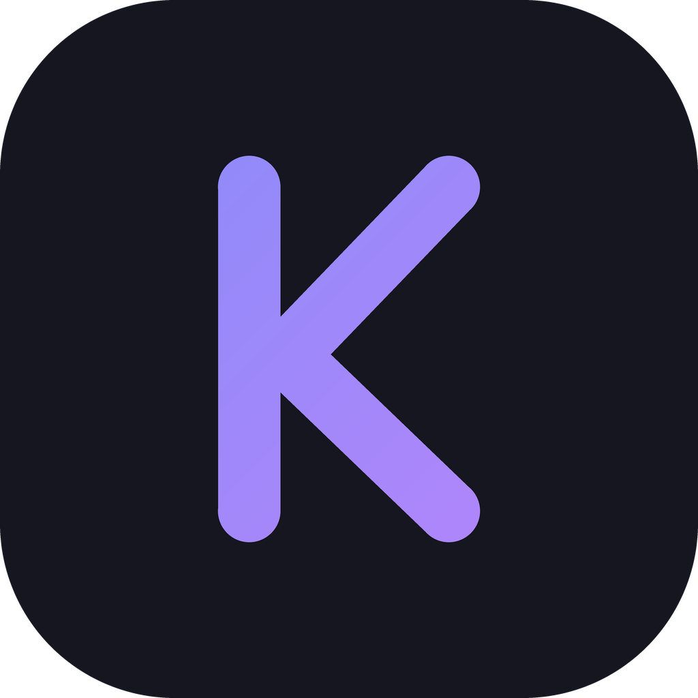

<p align="center">
  
</p>

<h1 align="center">Claude Agent Teams UI</h1>

<p align="center">
  <strong><code>You're the CTO, agents are your team. They handle tasks themselves, message each other, review each other's code. You just look at the kanban board and drink coffee.</code></strong>
</p>

<p align="center">
  <a href="https://github.com/777genius/claude_agent_teams_ui/releases/latest"></a>&nbsp;
  <a href="https://github.com/777genius/claude_agent_teams_ui/actions/workflows/ci.yml"></a>
</p>

<p align="center">
  <sub>100% free, open source. No API keys. No configuration. Runs entirely locally.</sub>
</p>

<br />

## Table of Contents

- [What is this](#what-is-this)
- [Quick start](#quick-start)
- [Installation](#installation)
- [FAQ](#faq)
- [Development](#development)
- [Roadmap](#roadmap)
- [Links](#links)
- [Contributing](#contributing)
- [Security](#security)
- [License](#license)

---

## What is this

**Claude Agent Teams UI** is a desktop app that turns Claude Code's "Orchestrate Teams" feature into a full task management experience. Create agent teams, watch them work on a kanban board, review their code changes, and stay in control — all running locally on your machine.

### Who is this for

- **Developers** who want AI agents to handle tasks in parallel while they oversee progress
- **Teams** using Claude Code and needing a shared task board, code review workflow, and team messaging
- **Anyone** who wants to browse and analyze Claude Code session history without running agents

### How it works

1. **Create a team** — Define roles (e.g. lead, frontend, backend) and a provisioning prompt. The app spawns Claude Code sessions as autonomous team members.
2. **Tasks flow automatically** — Agents create tasks, assign each other, move cards, leave comments, and send messages. You see everything on the kanban board in real time.
3. **Review like in Cursor** — When a task is done, you see the diff, approve, reject, or request changes. Agents get notified and can fix issues.
4. **Stay in control** — Send a direct message to any agent, add a comment on a task, or use quick actions on cards whenever you need to clarify or add work.

### Key features

| Feature | Description |
|---------|-------------|
| **Kanban board** | Tasks move through columns as agents work. Drag-and-drop, filters, quick actions. |
| **Code review** | Full diff view per task. Approve, reject, or request changes. Agents get notified. |
| **Team messaging** | Agents send direct messages. Inbox, notifications, clarification flags. |
| **Tool visibility** | See exactly which tools agents used (Bash, Read, Edit, etc.) for each task. |
| **Live processes** | See which agents are running. Open URLs directly in the browser. |
| **Session analysis** | Deep breakdown of each Claude session: commands, reasoning, subprocesses. |

<details>
<summary><strong>More features</strong></summary>

<br />

- **Recent tasks across projects** — browse the latest completed tasks from all your projects in one place
- **Deep session analysis** — detailed breakdown of what happened in each Claude session: bash commands, reasoning, subprocesses
- **Solo mode** — a one-member team: a single agent (regular claude process) that creates its own tasks, leaves comments, and shows live progress on the kanban board — saves tokens compared to a full team and can be expanded to a full team at any time
- **Advanced context monitoring system** — comprehensive breakdown of what consumes tokens at every step: user messages, Claude.md instructions, tool outputs, thinking text, and team coordination. Token usage, percentage of context window, and session cost are displayed for each category, with detailed views by category or size.
- **Smart task-to-log/changes matching** — automatically links Claude session logs/changes to specific tasks
- **Zero-setup onboarding** — built-in Claude Code installation and authentication, ready to go out of the box
- **Built-in code editor** — edit project files with Git support and other essential features without leaving the app
- **Branch strategy control** — choose via prompt whether all agents work on a single branch or each gets its own git worktree
- **Team member stats** — global performance statistics for every member of the team
- **Attach code context** — reference files or code snippets in your messages, just like in Cursor
- **Notification system** — configurable alerts when tasks complete, agents need attention, or errors occur
- **MCP integration** — supports the built-in `mcp-server` (see [mcp-server folder](./mcp-server)) for integrating external tools and extensible agent plugins out of the box

</details>

### Tech stack

Electron, React 18, TypeScript 5, Tailwind CSS 3, Zustand 4. Data from `~/.claude/` (session logs, todos, tasks). No cloud backend — everything runs locally.

---

## Quick start

1. **Download** the app for your platform (see [Installation](#installation))
2. **Launch** — On first run, the setup wizard will install and authenticate Claude Code
3. **Create a team** — Pick a project, define roles, write a provisioning prompt
4. **Watch** — Agents spawn, create tasks, and work. You see it all on the kanban board

---

## Installation

No prerequisites — Claude Code can be installed and configured directly from the app.

<table align="center">
<tr>
<td align="center">
  <a href="https://github.com/777genius/claude_agent_teams_ui/releases/latest/download/Claude-Agent-Teams-UI-arm64.dmg">
    
  </a>
  <br />
  <a href="https://github.com/777genius/claude_agent_teams_ui/releases/latest/download/Claude-Agent-Teams-UI-x64.dmg">
    
  </a>
</td>
<td align="center">
  <a href="https://github.com/777genius/claude_agent_teams_ui/releases/latest/download/Claude-Agent-Teams-UI-Setup.exe">
    
  </a>
  <br />
  <sub>May trigger SmartScreen — click "More info" → "Run anyway"</sub>
</td>
<td align="center">
  <a href="https://github.com/777genius/claude_agent_teams_ui/releases/latest/download/Claude-Agent-Teams-UI.AppImage">
    
  </a>
  <br />
  <a href="https://github.com/777genius/claude_agent_teams_ui/releases/latest/download/Claude-Agent-Teams-UI-amd64.deb">
    
  </a>&nbsp;
  <a href="https://github.com/777genius/claude_agent_teams_ui/releases/latest/download/Claude-Agent-Teams-UI-x86_64.rpm">
    
  </a>&nbsp;
  <a href="https://github.com/777genius/claude_agent_teams_ui/releases/latest/download/Claude-Agent-Teams-UI.pacman">
    
  </a>
</td>
</tr>
</table>

**System requirements:** macOS 10.15+, Windows 10+, or Linux (glibc 2.28+). Node.js is not required for the desktop app.

---

## FAQ

<details>
<summary><strong>Do I need to install Claude Code before using this app?</strong></summary>
<br />
No. The app includes built-in installation and authentication — just launch and follow the setup wizard.
</details>

<details>
<summary><strong>Does it read or upload my code?</strong></summary>
<br />
No. Everything runs locally. The app reads Claude Code's session logs from <code>~/.claude/</code> — your source code is never sent anywhere.
</details>

<details>
<summary><strong>Can agents communicate with each other?</strong></summary>
<br />
Yes. Agents send direct messages, create shared tasks, and leave comments — all coordinated through Claude Code's team protocol.
</details>

<details>
<summary><strong>Is it free?</strong></summary>
<br />
Yes, completely free and open source. The app requires no API keys or subscriptions. You only need a Claude Code plan from Anthropic to run agents.
</details>

<details>
<summary><strong>Can I review code changes before they're applied?</strong></summary>
<br />
Yes. Every task shows a full diff view where you can accept, reject, or comment on individual code hunks — similar to Cursor's review flow.
</details>

<details>
<summary><strong>What happens if an agent gets stuck?</strong></summary>
<br />
Send a direct message to course-correct, or stop and restart from the process dashboard. If an agent needs your input, you'll get a notification and the task will show a distinct badge on the board.
</details>

<details>
<summary><strong>Can I use it just to view past sessions without running agents?</strong></summary>
<br />
Yes. The app works as a session viewer — browse, search, and analyze any Claude Code session history.
</details>

<details>
<summary><strong>Does it support multiple projects and teams?</strong></summary>
<br />
Yes. Run multiple teams in one project or across different projects, even simultaneously. To avoid Git conflicts, ask agents to use git worktree in your provisioning prompt.
</details>

---

## Development

<details>
<summary><strong>Build from source</strong></summary>

<br />

**Prerequisites:** Node.js 20+, pnpm 10+

```bash
git clone https://github.com/777genius/claude_agent_teams_ui.git
cd claude_agent_teams_ui
pnpm install
pnpm dev
```

The app auto-discovers Claude Code projects from `~/.claude/`.

### Build for distribution

```bash
pnpm dist:mac:arm64  # macOS Apple Silicon (.dmg)
pnpm dist:mac:x64    # macOS Intel (.dmg)
pnpm dist:win        # Windows (.exe)
pnpm dist:linux      # Linux (AppImage/.deb/.rpm/.pacman)
pnpm dist            # macOS + Windows + Linux
```

### Scripts

| Command | Description |
|---------|-------------|
| `pnpm dev` | Development with hot reload |
| `pnpm build` | Production build |
| `pnpm typecheck` | TypeScript type checking |
| `pnpm lint` | Lint (no auto-fix) |
| `pnpm lint:fix` | Lint and auto-fix |
| `pnpm format` | Format code with Prettier |
| `pnpm test` | Run all tests |
| `pnpm test:watch` | Watch mode |
| `pnpm test:coverage` | Coverage report |
| `pnpm test:coverage:critical` | Critical path coverage |
| `pnpm check` | Full quality gate (types + lint + test + build) |
| `pnpm fix` | Lint fix + format |
| `pnpm quality` | Full check + format check + knip |

</details>

---

## Roadmap

- [ ] CLI runtime: Run not only on a local PC but in any headless/console environment (web UI), e.g. VPS, remote server, etc.
- [ ] 2 modes: current (agent teams), and a new mode: regular subagents (no communication between them)
- [ ] Visual workflow editor ([@xyflow/react](https://github.com/xyflow/xyflow)) for building and orchestrating agent pipelines with drag & drop
- [ ] Install skills, MCP, and integrations via an intuitive UI, and only for selected agents
- [ ] Planning mode to organize agent plans before execution
- [ ] Curate what context each agent sees (files, docs, MCP servers, skills)
- [ ] Multi-model support: proxy layer to use other popular LLMs (GPT, Gemini, DeepSeek, Llama, etc.), including offline/local models

---

## Links

- [Homepage](https://github.com/777genius/claude_agent_teams_ui)
- [Releases](https://github.com/777genius/claude_agent_teams_ui/releases)
- [Issues](https://github.com/777genius/claude_agent_teams_ui/issues)
- [MCP Server](./mcp-server) — Use Claude Agent Teams UI tools from Cursor, Claude Desktop, and other MCP clients

---

## Contributing

See [CONTRIBUTING.md](.github/CONTRIBUTING.md) for development guidelines. Please read our [Code of Conduct](.github/CODE_OF_CONDUCT.md).

## Security

IPC handlers validate all inputs with strict path containment checks. File reads are constrained to the project root and `~/.claude`. Sensitive credential paths are blocked. See [SECURITY.md](.github/SECURITY.md) for details.

## License

[AGPL-3.0](LICENSE)
