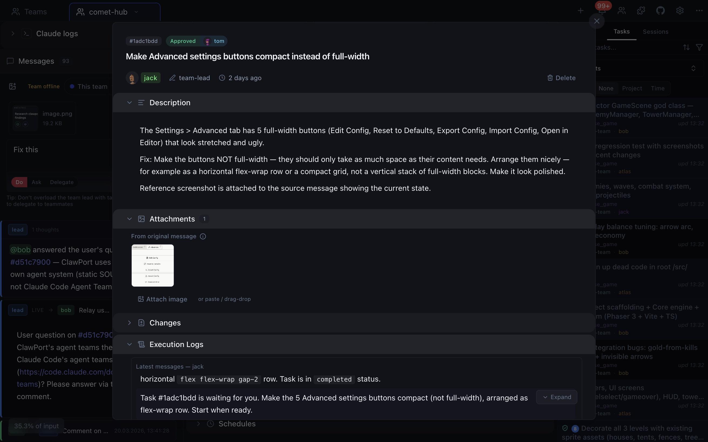
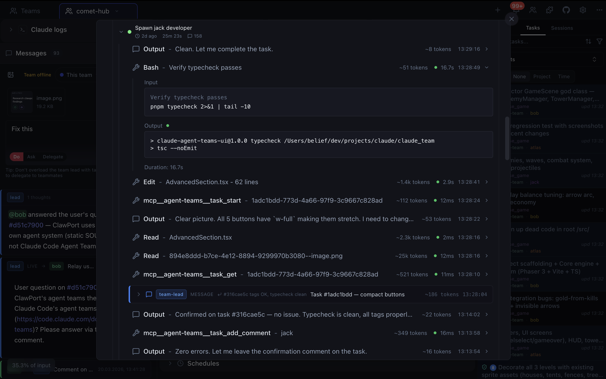
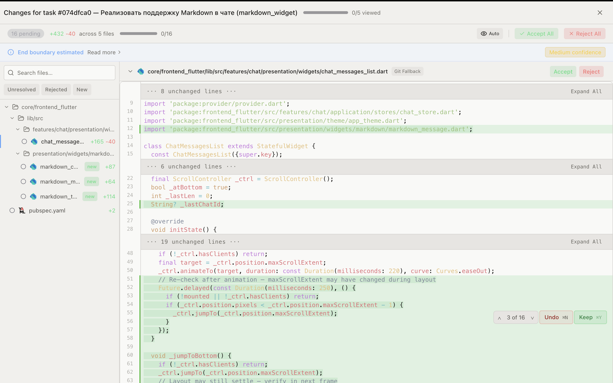
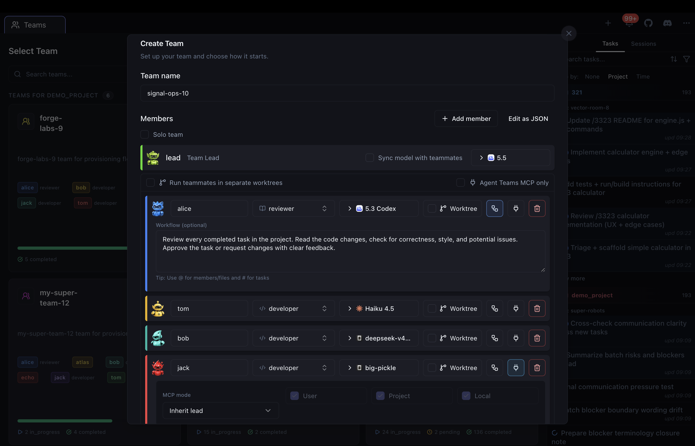
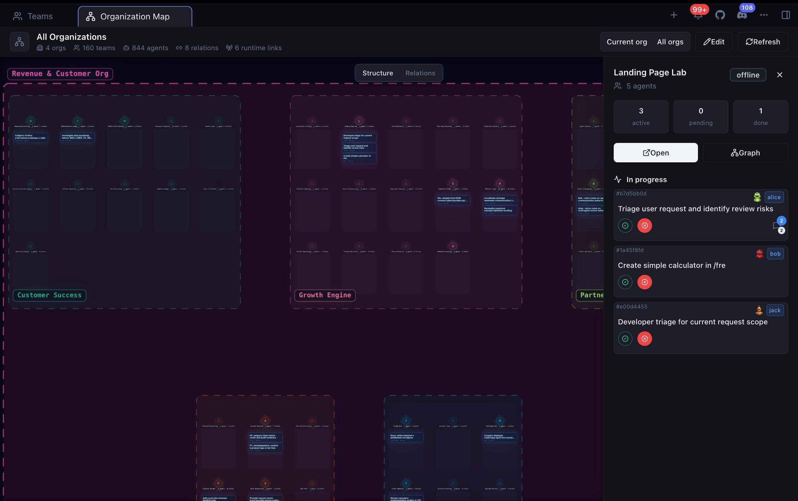

<p align="center">
  
</p>

<p align="center">
  <a href="https://github.com/alperalyaz/kanbancode/releases/latest"></a>&nbsp;
  <a href="https://github.com/alperalyaz/kanbancode/actions/workflows/ci.yml"></a>&nbsp;
  <a href="https://github.com/alperalyaz/kanbancode/blob/main/LICENSE"></a>
</p>

<p align="center">
  <sub>Free desktop app for AI agent teams. Start with a free model with no auth - no signup, API key, or card - or connect Claude/Codex/OpenCode provider access for more models. Not just coding agents.</sub>
</p>

## This is a fork

**KanbanCode** is a fork of [Agent Teams AI](https://github.com/777genius/agent-teams-ai) by **777genius**, distributed under the same [AGPL-3.0](LICENSE) license. All credit for the original design and implementation goes to the upstream project and its contributors.

- Upstream project: https://github.com/777genius/agent-teams-ai
- This fork: https://github.com/alperalyaz/kanbancode
- Please file bugs, feature requests, and questions about this fork against **this** repository, not the upstream one.

<table>
<tr>
<td width="33.33%">
  
</td>
<td width="33.33%">
  
</td>
<td width="33.33%">
  
</td>
</tr>
<tr>
<td width="33.33%">
  
</td>
<td width="33.33%">
  
</td>
<td width="33.33%">
  
</td>
</tr>
</table>

## Table of contents

- [This is a fork](#this-is-a-fork)
- [What is this](#what-is-this)
- [Installation](#installation)
- [Quick start](#quick-start)
- [Development](#development)
  - [Scripts](#scripts)
- [Contributing](#contributing)
- [Security](#security)
- [License](#license)

## What is this

An orchestration layer for AI agent teams across Claude, Codex, and OpenCode.

- **Claude + Codex + OpenCode orchestration** — start with a free model with no auth immediately, or auto-detect available Claude/Codex/OpenCode runtimes and use the provider access you already have - subscriptions or API keys
- **Assemble your team** — create agent teams with different roles that work autonomously in parallel
- **Agents talk to each other** — they communicate, create and manage their own tasks, review, leave comments
- **Cross-team communication** — agents can fully communicate across different teams; you can configure or prompt them to collaborate and message each other between teams
- **Sit back and watch** — tasks change status on the kanban board while agents handle everything on their own
- **Review changes like in Cursor** — see what code each task changed, then approve, reject, or comment
- **Task-specific logs and messages** — clearly see agent/runtime logs (tools), actions and messages in isolation for each individual task
- **Live process section** — see which agents are running processes and open URLs directly in the browser
- **Stay in control** — send a direct message to any agent, drop a comment on a task, or pick a quick action right on the kanban card
- **Flexible autonomy** — let agents run fully autonomous, or review and approve each action one by one
- **Solo mode** — one-member team: a single agent that creates its own tasks and shows live progress
- **Built-in code editor** — edit project files with Git support without leaving the app
- **MCP integration** — supports the built-in `mcp-server` (see [mcp-server folder](./mcp-server)) for integrating external tools and extensible agent plugins
- **Notification system** — configurable alerts when tasks complete, agents need your response, new comments arrive, or errors occur

100% free, open source, and local-first. The app uses available Claude/Codex/OpenCode provider access instead of forcing a single app-level API-key setup.

For the full feature list and FAQ, see the [upstream README](https://github.com/777genius/agent-teams-ai#readme) — this fork has not changed the core feature set.

## Installation

No prerequisites - the app can detect supported runtimes/providers and guide setup from the UI.

Grab the installer for your platform from this fork's [**Releases page**](https://github.com/alperalyaz/kanbancode/releases/latest):

- **Windows** — `.exe` installer or Microsoft Store (KanbanCode)
- **macOS** — `.dmg` (Apple Silicon / Intel)
- **Linux** — `.AppImage`, `.deb`, `.rpm`, or `.pacman`

> Windows: launching as Administrator is required when using OpenCode runtimes.

## Quick start

1. **Download** the app for your platform (see [Installation](#installation))
2. **Launch the desktop app** - start with the free model with no auth, or let the setup wizard detect runtimes and guide provider authentication
3. **Create a team** — Pick a project, define roles, write a provisioning prompt
4. **Watch** — Agents spawn, create tasks, and work. You see it all on the kanban board

Use the desktop app as the primary product. The browser/web path is not needed for normal use and does not provide the full desktop runtime, IPC, terminal, provider auth, or team lifecycle behavior.

## Development

**Prerequisites:** Node.js 24.15.0+ (below 25), pnpm 10+

```bash
git clone https://github.com/alperalyaz/kanbancode.git
cd kanbancode
pnpm install
pnpm dev
```

`pnpm dev` starts the desktop Electron app. Do not start a browser/web dev server for normal development; that path is limited and is not the supported way to run agent teams locally.

The desktop app auto-discovers Claude Code projects from `~/.claude/`.

Repo working instructions live in [CLAUDE.md](CLAUDE.md).

### Scripts

| Command                       | Description                                                                  |
| ----------------------------- | ---------------------------------------------------------------------------- |
| `pnpm dev`                    | Desktop app development with hot reload                                      |
| `pnpm dev:mcp`                | Desktop app development with hot reload and local CDP debugging on port 9222 |
| `pnpm build`                  | Production build                                                             |
| `pnpm typecheck`              | TypeScript type checking                                                     |
| `pnpm lint`                   | Lint (no auto-fix)                                                           |
| `pnpm lint:fix`               | Lint and auto-fix                                                            |
| `pnpm format`                 | Format code with Prettier                                                    |
| `pnpm test`                   | Run all tests                                                                |
| `pnpm check`                  | Full quality gate (types + lint + test + build)                             |
| `pnpm dist:win`               | Build Windows installer (`.exe` + `.appx`)                                   |
| `pnpm dist:mac:arm64`         | Build macOS (Apple Silicon) `.dmg`                                           |
| `pnpm dist:mac:x64`           | Build macOS (Intel) `.dmg`                                                   |
| `pnpm dist:linux`             | Build Linux `.AppImage` / `.deb` / `.rpm` / `.pacman`                        |

## Contributing

This fork follows the same contribution guidelines as upstream — see [CONTRIBUTING.md](.github/CONTRIBUTING.md) and the [Code of Conduct](.github/CODE_OF_CONDUCT.md).

## Security

IPC and standalone HTTP handlers validate IDs, paths, and payload shape at the boundary. Project editing and write operations are constrained to the selected project root, while read-only discovery also accesses local Claude data under `~/.claude/` and app-owned state paths when required. See [SECURITY.md](.github/SECURITY.md) for details, and report vulnerabilities in this fork against this repository.

## License

[AGPL-3.0](LICENSE) — same license as the upstream project. Original copyright: 777genius. This fork's changes are licensed under the same terms.
