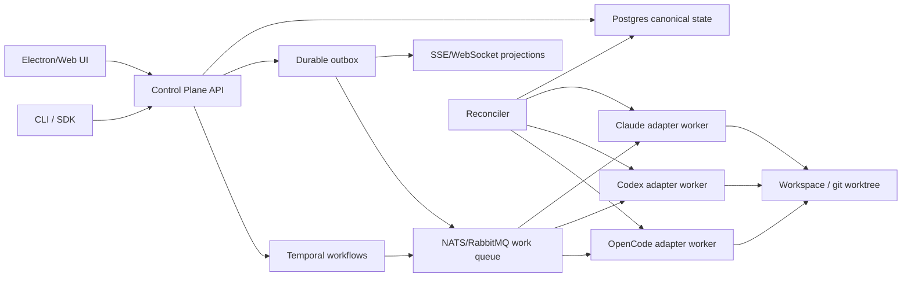

# Будущий оркестратор: что взять из Gas City, GoClaw и Gas Town

**Дата**: 2026-05-15
**Статус**: research note для нового проекта оркестратора
**Контекст**: не план миграции текущего Electron-приложения, а список идей, которые стоит заложить в новый фундамент.

## Короткий вердикт

RabbitMQ, Kafka и gRPC решают транспорт и обмен сообщениями, но не решают главную боль оркестратора: где находится каноническое состояние, кто владеет lifecycle агента, как восстанавливаться после падений, как доказывать что агент действительно сделал работу, и как не превратить UI, файлы, процессы и очереди в четыре разных источника правды.

Из изученных проектов лучший архитектурный reference - **Gas City**. Самые полезные backend-идеи по reliability - **GoClaw**. Самые полезные UX и team-workflow идеи - **Gas Town**, но его tmux/file substrate не стоит копировать как control plane.

## Топ-3 источника идей

| Источник | Что взять | Оценка | Примерный объём для MVP |
|----------|-----------|--------|--------------------------|
| **Gas City / gascity** | Provider interface, typed HTTP API, SSE events, async `request_id`, `event_cursor`, session state machine, trust boundaries, разделение supervisor/city | 🎯 9 🛡️ 8 🧠 8 | ~3000-9000 LOC |
| **GoClaw / goclaw** | Durable task lifecycle, scheduler lanes, periodic recovery, stale/orphan repair, явные failure domains | 🎯 8 🛡️ 8 🧠 7 | ~2500-7000 LOC |
| **Gas Town / gastown** | Роли агентов, mail/nudge модель, operator UX, recover/doctor mindset, простота запуска команды | 🎯 8 🛡️ 5.5 🧠 7 | ~1500-5000 LOC, если брать выборочно |

Оценки:
- 🎯 - уверенность, что идея полезна для нас.
- 🛡️ - надёжность паттерна как основы продукта.
- 🧠 - сложность внедрения, где 10 значит сложно.

## Что взять в новый оркестратор

### 1. Runtime Provider Contract

Из Gas City стоит взять идею строгого runtime-контракта для каждого агента: Claude, Codex, OpenCode и будущие adapters не должны жить внутри одного огромного сервиса.

Минимальный контракт:

```ts
interface RuntimeProvider {
  kind: 'claude' | 'codex' | 'opencode' | string;

  startSession(input: StartSessionInput): Promise<StartSessionResult>;
  sendInput(input: SendInputInput): Promise<SendInputResult>;
  cancelSession(input: CancelSessionInput): Promise<void>;
  inspectSession(input: InspectSessionInput): Promise<RuntimeSessionSnapshot>;
  recoverSession(input: RecoverSessionInput): Promise<RecoverSessionResult>;
}
```

Ключевая мысль: adapter - это не просто `spawn(command)`. Он должен уметь сообщать состояние, восстанавливаться, подтверждать readiness, отдавать evidence и нормально завершаться.

### 2. Typed Control Plane

Gas City хорош тем, что у него есть явный API-слой, а не скрытая связка UI -> process manager -> files -> CLI.

Для нового оркестратора стоит делать:
- gRPC для внутренних сервисов и adapter workers.
- HTTP/OpenAPI для внешней интеграции, CLI и dashboard.
- SSE или WebSocket для UI projection.
- Асинхронные команды в стиле `202 Accepted + request_id + event_cursor`.

Пример:

```txt
POST /runs
  -> 202 Accepted
  -> { request_id, run_id, event_cursor }

GET /events?cursor=...
  -> append-only stream of state changes
```

Это лучше, чем блокирующий запуск агента, потому что запуск CLI, auth, checkout, bootstrap и readiness могут занимать непредсказуемое время.

### 3. Durable Task Lifecycle

Из GoClaw стоит взять явную task model и scheduler, где task не является просто строкой в prompt или карточкой в UI.

Состояния должны быть формализованы:

```txt
queued -> assigned -> starting -> running -> blocked -> review -> completed
                             -> failed
                             -> cancelled
                             -> stale
```

Важно:
- Все переходы идут через один доменный сервис.
- Каждый переход пишет событие.
- UI только читает projection.
- Adapter не решает сам, что задача завершена, он присылает signal/evidence, а orchestrator принимает transition.

### 4. Recovery And Reconciliation Loops

У GoClaw сильная идея periodic recovery ticker: система не верит, что всё всегда завершится идеально.

Для нового оркестратора нужны фоновые reconciler-процессы:
- Найти runs, которые `starting` слишком долго.
- Найти agents без heartbeat.
- Найти task, где process умер, но state всё ещё `running`.
- Найти orphan workspace/process/session.
- Повторить idempotent-команды.
- Сформировать launch-failure artifact с redacted логами.

Это должно быть частью core, а не набором debug scripts.

### 5. Inter-Agent Mail And Nudge

Из Gas Town стоит взять product-идею: агенты не только выполняют task, но и умеют общаться, просить review, пинговать teammate, отдавать status и handoff.

Но реализация должна быть не через tmux pane и не через ad hoc text capture.

Правильнее:
- `messages` table как durable inbox/outbox.
- Типизированные сообщения: `question`, `status`, `handoff`, `review_request`, `decision`, `blocker`.
- Causal links: `task_id`, `run_id`, `parent_message_id`.
- Delivery state: `created`, `delivered`, `seen_by_adapter`, `acknowledged`.
- UI строит thread projection из canonical store.

### 6. Trust Boundaries

Из Gas City нужно взять идею явных trust boundaries: orchestrator, adapter, workspace, user secret store и UI не должны иметь одинаковые права.

Практические правила:
- Adapter worker получает только нужный workspace и scoped credentials.
- UI не исполняет команды и не пишет напрямую в runtime state.
- CLI tools не получают прямой доступ к master database без API boundary.
- Secrets не идут через event stream.
- Все dangerous operations требуют policy decision: filesystem, shell, git push, network, secrets, browser.

### 7. Evidence Model

Для больших проектов на сотни тысяч строк важно не просто “агент сказал done”.

Нужно хранить evidence:
- terminal tail
- diff summary
- changed files snapshot
- test command result
- lint/typecheck result
- agent final answer
- tool calls summary
- review verdict

Идея: task completion без evidence - это не completion, а claim.

### 8. UI As Projection, Not Source Of Truth

Текущая боль обычно появляется, когда Electron UI, IPC handlers, JSON files, process registry и runtime adapter все частично владеют состоянием.

Для нового проекта:
- Canonical truth: Postgres.
- Event truth: append-only outbox/events.
- UI truth: read model/projection.
- Process truth: runtime snapshots, которые reconciler сверяет с canonical state.

UI должен уметь умереть и открыться заново без потери смысла происходящего.

## Что не копировать

### Не копировать tmux как control plane

Gas Town полезен как workflow reference, но tmux/send-keys/capture-pane не должен быть foundation для нового мощного оркестратора.

Проблемы:
- readiness часто эвристический
- сложно гарантировать доставку сообщений
- сложно делать typed state transitions
- сложно изолировать права
- сложно масштабировать на distributed workers

tmux может быть optional local development view, но не backend truth.

### Не делать CLI as RPC

CLI можно поддерживать как adapter transport, но нельзя строить весь control plane на парсинге stdout/stderr.

Правильнее:
- CLI adapter нормализует output в typed events.
- Core orchestrator не знает про ANSI, panes, terminal prompt и escape sequences.
- Provider-specific parsing живёт внутри provider adapter.

### Не использовать in-memory event bus как critical truth

GoClaw показывает полезный event-bus mindset, но bounded in-process bus не должен быть источником истины.

Для side effects - нормально.
Для lifecycle, audit и recovery - нужен durable outbox.

### Не смешивать Kafka и RabbitMQ без причины

Kafka и RabbitMQ решают разные задачи.

Рекомендуемый baseline:
- RabbitMQ или NATS JetStream для commands/work queue.
- Kafka только если нужен большой durable event log, analytics, replay и интеграции.
- Для MVP чаще достаточно Postgres outbox + worker polling или NATS.

Иначе получится сложность распределённой системы до того, как появится понятная domain model.

## Целевая архитектура для нового проекта



Рекомендуемый стек:
- **Postgres** - canonical state, locks, task lifecycle, sessions, messages, evidence.
- **Temporal** - long-running workflows: launch, cancel, retry, review, recovery.
- **gRPC** - internal adapter protocol.
- **HTTP/OpenAPI** - public control plane.
- **SSE/WebSocket** - live UI events.
- **NATS JetStream или RabbitMQ** - work queue.
- **Kafka** - позже, если нужен global event log, replay и analytics.

## MVP vertical slice

Чтобы не построить “идеальную” систему на год вперёд, первый MVP должен доказать один полный путь:

1. Создать `run` и `task` в Postgres.
2. Запустить одного adapter worker через typed provider contract.
3. Получить live events в UI через cursor-based stream.
4. Сохранить evidence: output, diff summary, test result.
5. Убить worker и проверить, что reconciler переводит state в `failed` или восстанавливает run.

Если этот путь работает, тогда добавлять:
- multi-agent team planning
- inter-agent mail
- review workflow
- multi-provider adapters
- distributed workers
- Kafka/event lake

## Практический вывод для нас

Главная ошибка была бы думать, что “микросервисы + RabbitMQ + Kafka + gRPC” автоматически делают систему грамотной. Грамотной её делают:
- один canonical state
- typed provider boundary
- durable lifecycle
- recovery loops
- strict trust boundaries
- UI как projection
- evidence-based completion

Транспорт можно заменить. Потерянную domain model потом очень дорого чинить.

## Источники

- [Gas City repository](https://github.com/gastownhall/gascity)
- [Gas City API reference](https://raw.githubusercontent.com/gastownhall/gascity/main/docs/reference/api.md)
- [Gas City trust boundaries](https://raw.githubusercontent.com/gastownhall/gascity/main/docs/reference/trust-boundaries.md)
- [Gas City events reference](https://raw.githubusercontent.com/gastownhall/gascity/main/docs/reference/events.md)
- [Gas City runtime provider interface](https://raw.githubusercontent.com/gastownhall/gascity/main/internal/runtime/runtime.go)
- [Gas City session state machine](https://raw.githubusercontent.com/gastownhall/gascity/main/internal/session/state_machine.go)
- [Gas Town provider integration](https://github.com/gastownhall/gastown/blob/main/docs/agent-provider-integration.md)
- [GoClaw repository](https://github.com/nextlevelbuilder/goclaw)
- [GoClaw task ticker](https://raw.githubusercontent.com/nextlevelbuilder/goclaw/dev/internal/tasks/task_ticker.go)
- [GoClaw scheduler](https://raw.githubusercontent.com/nextlevelbuilder/goclaw/dev/internal/scheduler/scheduler.go)
- [GoClaw domain event bus](https://raw.githubusercontent.com/nextlevelbuilder/goclaw/dev/internal/eventbus/domain_event_bus.go)

## 📌 Summary

Для нового мощного оркестратора стоит брать не готовый проект целиком, а паттерны:
- Gas City - control plane, provider contract, events, trust boundaries.
- GoClaw - task lifecycle, scheduler, recovery loops.
- Gas Town - team UX, mail/nudge, operator workflow.

Не стоит копировать tmux/file-first подход как фундамент. База должна быть durable: Postgres + workflows + typed adapters + event stream.
