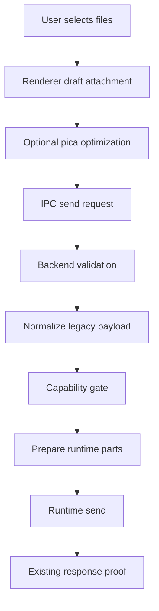
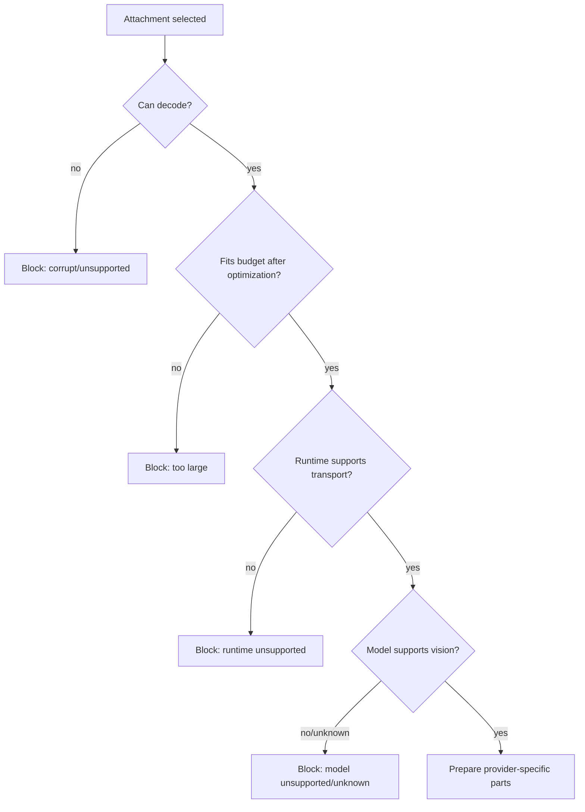

# Agent attachments architecture plan

## Summary

Goal: support screenshots/images and later documents across Claude, Codex, and OpenCode teammates without treating base64 as a universal transport and without destabilizing team launch/runtime delivery.

Chosen architecture: **shared attachment normalization + artifact variants + runtime capability gate + provider-specific delivery adapters**.

🎯 9.1   🛡️ 8.7   🧠 7.0  
Estimated total implementation size: `650-1100` LOC across phased work, excluding broad tests and fixtures.

Risk if implemented in phases: `3/10`.
Risk if implemented as one big change across all runtimes: `7/10`.

Repos involved:

- `/Users/belief/dev/projects/claude/claude_team`
- `/Users/belief/dev/projects/claude/agent_teams_orchestrator`

## Live research facts

The design is based on live smoke tests run on May 8-9, 2026.

### Claude

Claude subscription is working for image input in streaming mode.

Confirmed path:

```text
@anthropic-ai/claude-agent-sdk query({ prompt: async iterable with image block })
PNG -> red
JPEG -> red
```

Important nuance:

```text
claude -p / single-message mode is not the right validation path for images.
```

Official Claude Code docs say image uploads are supported in streaming input mode and not in single-message mode. Our team lead process uses long-lived `--input-format stream-json`, so Claude support is viable.

### Codex

Codex subscription image input works through CLI file attachment:

```bash
codex exec --json --skip-git-repo-check -C /tmp --model gpt-5.4-mini --image red-card-valid.png -
```

Result:

```text
red
```

Therefore Codex native delivery should use optimized image files and `--image <path>`, not inline base64 in prompt text.

### OpenCode

OpenCode OpenAI OAuth image input works:

```bash
opencode run --pure --format json --dir /tmp --model openai/gpt-5.4-mini "..." -f red-card-valid.png
```

Result:

```text
red
```

OpenCode OpenRouter works when `OPENROUTER_API_KEY` is present:

```text
openrouter/moonshotai/kimi-k2.6 -> red
openrouter/z-ai/glm-4.5v -> red
openrouter/z-ai/glm-5.1 -> model replied it cannot view images
```

Therefore OpenCode support is not only provider-level. It needs model-level vision capability gating.

## Non-goals

- Do not change team launch/bootstrap semantics.
- Do not make attachments part of readiness or liveness truth.
- Do not send base64 blobs as plain text to any model.
- Do not silently drop attachments for unsupported runtimes.
- Do not attempt to make every OpenRouter model vision-capable.
- Do not add a native image processing dependency in Electron main for v1.
- Do not introduce a new retry loop for attachment failures.

## Core invariants

1. Original user attachment is immutable.
2. Optimized variants are derived artifacts with deterministic metadata.
3. Delivery is blocked before send if the selected runtime/model cannot accept the attachment.
4. Delivery success does not mean model understood the image; it only means the runtime accepted the attachment transport.
5. A model that says it cannot view an image is a model capability failure, not a transport failure.
6. The renderer can optimize for UX and payload size, but the backend is the final validation authority.
7. No runtime adapter should know about React, IPC, or draft UI state.
8. No renderer code should know filesystem runtime log paths or process internals.
9. No app shell code should deep-import feature internals.
10. All user-visible attachment errors must be actionable and specific.

## Why not universal base64

Universal base64 looks simple but is the wrong abstraction.

Claude accepts inline image content blocks in streaming mode.
Codex accepts image file paths through `--image`.
OpenCode accepts file parts through `-f` / session message parts.
OpenRouter models vary by capability.

Sending base64 text to all providers creates false success:

```text
transport accepted prompt text
model sees base64 noise
user thinks image was attached
agent silently fails to use screenshot
```

The right abstraction is a normalized attachment plus runtime-specific prepared parts.

## Target feature layout

Medium-sized cross-process feature should follow `docs/FEATURE_ARCHITECTURE_STANDARD.md`.

Recommended home:

```text
src/features/agent-attachments/
  contracts/
    api.ts
    dto.ts
    channels.ts
  core/
    domain/
      AttachmentModel.ts
      AttachmentCapability.ts
      AttachmentBudget.ts
      AttachmentDeliveryDecision.ts
    application/
      AttachmentNormalizer.ts
      AttachmentCapabilityResolver.ts
      AttachmentDeliveryPlanner.ts
      AttachmentVariantSelector.ts
      ports.ts
  main/
    composition/
      createAgentAttachmentsFeature.ts
    adapters/
      input/
        ipc/registerAgentAttachmentIpc.ts
      output/
        ClaudeStreamJsonAttachmentAdapter.ts
        CodexNativeAttachmentAdapter.ts
        OpenCodeAttachmentAdapter.ts
    infrastructure/
      AttachmentArtifactStore.ts
      AttachmentMetadataStore.ts
      RuntimeModelCapabilityCatalog.ts
      ServerImageBudgetValidator.ts
  preload/
    createAgentAttachmentsBridge.ts
  renderer/
    hooks/
      useAttachmentPreparation.ts
      useAttachmentCapabilityWarnings.ts
    ui/
      AttachmentPreviewList.tsx
      AttachmentCapabilityNotice.tsx
    utils/
      picaImageOptimizer.ts
```

Do not move existing composer code wholesale in one step. Introduce the feature and connect it gradually.

## Domain model sketch

```ts
export type AgentAttachmentKind = 'image' | 'document' | 'text' | 'unsupported';

export type AttachmentDataRef =
  | { kind: 'inline-base64'; base64: string }
  | { kind: 'artifact-file'; path: string; sha256: string }
  | { kind: 'text'; text: string };

export interface NormalizedAgentAttachment {
  id: string;
  originalName: string;
  mimeType: string;
  kind: AgentAttachmentKind;
  originalBytes: number;
  originalRef: AttachmentDataRef;
  variants: AgentAttachmentVariant[];
  warnings: AttachmentWarning[];
}

export interface AgentAttachmentVariant {
  id: string;
  sourceAttachmentId: string;
  purpose:
    | 'preview'
    | 'claude-inline-image'
    | 'claude-inline-document'
    | 'codex-image-file'
    | 'opencode-file-part';
  mimeType: string;
  byteSize: number;
  width?: number;
  height?: number;
  ref: AttachmentDataRef;
}

export interface AttachmentWarning {
  code:
    | 'image_resized'
    | 'format_converted'
    | 'animated_gif_not_supported'
    | 'model_does_not_support_images'
    | 'attachment_too_large'
    | 'unknown_runtime_capability';
  message: string;
  severity: 'info' | 'warning' | 'error';
}
```

## Capability model sketch

```ts
export type AttachmentRuntimeKind = 'claude-stream-json' | 'codex-native' | 'opencode';

export interface AttachmentRuntimeContext {
  teamName: string;
  memberName?: string;
  providerId: 'anthropic' | 'codex' | 'opencode' | string;
  modelId: string;
  runtimeKind: AttachmentRuntimeKind;
  deliveryTarget: 'lead' | 'member' | 'opencode-secondary';
}

export interface RuntimeAttachmentCapability {
  supportsImages: boolean;
  supportsDocuments: boolean;
  supportedImageMimeTypes: string[];
  maxInlineBytes?: number;
  maxFileBytes?: number;
  modelCapabilitySource: 'static' | 'catalog' | 'live-probe' | 'unknown';
  reason?: string;
}

export interface AttachmentCapabilityDecision {
  allowed: boolean;
  warnings: AttachmentWarning[];
  blockers: AttachmentWarning[];
  capability: RuntimeAttachmentCapability;
}
```

## Delivery planner sketch

```ts
export interface PreparedAttachmentPart {
  runtimeKind: AttachmentRuntimeKind;
  attachmentId: string;
  part:
    | { kind: 'claude-content-block'; value: Record<string, unknown> }
    | { kind: 'codex-image-arg'; path: string }
    | { kind: 'opencode-file-part'; value: Record<string, unknown> };
  diagnostics: string[];
}

export interface AttachmentDeliveryAdapter {
  runtimeKind: AttachmentRuntimeKind;
  canDeliver(
    ctx: AttachmentRuntimeContext,
    attachment: NormalizedAgentAttachment,
  ): AttachmentCapabilityDecision;
  prepare(
    ctx: AttachmentRuntimeContext,
    attachment: NormalizedAgentAttachment,
  ): Promise<PreparedAttachmentPart>;
}

export class AttachmentDeliveryPlanner {
  constructor(private readonly adapters: AttachmentDeliveryAdapter[]) {}

  async prepareAll(
    ctx: AttachmentRuntimeContext,
    attachments: NormalizedAgentAttachment[],
  ): Promise<PreparedAttachmentPart[]> {
    const adapter = this.adapters.find(candidate => candidate.runtimeKind === ctx.runtimeKind);
    if (!adapter) {
      throw new Error(`Attachments are not supported for runtime ${ctx.runtimeKind}`);
    }

    const prepared: PreparedAttachmentPart[] = [];
    for (const attachment of attachments) {
      const decision = adapter.canDeliver(ctx, attachment);
      if (!decision.allowed) {
        throw new Error(decision.blockers.map(blocker => blocker.message).join('\n'));
      }
      prepared.push(await adapter.prepare(ctx, attachment));
    }
    return prepared;
  }
}
```

## Phase map

### Phase 1 - normalization, image optimization, budgets, and UI warnings

🎯 9.4   🛡️ 9.3   🧠 5.8  
Estimated change size: `260-420` LOC.

Create feature skeleton, normalize attachments, optimize images with `pica@9.0.1`, enforce hard server-side budgets, and show capability/budget warnings. Do not change provider delivery paths yet except to fail oversized images earlier.

Plan file:

```text
docs/team-management/agent-attachments-phase-1-normalization-and-budgets-plan.md
```

### Phase 2 - Claude stream-json adapter

🎯 9.0   🛡️ 8.8   🧠 5.8  
Estimated change size: `180-320` LOC.

Route existing Claude lead attachments through the new planner while preserving current content block semantics. This removes ad-hoc attachment serialization from `TeamProvisioningService` without changing launch.

Plan file:

```text
docs/team-management/agent-attachments-phase-2-claude-stream-json-plan.md
```

### Phase 3 - Codex native image adapter

🎯 8.6   🛡️ 8.4   🧠 6.6  
Estimated change size: `260-440` LOC across two repos.

Write optimized image artifacts and pass them to Codex native via `--image <path>`. Extend Codex native exec input from text-only to text plus image paths.

Plan file:

```text
docs/team-management/agent-attachments-phase-3-codex-native-plan.md
```

### Phase 4 - OpenCode file parts and model vision gate

🎯 8.3   🛡️ 8.0   🧠 7.2  
Estimated change size: `320-560` LOC across two repos.

Support OpenCode file parts and model capability gating. Block text-only models like `openrouter/z-ai/glm-5.1` before send. Allow vision models like Kimi K2.6 and GLM 4.5V.

Plan file:

```text
docs/team-management/agent-attachments-phase-4-opencode-vision-plan.md
```

### Phase 5 - cross-runtime E2E, diagnostics, docs, and polish

🎯 8.8   🛡️ 8.7   🧠 5.4  
Estimated change size: `180-320` LOC plus tests/docs.

Add live e2e scripts, UI copy, diagnostics, and documentation. Keep this separate to avoid mixing correctness changes with polish.

Plan file:

```text
docs/team-management/agent-attachments-phase-5-e2e-and-polish-plan.md
```

## Shared testing strategy

Use three levels of tests.

### Unit tests

- image optimizer budget decisions;
- capability resolver decisions;
- adapter serialization output;
- artifact idempotency;
- redaction of secrets in diagnostics.

### Fixture integration tests

- renderer attachment preview and warnings;
- IPC validation rejects oversized or unsupported attachments;
- planner blocks unsupported runtime/model;
- delivery paths produce correct content parts without live provider calls.

### Live e2e smoke tests

Run only when explicitly requested or behind live test env.

Live models already validated manually:

```text
Claude subscription PNG/JPEG -> red
Codex gpt-5.4-mini PNG -> red
OpenCode openai/gpt-5.4-mini PNG -> red
OpenCode openrouter/moonshotai/kimi-k2.6 PNG -> red
OpenCode openrouter/z-ai/glm-4.5v PNG -> red
OpenCode openrouter/z-ai/glm-5.1 PNG -> text-only refusal
```

## Release safety

Default rollout order:

1. Land Phase 1 alone.
2. Verify no regressions in text-only sends.
3. Land Phase 2 for Claude only.
4. Land Phase 3 Codex after focused native exec tests.
5. Land Phase 4 OpenCode after model capability tests.
6. Land Phase 5 e2e/polish.

Do not bundle all phases into one release commit.

## Main bug risks and mitigations

| Risk | Impact | Mitigation |
|---|---:|---|
| Oversized image crashes or kills lead process | High | renderer optimization + backend serialized budget |
| Unsupported model silently ignores image | High | capability gate blocks before send |
| Base64 leaked into prompt text | Medium | adapters never produce plain text base64 |
| Retry loses attachment artifact | Medium | artifact store rebuilds from original or fails loudly |
| OpenCode model catalog changes | Medium | static curated map plus explicit unknown capability state |
| Cross-process API becomes too broad | Medium | feature contracts expose only DTOs and use cases |
| Existing Claude path regresses | Medium | Phase 2 keeps exact content block semantics and tests current behavior |

## Decision record

Use `pica@9.0.1` in renderer for high-quality browser image resizing.

Do not use `sharp` in Electron main for this phase because native packaging risk is not worth it before release.

Do not use `@squoosh/lib` because it is stale and heavier operationally.

Do not use text dedupe or model-specific prompt hacks for attachments.

Do not treat OpenCode provider support as model support.

## Deep implementation guardrails

This section tightens the plan after reviewing the first draft. The most important correction is that the attachment feature must not become a generic utility imported everywhere. It should be a feature with a small public facade and strict contracts. Provider-specific code should depend on feature ports, not on renderer utilities or raw DTOs.

### Ownership boundaries

| Layer | Owns | Must not own |
|---|---|---|
| Renderer | user preview, local optimization attempt, UI warnings | final safety decision, filesystem artifact paths, runtime args |
| Main feature application | normalization policy, budget policy, delivery planning | direct process spawning, React state, OpenCode/Codex implementation details |
| Main infrastructure | artifact store, filesystem reads/writes, byte validation | provider business rules |
| Runtime adapters | provider-specific serialization | UI messages, attachment optimization algorithm |
| TeamProvisioningService | send orchestration and runtime state | image resizing, model capability catalog, base64 parsing details |
| Orchestrator | actual Codex/OpenCode runtime bridge | desktop UI validation, user-facing attachment UX |

Concrete rule:

```ts
// Good: app service asks a feature facade to prepare parts.
const prepared = await this.agentAttachments.prepareForRuntime(ctx, attachments);

// Bad: team service knows provider-specific conversion details.
const jpeg = await picaResizeInTeamProvisioningService(...);
const codexArgs = ['--image', jpeg.path];
```

### Dependency direction

```text
renderer UI -> feature renderer hooks -> contracts
main IPC -> feature application -> domain -> ports
main composition -> infrastructure/adapters
team services -> feature facade only
runtime provider adapters -> feature contracts only
```

No circular dependency should exist between:

```text
TeamProvisioningService <-> agent-attachments internals
OpenCodePromptDeliveryLedger <-> agent-attachments internals
CodexNativeTurnExecutor <-> desktop renderer contracts
```

### Correct source of truth per decision

| Decision | Source of truth |
|---|---|
| Is the file selected by the user? | renderer draft state |
| Is the file safe to upload? | backend validator |
| Is the image optimized enough? | attachment budget policy |
| Can the runtime accept the transport? | provider adapter capability |
| Can the model interpret images? | model capability catalog/probe |
| Did the agent answer? | existing delivery proof gates |
| Is teammate alive/ready? | existing runtime/bootstrap proof |

Do not collapse these into one boolean like `supportsAttachments`.

### Cross-runtime delivery matrix

| Runtime | Transport | Transport proof | Model understanding proof |
|---|---|---|---|
| Claude stream-json | content block `{ type: 'image', source: base64 }` | stdin write accepted, no immediate CLI schema error | normal assistant response |
| Codex native | `codex exec --image <file>` | process spawned with image path, no CLI arg error | normal Codex response |
| OpenCode | session file part / CLI `-f` equivalent | OpenCode accepted message part | existing OpenCode response proof |
| OpenCode OpenRouter text-only model | file part may be accepted | transport may succeed | model may say it cannot view image, so capability gate should prevent send |

The subtle case is OpenCode/OpenRouter: transport can succeed while the model is text-only. That must be represented as capability failure before send.

### Error taxonomy

Use typed errors internally. Do not parse English UI messages later.

```ts
export type AttachmentFailureCode =
  | 'attachment_too_large_original'
  | 'attachment_too_large_optimized'
  | 'attachment_serialized_payload_too_large'
  | 'attachment_unsupported_mime'
  | 'attachment_corrupt_image'
  | 'attachment_runtime_unsupported'
  | 'attachment_model_vision_unsupported'
  | 'attachment_model_vision_unknown'
  | 'attachment_artifact_missing'
  | 'attachment_artifact_write_failed'
  | 'attachment_provider_auth_required'
  | 'attachment_provider_quota_exceeded';

export interface AttachmentFailure {
  code: AttachmentFailureCode;
  severity: 'warning' | 'error';
  userMessage: string;
  diagnostic: string;
  retryable: boolean;
}
```

UI should render `userMessage`. Logs/copy diagnostics may include `diagnostic` after redaction.

### Idempotency requirements

Attachment artifacts need stable identity. Repeated sends/retries/watchdog runs must not create unbounded duplicate files.

Recommended id:

```ts
const attachmentId = sha256([
  teamName,
  originalMessageId,
  filename,
  mimeType,
  originalBytes,
  originalSha256,
].join('\0')).slice(0, 24);
```

Variant id:

```ts
const variantId = sha256([
  attachmentId,
  purpose,
  outputMimeType,
  width,
  height,
  byteSize,
  optimizerVersion,
].join('\0')).slice(0, 24);
```

This prevents retry storms from creating multiple equivalent optimized copies.

### Backward compatibility

Current renderer payload shape is still:

```ts
{ data: string; mimeType: string; filename?: string }
```

Do not break this in Phase 1. Instead normalize at the boundary:

```ts
const normalized = await agentAttachments.normalizeLegacyPayloads(legacyAttachments);
```

Only later introduce a richer DTO if needed. Existing IPC clients and tests should continue to work until explicitly migrated.

### What not to do

- Do not pass base64 as a textual paragraph to Codex/OpenCode.
- Do not auto-convert PDFs to images in v1.
- Do not mark delivery success because an attachment was accepted.
- Do not infer OpenCode vision support from provider id alone.
- Do not run live model probes on every send.
- Do not store API keys in artifact metadata.
- Do not log image base64 or data URLs.
- Do not delete Codex image files immediately after process spawn.
- Do not make unknown model capability permissive by default before release.

### Suggested implementation order inside each phase

1. Add pure domain/application types and tests.
2. Add infrastructure behind ports.
3. Add adapter tests with fake artifacts.
4. Wire into one call site.
5. Add UI copy or diagnostics.
6. Run focused tests.
7. Only then expand to the next runtime.

### Minimal safe rollback strategy

Each phase should be revertable independently.

- Phase 1 rollback: disable new validator facade and keep current attachmentUtils path.
- Phase 2 rollback: switch Claude `sendMessageToRun()` back to old content-block builder.
- Phase 3 rollback: keep Codex text-only guard and block image attachments.
- Phase 4 rollback: restore OpenCode `opencode_attachments_not_supported_for_secondary_runtime` block.
- Phase 5 rollback: remove smoke/docs only.

Do not make a database migration mandatory for Phase 1-4.

## Additional edge-case matrix

| Edge case | Expected behavior | Reason |
|---|---|---|
| User attaches image then switches recipient to unsupported OpenCode model | Composer warning changes and send is blocked | capability belongs to current target |
| User sends while team goes offline | Existing offline/send guard wins; attachment path does not queue fake delivery | avoid confusing offline queue |
| Attachment optimization succeeds but artifact write fails | Block send with retryable local error | runtime never saw file |
| Artifact exists but checksum mismatch | Rebuild from original if possible, otherwise block | avoid corrupted screenshots |
| Original missing but optimized variant present | Allow only if variant checksum is valid and policy permits | useful for old drafts but risky, log diagnostic |
| Multiple recipients have mixed capability | Block and explain unsupported recipients, unless product explicitly supports per-recipient partial send | avoid silent partial delivery |
| User includes a text file and images | Claude may support text document, Codex/OpenCode v1 may block non-image | runtime-specific adapters decide |
| OpenRouter key missing | Provider auth error, not attachment bug | clear setup path |
| OpenRouter quota exceeded | Preserve provider exact error | user needs credits/key change |
| Model returns “I cannot see images” despite catalog says supported | mark delivery responded, surface model capability diagnostic, update catalog later | do not convert response into transport crash |

## Phase readiness gates

Before implementing any phase, the phase must pass these gates on paper.

### Gate A - Contract clarity

Every new public type must answer:

- who creates it;
- who consumes it;
- whether it crosses IPC/preload;
- whether it can contain base64;
- whether it can contain filesystem paths;
- whether it is safe to log.

If a type contains base64 or filesystem paths, it must not be exposed broadly to renderer UI or copied diagnostics.

### Gate B - Runtime isolation

A phase is not ready if implementation requires touching all three runtime providers at once.

Good phase boundary:

```text
Phase 2 touches Claude stream-json only.
Phase 3 touches Codex native only.
Phase 4 touches OpenCode only.
```

Bad phase boundary:

```text
Add attachments everywhere and fix broken cases later.
```

### Gate C - Rollback clarity

Each phase must have a single revert path:

```text
remove feature facade call -> restore previous behavior
```

If rollback requires data migration cleanup, the phase is too large.

### Gate D - No readiness coupling

Attachment delivery must never influence:

- `confirmed_alive`;
- `bootstrapConfirmed`;
- `runtimeAlive`;
- `launchState`;
- `member_work_sync` status.

The only allowed interactions are message delivery validation and diagnostics.

## Review checklist for implementation PRs

Use this checklist in code review.

- New code does not parse provider errors with regex for core behavior.
- Runtime-specific serialization lives in an adapter, not in UI or `TeamProvisioningService`.
- The backend validates size even if renderer already optimized.
- Unsupported runtime/model blocks before send.
- Text-only sends use the old behavior path or equivalent no-op path.
- No base64/data URL in logs, notifications, copied diagnostics, or thrown Error messages.
- OpenCode attachment accepted does not mark ledger delivered without response proof.
- Codex image file path comes from app artifact store, not renderer input.
- Claude stream-json payload budget is checked before `stdin.write`.
- Tests include negative cases, not only happy path.

## Suggested shared code comments

Some comments are valuable because this feature has non-obvious transport differences.

```ts
// Attachments are normalized once, but delivery is runtime-specific.
// Do not send base64 as plain prompt text. Codex expects image files,
// Claude expects content blocks, and OpenCode expects file parts.
```

```ts
// Model vision support is separate from OpenCode file-part transport support.
// Some OpenRouter models accept the prompt but cannot interpret images.
```

```ts
// Attachment transport acceptance is not delivery proof. OpenCode still needs
// the existing visible reply / relay / work-sync proof gates.
```

## Data lifecycle



Key rule: `J` is existing delivery proof, not a new attachment proof.

## Failure lifecycle



## Compatibility with current codebase

Current code has multiple attachment entry points:

```text
renderer attachmentUtils
renderer useComposerDraft
main IPC validateAttachments
TeamProvisioningService.sendMessageToRun
OpenCode secondary delivery block
Codex native text-only guard
```

The safe strategy is not to delete these immediately. Wrap and replace one boundary at a time.

### Compatibility adapter

```ts
export interface LegacyTeamMessageAttachment {
  data: string;
  mimeType: string;
  filename?: string;
}

export async function normalizeLegacyTeamMessageAttachments(
  attachments: LegacyTeamMessageAttachment[] | undefined,
): Promise<NormalizedAgentAttachment[]> {
  if (!attachments?.length) return [];
  return attachments.map(normalizeLegacyTeamMessageAttachment);
}
```

This lets existing call sites pass their current shape while the new feature owns policy.

## Implementation anti-patterns to reject

### Anti-pattern 1 - runtime switch in TeamProvisioningService

```ts
if (provider === 'codex') {
  // build --image
} else if (provider === 'opencode') {
  // build file part
}
```

Reject this. It breaks SRP and makes future providers risky.

### Anti-pattern 2 - capability by provider only

```ts
if (provider === 'openrouter') supportsImages = true;
```

Reject this. GLM 5.1 proved provider support is not model support.

### Anti-pattern 3 - best-effort partial send

```ts
const supported = attachments.filter(canSend);
send(supported);
```

Reject this unless product explicitly designs partial delivery UI. Silent partial sends are dangerous.

### Anti-pattern 4 - live probe on every send

```ts
await opencode.runProbe(modelId, tinyImage);
```

Reject this. It adds latency, cost, auth failure modes, and quota usage to normal send.

## Confidence summary after deeper review

- Phase 1 risk: `2/10` because it is mostly validation/optimization and can block unsafe sends.
- Phase 2 risk: `3/10` because it preserves Claude content block shape.
- Phase 3 risk: `4/10` because it crosses repo boundary and changes Codex exec args.
- Phase 4 risk: `5/10` because OpenCode/OpenRouter model capabilities are dynamic.
- Phase 5 risk: `2/10` because it is mostly tooling/docs/diagnostics.

Overall phased risk remains `3/10` if phases are landed separately.

## Implementation governance v2

This section exists to prevent the most likely failure mode: a correct design implemented as a broad, risky refactor.

### One-phase-at-a-time rule

Only one runtime delivery path may be changed per implementation phase.

Allowed:

```text
Phase 2 changes Claude stream-json only.
```

Not allowed:

```text
Phase 2 also sneaks in Codex image args because the abstraction is nearby.
```

If a phase needs code in both repos, the cross-repo contract must be documented in that phase and tested with fixtures before any live e2e.

### Exit criteria for every phase

A phase is not complete until these are true:

- text-only message path is unchanged or equivalently tested;
- unsupported attachment fails before runtime call;
- copied diagnostics contain no base64/data URL/secrets;
- error message is user-actionable;
- rollback is one commit revert or one facade switch;
- no attachment state is used as teammate readiness/liveness proof.

### Attachment feature facade

Expose a small facade to app shell code.

```ts
export interface AgentAttachmentsFeatureFacade {
  validateLegacyPayloadsForSend(input: ValidateLegacyPayloadsInput): Promise<ValidationResult>;
  normalizeLegacyPayloads(input: LegacyTeamMessageAttachment[]): Promise<NormalizedAgentAttachment[]>;
  prepareForRuntime(
    ctx: AttachmentRuntimeContext,
    attachments: NormalizedAgentAttachment[],
  ): Promise<PreparedAttachmentPart[]>;
  describeCapability(
    ctx: AttachmentRuntimeContext,
    attachments: NormalizedAgentAttachment[],
  ): AttachmentCapabilitySummary;
}
```

App shell should not import adapter classes directly.

### Prepared part exhaustiveness

Every runtime integration must exhaustively switch on prepared part kind.

```ts
function assertNever(value: never): never {
  throw new Error(`Unhandled attachment part kind: ${JSON.stringify(value)}`);
}

for (const prepared of parts) {
  switch (prepared.part.kind) {
    case 'claude-content-block':
      contentBlocks.push(prepared.part.value);
      break;
    default:
      assertNever(prepared.part);
  }
}
```

This prevents accidentally passing a Codex/OpenCode prepared part into Claude.

### Unknown capability policy

Before release, unknown means blocked for binary/image attachments.

```ts
if (capability.kind === 'unknown') {
  return block({
    code: 'attachment_model_vision_unknown',
    userMessage: `Image input support for ${displayModelName(modelId)} is not verified. Choose a verified vision model.`,
  });
}
```

Do not downgrade unknown to warning until there is explicit product UI for “send anyway”.

### Diagnostic redaction contract

Any feature diagnostic must pass through a single redactor.

```ts
export function redactAttachmentDiagnostic(input: string): string {
  return input
    .replace(/data:image\/[a-z0-9.+-]+;base64,[A-Za-z0-9+/=]+/gi, 'data:image/[REDACTED];base64,[REDACTED]')
    .replace(/sk-or-v1-[A-Za-z0-9_-]+/g, 'sk-or-v1-[REDACTED]')
    .replace(/sk-ant-[A-Za-z0-9_-]+/g, 'sk-ant-[REDACTED]')
    .replace(/(OPENAI_API_KEY|ANTHROPIC_API_KEY|OPENROUTER_API_KEY)=\S+/g, '$1=[REDACTED]')
    .replace(/Bearer\s+[A-Za-z0-9._-]+/gi, 'Bearer [REDACTED]');
}
```

### Observability fields

Safe fields to log:

```ts
{
  attachmentCount: 2,
  kinds: ['image'],
  optimizedBytes: 812345,
  estimatedSerializedBytes: 1092345,
  runtimeKind: 'opencode',
  modelId: 'openrouter/moonshotai/kimi-k2.6',
  capability: 'supported',
}
```

Unsafe fields:

```ts
{
  base64: '...',
  dataUrl: '...',
  apiKey: '...',
  rawPayload: '...',
}
```

### Test matrix by responsibility

| Responsibility | Unit | Integration | Live |
|---|---|---|---|
| budget estimate | required | required | no |
| pica optimization | required | renderer required | no |
| Claude content block | required | service required | optional |
| Codex args | required | orchestrator required | optional |
| OpenCode file part | required | bridge required | optional |
| model capability | required | renderer/backend required | optional |
| provider auth errors | fixture | service required | optional |

## Full edge-case backlog

These are intentionally broad. Not all need implementation in v1, but each should have an explicit decision.

| Area | Edge case | Decision for v1 |
|---|---|---|
| image format | HEIC/AVIF | block with clear unsupported message |
| image format | SVG | block, no rasterization in v1 |
| image format | animated GIF | keep only if small, otherwise block |
| image format | transparent PNG | preserve alpha, no silent JPEG |
| image quality | tiny text screenshot | prefer higher quality, block instead of unreadable compression |
| size | compressed small but huge dimensions | block by megapixels |
| size | many small images | total serialized budget wins |
| draft | optimization completes after recipient switch | discard stale result |
| draft | app restart with old base64 draft | revalidate/re-optimize on send |
| artifact | checksum mismatch | rewrite from original or block |
| artifact | cleanup while retry pending | retry rebuilds or fails loudly |
| runtime | team offline | existing offline error wins |
| runtime | lead busy | existing delivery semantics win |
| runtime | provider auth expired | exact provider error wins |
| OpenCode | model accepts file but refuses vision | capability catalog update, no transport blame |
| Codex | image path missing | pre-spawn local error |
| Claude | API says image invalid | provider/runtime error, not optimizer error |
