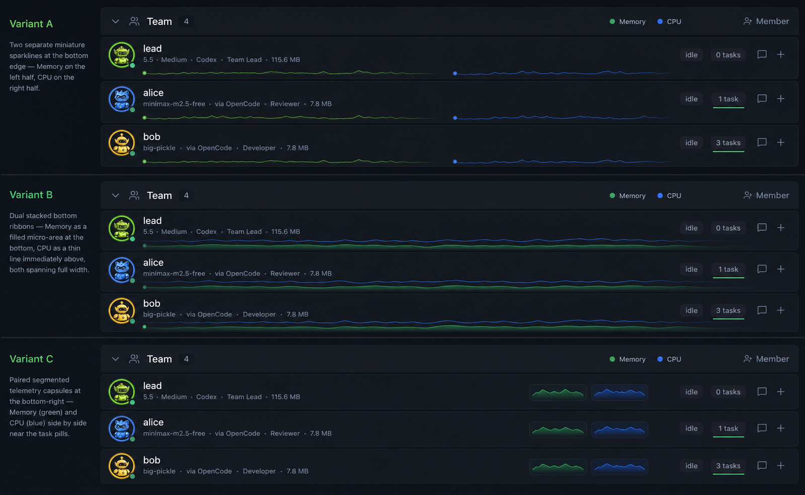

# Member Runtime Telemetry Reference

Design reference for participant-card runtime telemetry:

Chosen direction: Variant B.

- Memory history renders as a subtle green filled micro-area at the bottom of each member row.
- CPU history renders as a thin blue line immediately above the memory band.
- The strip stays behind row content and uses low contrast so member names, model labels, task pills, and icons remain readable.
- Runtime history is owned by the main process and attached to `TeamAgentRuntimeSnapshot`, not accumulated in React components.
