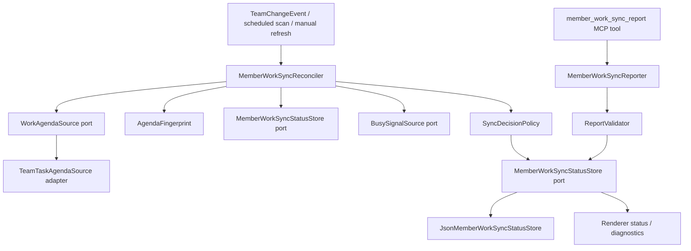
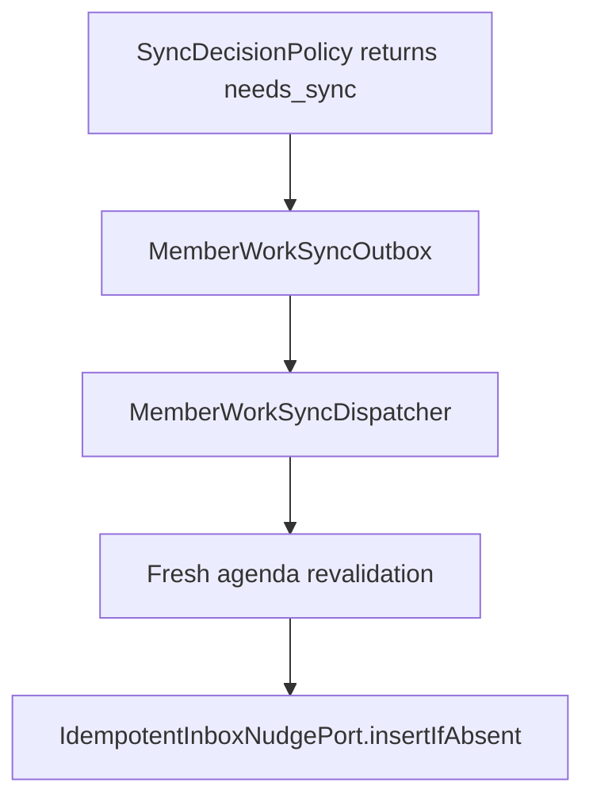

# Member Work Sync Control Plane Plan

**Status:** Phase 1 and Phase 1.5 observability implemented, Phase 2 deferred until shadow metrics are reviewed
**Scope:** Team management, task work synchronization, agent work coordination  
**Primary repo:** `claude_team`  
**Secondary write-boundary repo:** `agent_teams_orchestrator` / `agent-teams-controller`  
**Feature name:** `member-work-sync`

---

## 1. Summary

Build a shadow-first control plane that lets the app determine whether each teammate has seen and acknowledged the current actionable work state.

This is not a simple "ping when agent is idle" feature. The app owns the truth:

- the current actionable work agenda;
- the agenda fingerprint;
- whether an agent report is valid for that fingerprint;
- whether a future nudge would be needed;
- whether watchdog remains responsible for semantic task stalls.

Recommended implementation:

**Phase 1: Shadow-first `member-work-sync` control plane**  
`🎯 10   🛡️ 10   🧠 5`, roughly `850-1150 LOC`.

Phase 1 does not send nudges. It computes agenda/fingerprint/status, validates `member_work_sync_report`, stores status conditions, and exposes diagnostics. This avoids agent spam and gives real metrics before behavior changes.

Phase 2 adds durable nudges only after Phase 1 metrics prove that fingerprint churn and false positives are low.

Current implementation note:

- Phase 1 is intentionally shadow-only: it computes agendas, fingerprints, report tokens, reports, persisted status, passive queue reconciliation, startup replay, diagnostics, metrics, and read-only renderer view models.
- Phase 1 does not insert inbox messages, send nudges, mark tasks/messages read, or change `TeamTaskStallMonitor` semantics.
- Phase 2 must not start until real shadow metrics confirm that `needs_sync` churn and false positives are acceptably low.

Patterns used:

- Kubernetes-style level-triggered reconcile: recompute from current desired/current state instead of trusting events.
- Queue visibility / lease pattern: `still_working` suppresses duplicate nudges for a bounded time, but never completes work.
- Durable outbox pattern: Phase 2 sends rare nudges through idempotent outbox records, not direct side effects in reconcilers.
- Concurrency-key pattern: one pending nudge per `(team, member, agendaFingerprint)`.
- Gastown-style control loop idea: prefer explicit coordination state over ad hoc idle pings.
- GoClaw-style lightweight worker signals: tool/turn events are useful triggers, but not proof.

---

## 2. Why This Exists

Current failure class:

1. A teammate has assigned tasks or review work.
2. The agent stops after saying "done", "standing by", "continuing", or "I will work on it".
3. The UI may still show "working on" or the task remains incomplete.
4. Existing watchdog eventually catches some stalls, but it is task-specific and delayed.
5. A naive ping-after-idle loop would spam agents and conflict with the watchdog.

The missing layer is a fast consistency loop:

```text
Does this member know the current actionable work agenda?
```

That question is different from:

```text
Did delivery succeed?
Is the runtime alive?
Is the member making meaningful progress?
Did the task complete?
```

Those remain separate systems.

---

## 3. Design Principles

### 3.1 Clean Architecture

The feature follows `docs/FEATURE_ARCHITECTURE_STANDARD.md`.

```text
src/features/member-work-sync/
  contracts/
  core/
    domain/
    application/
  main/
    composition/
    adapters/
      input/
      output/
    infrastructure/
  preload/
  renderer/
```

Rules:

- `core/domain` contains pure business rules.
- `core/application` orchestrates use cases through ports.
- `main/adapters/output` adapts current team/task/runtime services.
- `main/infrastructure` owns filesystem stores, locks, versioning.
- `renderer` only displays status and diagnostics.
- controller/orchestrator owns only the MCP write boundary for `member_work_sync_report`.

### 3.2 SOLID

- **SRP:** agenda building, fingerprinting, report validation, decision policy, persistence, and dispatch are separate classes.
- **OCP:** Phase 2 nudges add a new outbox port without rewriting Phase 1 domain logic.
- **LSP:** tests can replace real adapters with fakes without special cases.
- **ISP:** ports are narrow: `WorkAgendaSource`, `MemberWorkSyncStatusStore`, `BusySignalSource`, `Clock`, `Logger`.
- **DIP:** application layer depends on interfaces, not `TeamDataService`, `TeamTaskReader`, Electron, or filesystem.

### 3.3 Naming Convention

Use `MemberWorkSync` for implementation types and files.

Preferred public names:

- feature folder: `src/features/member-work-sync`
- agent report tool: `member_work_sync_report`
- optional read helper: `member_work_sync_status`
- message kind for Phase 2 nudges: `member_work_sync_nudge`

Avoid introducing new board-prefixed sync type names. "Board" is still part of the domain explanation, but the feature name should stay focused on member actionable work.

### 3.4 Domain Coupling Is Intentional

The feature is strongly coupled to the task board domain. That is correct.

It must depend on:

- `TeamTask`;
- task owner;
- review state;
- blockers;
- clarification state;
- workflow history events;
- configured team members.

It must not depend on:

- React state;
- kanban UI columns as presentation;
- CSS/layout;
- raw OpenCode transcript quirks;
- prompt wording;
- current animation/spinner state.

The core abstraction is not "kanban board UI". It is:

```text
authoritative actionable work graph
```

---

## 4. Key Terms

### 4.1 Actionable Work Agenda

A canonical list of work items that currently require action from a specific member.

It can include:

- implementation work owned by the member;
- review work assigned to the member;
- clarification follow-up owned by the member;
- blocked work that requires explicit blocker reporting;
- tasks that became actionable because another task unblocked them.

It should not include:

- completed tasks;
- deleted tasks;
- tasks owned by another member unless this member is reviewer/action owner;
- informational comments;
- runtime heartbeats;
- tool logs;
- UI-only ordering.

### 4.2 Agenda Fingerprint

A stable hash of the canonical agenda.

Example:

```text
agenda:v1:7d6d337b5f91c1e9a2f7f6e9d2f0b1013e145db1...
```

The fingerprint is the work-sync equivalent of `observedGeneration`.

Agent reports are valid only for the current fingerprint.

### 4.3 Work Sync Report

An agent-side report for a specific fingerprint.

It is not trusted blindly. The app validates it against current agenda.

Allowed states:

- `still_working`
- `blocked`
- `caught_up`

### 4.4 Lease

A time-limited report that suppresses sync nudges.

Important:

- `still_working` is a lease.
- `blocked` is a lease with board evidence.
- `caught_up` is not a free-form lease. It is only accepted when agenda is empty.
- A lease is not task progress.

---

## 5. Non-Goals

Phase 1 does not:

- send nudges to agents;
- auto-complete tasks;
- mark inbox messages read;
- replace `TeamTaskStallMonitor`;
- change OpenCode delivery ledger semantics;
- interpret model text as truth;
- read UI kanban layout as source of truth.

Phase 1 may add prompt/tool instructions, but they must be advisory. The server validates everything.

---

## 6. Architecture Overview



Phase 2 extends this:



---

## 7. Feature Directory Plan

```text
src/features/member-work-sync/
  index.ts

  contracts/
    index.ts
    types.ts
    ipc.ts

  core/
    domain/
      ActionableWorkAgenda.ts
      AgendaFingerprint.ts
      MemberWorkSyncReportValidator.ts
      SyncDecisionPolicy.ts
      MemberWorkSyncConditions.ts
      memberName.ts
    application/
      MemberWorkSyncReconciler.ts
      MemberWorkSyncReporter.ts
      MemberWorkSyncDiagnosticsReader.ts
      ports.ts

  main/
    composition/
      createMemberWorkSyncFeature.ts
    adapters/
      input/
        registerMemberWorkSyncIpc.ts
      output/
        TeamTaskAgendaSource.ts
        TeamMemberRosterSource.ts
        MemberBusySignalSource.ts
        WatchdogCooldownSource.ts
    infrastructure/
      JsonMemberWorkSyncStore.ts
      MemberWorkSyncStorePaths.ts
      MemberWorkSyncQueue.ts
      HmacReportTokenAdapter.ts

  preload/
    index.ts

  renderer/
    adapters/
      memberWorkSyncStatusViewModel.ts
    hooks/
      useMemberWorkSyncStatus.ts
    ui/
      MemberWorkSyncBadge.tsx
      MemberWorkSyncDetails.tsx
```

Phase 1 can omit preload/renderer UI if we expose diagnostics only through existing debug surfaces, but the feature should reserve contracts now.

---

## 8. Core Domain Types

## 8.0 Highest-Risk Domain Decisions

These are the places most likely to create bugs if implemented casually.

| Area | Main failure mode | Required guard | Required tests |
|---|---|---|---|
| Agenda semantics | False `NeedsSync`, hidden pending work, or wrong owner | Build only from canonical task/review/blocker facts and document every include/exclude rule | pending owned task, review task, blocked task, clarification task, completed task |
| Fingerprint | Churn from comments, timestamps, retries, or runtime liveness | Stable canonical JSON, explicit include/exclude list, transition diagnostics | timestamp-only change, weak comment, owner change, blocker change |
| Reviewer resolution | Old review cycle becomes current work | Current-cycle review resolver, never "last reviewer wins" | approved old review plus new work, needs-fix reopening, unresolved reviewer |
| Report validation | Model hides work with `caught_up` or stale lease | Validate against fresh app-side agenda, fail closed, return current preview | stale fingerprint, non-empty caught-up, foreign task id |
| Identity authority | Model claims `user`, provider id, lead alias, or another teammate | Treat `from` as a claim, require runtime context or report token for accepted leases | codex-as-author, user-as-author, session jack/from bob, removed member |
| Controller fallback | Controller claims lease while app is down | Raw intent only, never accepted lease, replay through app validator | app unavailable, duplicate intent replay, stale intent |
| Event queue | File/change burst creates reconcile storm | Per-member coalescing, quiet window, bounded concurrency, no synchronous emitter work | burst coalescing, stop drains queue, removed member drop |
| Team lifecycle | Stopped team still accepts reports or schedules nudges | Explicit lifecycle port checked before reconcile, report acceptance, and dispatch | stopped team report, queued item after stop, restart after stop |
| Store writes | Lost update or corrupted JSON | Versioned store, file lock, atomic write, bounded history, quarantine | concurrent update, invalid JSON, future schema |
| Watchdog interaction | Double nudge or false progress proof | Work sync reports are not progress, shared cooldown only in Phase 2 | watchdog cooldown respected, watchdog still fires on real stall |

Phase 1 success depends more on these guards than on UI.

Risk ranking:

1. Agenda semantics - `🎯 8   🛡️ 9   🧠 7`, `250-400 LOC`.
   This is the hardest part because it decides what the system believes is real work.
2. Identity authority and report-token validation - `🎯 8   🛡️ 9   🧠 6`, `180-320 LOC`.
   This prevents the model from suppressing another member's sync state or repeating the earlier `codex` / `user` author bug.
3. App/controller validation split - `🎯 8   🛡️ 9   🧠 6`, `150-260 LOC`.
   This prevents MCP tool calls from becoming untrusted writes.
4. Queue, locking, and outbox boundaries - `🎯 9   🛡️ 9   🧠 6`, `220-380 LOC`.
   This prevents spam, deadlocks, duplicate nudges, and startup storms.
5. Team lifecycle gating - `🎯 9   🛡️ 9   🧠 4`, `80-160 LOC`.
   This prevents "team is off but background agents still report" behavior from becoming accepted sync state.

Pre-coding hardening checklist:

- Write agenda-builder tests before adapters. If the agenda is wrong, every later layer behaves confidently wrong.
- Implement fingerprint diagnostics before Phase 2. Without transition reasons, churn bugs are hard to debug after nudges exist.
- Keep controller fallback intentionally weak. It can record intent, but cannot accept a lease.
- Add identity tests before report persistence. `from` is not authority unless runtime context or report token proves it.
- Treat every app restart as a replay scenario. Pending intents, queued reconciles, and stale reports must be safe to process again.
- Make every Phase 2 side effect idempotent before adding the dispatcher.
- Add one explicit kill switch per side-effect class: reconcile/status, report acceptance, and nudges.
- Do not merge watchdog and work-sync concepts. Work-sync is agenda observation; watchdog is semantic progress.

Failure-mode matrix:

| Failure | Safe behavior |
|---|---|
| Agenda source throws | record diagnostic, no accepted report, no nudge |
| Roster source cannot resolve member | reject report, drop queued reconcile |
| Team is stopped/cancelled | reject reports as inactive, drop queued reconcile, send no nudges |
| Controller cannot reach app validator | append pending intent only |
| Runtime identity and payload `from` disagree | reject with `identity_mismatch`, write no intent |
| Report token missing in full feature mode | reject or pending diagnostics, no accepted lease |
| Provider id appears as member name | reject unless roster has that exact configured member |
| Pending intent becomes stale before replay | reject/supersede intent, no lease |
| Fingerprint changes while report writes | app validator re-reads and rejects stale report |
| Queue receives 100 task events | one reconcile per member after quiet window |
| Store lock timeout | leave old status intact, record diagnostic |
| Phase 2 dispatcher crashes after inbox insert | deterministic message id prevents duplicate |
| Watchdog already nudged same member/task | Phase 2 work-sync nudge suppressed by cooldown |

Codebase-specific integration hazards:

| Existing area | Risk for this feature | Required decision |
|---|---|---|
| `src/shared/types/team.ts` | Plan drifts from real `TeamTask` fields | Use `historyEvents`, `reviewState`, `needsClarification`, `blockedBy`, `blocks`, `comments` exactly as typed |
| `TeamDataService` reviewer helpers | Duplicate stale reviewer logic | Extract or reuse current-cycle resolver instead of creating a third interpretation |
| `stallMonitor/reviewerResolution.ts` | Existing resolver can return old `review_approved` actor | Do not reuse it blindly for work-sync action ownership |
| `TeamTaskStallMonitor.noteTeamChange()` | Two background systems may react to same events | Work-sync uses its own queue and never calls stall monitor |
| `VersionedJsonStore` | New store could reimplement locking/quarantine badly | Wrap or reuse this pattern in member-work-sync infrastructure |
| `TeamTaskWriter` locks | Nested task lock plus sync-store lock can deadlock | Read task snapshot first, release, then write sync store |
| `TeammateToolTracker` | Tool finish may be mistaken for completion | Use only as busy/trigger signal |
| `RuntimeDeliveryService` / OpenCode ledger | Pending delivery may cause premature sync nudge | Treat pending delivery as busy until quiet window expires |

Most important code alignment:

```text
Action ownership comes from TeamTask board state.
Current activity comes from tracker/ledger only as suppression.
Progress quality comes from TaskStallMonitor only.
```

If implementation starts parsing transcript text to decide agenda ownership, stop and redesign. That crosses the boundary into watchdog semantics.

Real type alignment:

- `TeamTask.reviewState` is derived, not the only authority.
- `TeamTaskWithKanban.reviewer` can contain kanban overlay reviewer state.
- `TeamTask.historyEvents` is append-only workflow history and must be used for current-cycle proof.
- `TaskHistoryEvent.type` uses `review_changes_requested`, not generic `changes_requested`.
- `TaskHistoryEvent.type` uses `status_changed` with `to`, not separate `task_start` / `task_complete` event names.

Implementation must compile against `src/shared/types/team.ts` before writing any adapter code. If a planned event name is not in that file, the plan is wrong, not the type.

### 8.1 Actionable Work Item

```ts
export type ActionableWorkKind =
  | 'work'
  | 'review'
  | 'clarification'
  | 'blocked_dependency';

export type ActionableWorkPriority =
  | 'normal'
  | 'review_requested'
  | 'blocked'
  | 'needs_clarification';

export interface ActionableWorkItem {
  taskId: string;
  displayId?: string;
  subject: string;
  kind: ActionableWorkKind;
  assignee: string;
  priority: ActionableWorkPriority;
  reason: string;
  evidence: {
    status: string;
    owner?: string;
    reviewer?: string;
    reviewState?: string;
    needsClarification?: 'lead' | 'user';
    blockerTaskIds?: string[];
    blockedByTaskIds?: string[];
    historyEventIds?: string[];
  };
}
```

### 8.2 Agenda

```ts
export interface ActionableWorkAgenda {
  teamName: string;
  memberName: string;
  generatedAt: string;
  items: ActionableWorkItem[];
  sourceRevision?: string;
}
```

`sourceRevision` is optional in Phase 1. If a reliable board revision exists later, it should be included.

### 8.2.1 Agenda Semantics

The agenda is a per-member operational projection, not a full task list.

Include a task item only when the member has a concrete next action:

| Task state | Member relation | Agenda item |
|---|---|---|
| `pending` | `owner === member` | `work` |
| `in_progress`, not in review | `owner === member` | `work` |
| `reviewState === review` | member is current-cycle reviewer | `review` |
| `needsClarification` set | owner/member must respond or escalate | `clarification` when owner is member |
| blocked by dependency | owner still owns blocked work | `blocked_dependency` when owner is member |

Exclude:

- completed/deleted tasks;
- pending tasks not assigned to member;
- tasks in review where member is original owner but not reviewer;
- stale reviewer assignments from previous review cycles;
- comments that only say "starting", "ok", "will do";
- work-sync report records.

Important: `blocked_dependency` means "the member owns blocked work and may need to report/wait", not "the member must fix the dependency". If the dependency is owned by another member, that other member gets their own agenda item from their task state.

Important: `pending` + owner member is actionable. Otherwise a newly assigned task can be invisible until the agent calls `task_start`, which is exactly the class of "agent stopped but still has work" bug this feature exists to catch.

Clarification semantics:

- If `needsClarification === 'lead'` and the task owner is the member, the member agenda should include a `clarification` item: the member must unblock by asking the lead or updating the task.
- If `needsClarification === 'user'` and the task owner is the member, include a `clarification` item only if the member is expected to route the question through team messaging or task comments.
- If the task owner is not the member, do not assign the clarification to this member unless the current-cycle reviewer resolver says this member owns the current action.
- If uncertain, include no item and store a diagnostic reason. A false positive nudge is worse than a missing diagnostic in Phase 1.

Blocked dependency semantics:

- Include a `blocked_dependency` item for the blocked task owner.
- Do not include a dependency task for the blocked task owner unless they also own that dependency task.
- `blocked_dependency` permits `blocked` report only when the dependency/blocker evidence is still present in board state.
- If the blocker disappears, the fingerprint changes and old `blocked` leases become stale.

Concrete action owner table:

| Situation | Action owner |
|---|---|
| owned pending task | owner |
| owned in-progress task | owner |
| task in active review | current-cycle reviewer |
| changes requested / returned to work | owner |
| clarification on owned task | owner |
| task completed | none |
| task deleted | none |
| unowned task | none |

Agenda builder must be deterministic and monotonic per board snapshot:

- Deterministic: same task snapshot always produces the same agenda items in the same order.
- Monotonic: adding unrelated comments or runtime logs must not remove an agenda item.
- Conservative: if ownership is ambiguous, prefer no item plus diagnostic over assigning to the wrong member.
- Board-only: do not inspect transcript text, model messages, or UI labels to determine action ownership.

Hard edge cases:

| Case | Expected agenda behavior |
|---|---|
| Task owner changed from `bob` to `jack` | Bob agenda loses item, Jack agenda gains item, fingerprint changes for both |
| Task moved to review with reviewer `alice` | Owner agenda loses work item, Alice agenda gains review item |
| Review asks for changes | Reviewer agenda loses item, owner agenda gains work item |
| Task has stale reviewer from previous cycle | No review item unless current-cycle resolver proves it |
| Task is blocked by another task | Owner gets `blocked_dependency`; dependency owner is handled separately |
| Task has only "starting work" comment | No fingerprint change |
| Member removed from config | Agenda returns null and queued reconciles drop |
| Lead owns task | Lead agenda can include it; teammates do not inherit it |

Implementation guidance:

```ts
function buildAgendaForMember(input: {
  tasks: TeamTask[];
  member: ActiveTeamMember;
  reviewerResolver: ReviewerResolverPort;
}): ActionableWorkAgenda {
  const items = input.tasks.flatMap((task) => {
    if (isTaskTerminal(task)) {
      return [];
    }

    const reviewItem = mapCurrentReviewItem(task, input.member, input.reviewerResolver);
    if (reviewItem) {
      return [reviewItem];
    }

    return mapOwnedTaskItem(task, input.member) ?? [];
  });

  return sortAgenda(input.member, items);
}
```

Do not let `mapOwnedTaskItem` create an item for a task currently owned by another member. Cross-member dependencies should be modeled as evidence, not ownership transfer.

### 8.2.2 Current-Cycle Review Resolution

Review ownership must use the current review cycle.

Recommended algorithm:

1. Find the most recent review-cycle opening event for the task.
2. Ignore review events before the latest return-to-work / needs-fix / completed transition.
3. Resolve reviewer from current-cycle `review_started` first, then current-cycle `review_requested`.
4. If reviewer is still unresolved, do not assign review agenda to a teammate.
5. Do not use old `review_approved` actor as the current reviewer.

This mirrors the conservative direction used by the stall monitor and avoids assigning work to a stale reviewer.

Pseudo-code:

```ts
function resolveCurrentCycleReviewer(task: TeamTask): string | null {
  if (task.reviewState !== 'review') {
    return null;
  }

  const historyEvents = task.historyEvents ?? [];

  const cycleStartIndex = findLatestIndex(historyEvents, (event) =>
    event.type === 'review_requested' ||
    event.type === 'review_started'
  );

  const returnToWorkIndex = findLatestIndex(historyEvents, (event) =>
    event.type === 'review_changes_requested' ||
    (event.type === 'status_changed' &&
      (event.to === 'in_progress' || event.to === 'completed' || event.to === 'deleted'))
  );

  if (cycleStartIndex < 0) {
    return null;
  }

  if (returnToWorkIndex > cycleStartIndex) {
    return null;
  }

  const currentCycleEvents = historyEvents.slice(cycleStartIndex);
  return (
    findLastReviewer(currentCycleEvents, 'review_started') ??
    findLastReviewer(currentCycleEvents, 'review_requested') ??
    null
  );
}
```

Hard rule: if this resolver cannot prove a current reviewer, it returns `null`. It must not fall back to `task.owner`, lead, or a previously active reviewer. That keeps Phase 1 conservative and prevents accidental reassignment.

Existing-code warning:

`stallMonitor/reviewerResolution.ts` can resolve from `review_approved` history actor because stall detection needs historical evidence. Member-work-sync needs current action ownership, so it must not directly use that function unless the function is split into two explicit policies:

- `resolveCurrentActionReviewer()` for work-sync and task briefing action ownership;
- `resolveHistoricalReviewActor()` for stall evidence and diagnostics.

Recommended extraction:

```text
src/main/services/team/reviewerResolution/currentReviewCycle.ts
src/main/services/team/reviewerResolution/historicalReviewEvidence.ts
```

Do not hide the policy difference behind one generic `resolveReviewerFromHistory()` name.

Kanban overlay rule:

- If `TeamTaskWithKanban.reviewer` is present and task `reviewState === 'review'`, it can be used as current action reviewer.
- If kanban reviewer is missing, fall back to current-cycle history resolver.
- If both exist and conflict, prefer kanban reviewer for current UI state but record a diagnostic conflict.
- Do not hash diagnostic conflicts into agenda fingerprint unless the action owner changes.

This matches the current app shape: task files carry history, while UI DTOs may add kanban reviewer overlay.

### 8.3 Fingerprint

```ts
export interface AgendaFingerprintResult {
  version: 'agenda:v1';
  fingerprint: string;
  canonicalJson: string;
}
```

Fingerprint must be deterministic.

It should sort:

- items by `taskId`, then `kind`;
- arrays inside evidence;
- object keys.

It must exclude:

- `generatedAt`;
- raw comments;
- tool logs;
- runtime status;
- sync report timestamps.

It must also exclude low-signal self updates that do not change actionable ownership:

- "starting", "начинаю", "беру в работу";
- acknowledgement-only comments;
- member work-sync reports;
- delivery retry markers;
- runtime liveness changes.

It must include only facts that change the member agenda:

- owner/reviewer/action owner;
- task status and review state;
- blocker/dependency/clarification state;
- current-cycle review assignment;
- new actionable user/lead request;
- task creation/deletion when it affects this member.

Implementation split:

- `core/domain` builds canonical data and stable JSON only.
- `core/application` depends on a `HashPort`.
- `main/infrastructure` provides the Node `sha256` implementation.

Domain example:

```ts
export function buildCanonicalAgendaJson(agenda: ActionableWorkAgenda): string {
  const canonical = {
    teamName: agenda.teamName,
    memberName: agenda.memberName,
    items: agenda.items.map((item) => ({
      taskId: item.taskId,
      displayId: item.displayId ?? null,
      kind: item.kind,
      assignee: item.assignee,
      priority: item.priority,
      reason: item.reason,
      evidence: sortObjectDeep(item.evidence),
    })),
  };

  return stableStringify(canonical);
}
```

Application example:

```ts
export interface HashPort {
  sha256Hex(input: string): string;
}

export class AgendaFingerprintService {
  constructor(private readonly hash: HashPort) {}

  fingerprint(agenda: ActionableWorkAgenda): AgendaFingerprintResult {
    const canonicalJson = buildCanonicalAgendaJson(agenda);
    const hash = this.hash.sha256Hex(canonicalJson);

    return {
      version: 'agenda:v1',
      fingerprint: `agenda:v1:${hash}`,
      canonicalJson,
    };
  }
}
```

Infrastructure example:

```ts
import { createHash } from 'crypto';

export class NodeHashAdapter implements HashPort {
  sha256Hex(input: string): string {
    return createHash('sha256').update(input).digest('hex');
  }
}
```

Do not import Node `crypto` in `core/domain` or `core/application`.

Avoid:

```ts
// Bad: framework/runtime dependency inside domain logic.
import { createHash } from 'crypto';
```

The final output still has this shape:

```ts
function exampleResult(hash: string, canonicalJson: string): AgendaFingerprintResult {
  return {
    version: 'agenda:v1',
    fingerprint: `agenda:v1:${hash}`,
    canonicalJson,
  };
}
```

### 8.3.1 Fingerprint Stability Contract

Fingerprint changes should mean: "the member's actionable agenda changed".

It should not mean:

- a task file mtime changed;
- an agent wrote "I am starting";
- a runtime process restarted;
- a delivery retry marker was appended;
- a status condition timestamp changed.

Phase 1 must track `fingerprintChangeCount` and store the last few fingerprint transition reasons. If this count rises without visible agenda changes, do not enable Phase 2 nudges.

Recommended transition diagnostic:

```ts
export interface AgendaFingerprintTransition {
  from: string | null;
  to: string;
  changedTaskIds: string[];
  changedReasons: Array<
    | 'task_added'
    | 'task_removed'
    | 'owner_changed'
    | 'reviewer_changed'
    | 'status_changed'
    | 'review_state_changed'
    | 'blocker_changed'
    | 'clarification_changed'
  >;
  changedAt: string;
}
```

This diagnostic is not part of the hash. It is stored only to debug churn.

### 8.4 Report

```ts
export type MemberWorkSyncReportState =
  | 'still_working'
  | 'blocked'
  | 'caught_up';

export interface MemberWorkSyncTrustedContext {
  origin: 'mcp' | 'app' | 'intent_replay';
  expectedTeamName?: string;
  expectedMemberName?: string;
  runtimeSessionId?: string;
  providerId?: string;
  receivedAt: string;
  identitySource:
    | 'runtime_session'
    | 'process_team'
    | 'report_token'
    | 'claimed_member'
    | 'unknown';
}

export interface MemberWorkSyncReportInput {
  teamName: string;
  memberName: string;
  agendaFingerprint: string;
  state: MemberWorkSyncReportState;
  taskIds?: string[];
  blockerCommentId?: string;
  note?: string;
  reportToken?: string;
  reportedAt?: string;
  trustedContext: MemberWorkSyncTrustedContext;
}
```

Stored report:

```ts
export interface MemberWorkSyncReportRecord extends MemberWorkSyncReportInput {
  id: string;
  accepted: boolean;
  rejectedReason?: string;
  observedFingerprint: string;
  expiresAt?: string;
  acceptedAt?: string;
  lastSeenAt: string;
  trustedIdentity: boolean;
}
```

Report identity must be stable enough for idempotent replay.

Recommended accepted/rejected report id:

```ts
function buildReportId(input: {
  teamName: string;
  memberName: string;
  agendaFingerprint: string;
  state: MemberWorkSyncReportState;
  taskIds: string[];
  blockerCommentId?: string;
}): string {
  return `member-work-sync-report:${stableHash(input)}`;
}
```

Do not include `reportedAt` or `note` in this id. A repeated report for the same lease key should update `lastSeenAt` and latest diagnostic note, not create unbounded duplicates. `note` is useful for diagnostics but must not affect lease identity.

### 8.4.1 Clock And Lease Authority

Lease time is always computed from app-owned time, never model-supplied time.

Rules:

- `trustedContext.receivedAt` is the authority for `acceptedAt`, `lastSeenAt`, and lease expiry.
- `reportedAt` is optional diagnostics only. It must not extend or shorten a lease.
- If the system clock jumps, lease expiry is recomputed from stored app timestamps on next read.
- Tests must use an injected `ClockPort`; no direct `Date.now()` in domain or application use cases.
- A replayed pending intent uses the replay app time for validation, but the original intent time stays in diagnostics.

This prevents a model from keeping itself quiet forever by sending a future timestamp.

### 8.4.2 Identity Authority

`memberName` / MCP `from` is a claim, not authority.

Accepted reports that suppress nudges require one of these identity proofs:

- trusted runtime session context says the caller is the same configured member;
- process/team metadata says the caller is the same configured member;
- app-generated `reportToken` validates for `(teamName, memberName, agendaFingerprint)`.

If none is available, the report can be stored as rejected diagnostics, but it must not create a valid lease.

Identity hard rules:

- All identity comparisons use canonical team/member names, preserving display case only after validation.
- `user` and `system` can never submit a member work-sync report.
- Provider ids such as `codex`, `anthropic`, `opencode`, or `gemini` are not member names unless the team explicitly has a member with that exact configured name.
- `lead` / `team-lead` aliases map only to the configured lead member and only for the lead's own agenda.
- A lead alias cannot report for another teammate.
- A runtime-bound report for `expectedMemberName="jack"` with `from="bob"` is rejected as `identity_mismatch`.
- A report for a removed/inactive member is rejected before intent persistence.
- Identity mismatch is terminal for that call; do not write a pending intent that could later become accepted.

This deliberately repeats the earlier `codex` / `user` author bug prevention at the work-sync boundary.

Retention:

- keep latest accepted report per member/fingerprint;
- keep latest rejected report per member/fingerprint/reason;
- keep a bounded history, recommended `20` report records per member or `7` days;
- never let report history affect fingerprint;
- never treat a pending intent as accepted history.

### 8.5 Conditions

```ts
export type MemberWorkSyncConditionType =
  | 'CaughtUp'
  | 'ValidLease'
  | 'NeedsSync'
  | 'SuppressedBusy'
  | 'SuppressedCooldown'
  | 'StaleReport'
  | 'InvalidReport';

export interface MemberWorkSyncCondition {
  type: MemberWorkSyncConditionType;
  status: 'true' | 'false' | 'unknown';
  observedFingerprint: string;
  reason: string;
  message: string;
  lastTransitionAt: string;
}
```

Condition examples:

```json
{
  "type": "NeedsSync",
  "status": "true",
  "observedFingerprint": "agenda:v1:abc...",
  "reason": "ActionableAgendaWithoutValidLease",
  "message": "Member has 2 actionable work items and no valid report lease.",
  "lastTransitionAt": "2026-04-29T12:00:00.000Z"
}
```

---

## 9. Application Ports

`core/application/ports.ts`:

```ts
export interface ClockPort {
  now(): Date;
}

export interface LoggerPort {
  debug(message: string, context?: Record<string, unknown>): void;
  warn(message: string, context?: Record<string, unknown>): void;
  error(message: string, context?: Record<string, unknown>): void;
}

export interface WorkAgendaSourcePort {
  getAgenda(input: {
    teamName: string;
    memberName: string;
  }): Promise<ActionableWorkAgenda | null>;
}

export interface MemberRosterSourcePort {
  getMember(input: {
    teamName: string;
    memberName: string;
  }): Promise<{
    name: string;
    providerId?: string;
    active: boolean;
    isLead: boolean;
  } | null>;
}

export interface TeamLifecycleSourcePort {
  getTeamLifecycle(input: {
    teamName: string;
  }): Promise<{
    active: boolean;
    state: 'active' | 'stopped' | 'cancelled' | 'deleted' | 'unknown';
    reason?: string;
  }>;
}

export interface BusySignalSourcePort {
  getBusyState(input: {
    teamName: string;
    memberName: string;
  }): Promise<{
    busy: boolean;
    reason?: 'tool_active' | 'runtime_delivery_pending' | 'launching' | 'recent_activity';
    until?: string;
  }>;
}

export interface MemberWorkSyncStatusStorePort {
  readMemberStatus(input: {
    teamName: string;
    memberName: string;
  }): Promise<MemberWorkSyncStatus | null>;

  updateMemberStatus(input: {
    teamName: string;
    memberName: string;
    updater: (current: MemberWorkSyncStatus | null) => MemberWorkSyncStatus;
  }): Promise<MemberWorkSyncStatus>;
}

export interface ReportTokenPort {
  issue(input: {
    teamName: string;
    memberName: string;
    agendaFingerprint: string;
    issuedAt: Date;
  }): Promise<string>;

  verify(input: {
    teamName: string;
    memberName: string;
    agendaFingerprint: string;
    token: string;
    now: Date;
  }): Promise<{ ok: true } | { ok: false; reason: 'missing' | 'expired' | 'invalid' }>;
}
```

Phase 2 ports:

```ts
export interface MemberWorkSyncOutboxPort {
  ensurePending(input: MemberWorkSyncOutboxEnsureInput): Promise<MemberWorkSyncOutboxItem>;
  claimDue(input: MemberWorkSyncOutboxClaimInput): Promise<MemberWorkSyncOutboxItem[]>;
  markDelivered(input: MemberWorkSyncOutboxMarkDeliveredInput): Promise<void>;
  markSuperseded(input: MemberWorkSyncOutboxMarkSupersededInput): Promise<void>;
}

export interface IdempotentInboxNudgePort {
  insertIfAbsent(input: {
    teamName: string;
    memberName: string;
    messageId: string;
    payloadHash: string;
    payload: MemberWorkSyncNudgePayload;
  }): Promise<{
    inserted: boolean;
    messageId: string;
    conflict?: boolean;
  }>;
}
```

---

## 10. Domain Policies

### 10.1 Report Validation

Rules:

1. Unknown or stopped team -> reject.
2. Unknown member -> reject.
3. Removed/inactive member -> reject.
4. Reserved member names `user` / `system` -> reject.
5. Runtime identity mismatch -> reject without writing an intent.
6. Invalid report token -> reject without writing an accepted lease.
7. Stale fingerprint -> reject with current fingerprint and agenda summary.
8. `caught_up` with non-empty agenda -> reject.
9. `still_working` with empty agenda -> reject with `caught_up` recommendation.
10. `still_working` taskIds must be subset of current agenda task ids.
11. `blocked` requires board evidence.

Validation must be fail-closed. If the validator cannot prove a report is safe, reject it and return the current agenda preview.

Additional rules:

12. `note` is advisory only and never changes validation.
13. `blockerCommentId` must point to a comment on one of the current agenda tasks if provided.
14. A report for a lead agenda cannot be used on behalf of another teammate.
15. `taskIds` must be unique after task-ref normalization.
16. Reports for deleted tasks are rejected.
17. A report with empty `taskIds` and state `still_working` covers all current agenda items.
18. A report with empty `taskIds` and state `blocked` is rejected unless the whole agenda is blocked by board evidence.

Source-of-truth rule:

```text
MCP controller validates identity, schema, and size.
claude_team application validates agenda, fingerprint, leases, blockers, and status writes.
```

The controller must not duplicate agenda policy. If the controller has no live app validation port, it records an intent and returns `pending_validation`. This avoids policy drift where the orchestrator accepts a report that the app would reject.

Hard failure cases:

- agenda source unavailable -> reject or pending intent, never accepted;
- stopped/cancelled team -> reject, never accepted;
- member missing from roster -> reject;
- report for `user` / `system` -> reject;
- runtime/session identity mismatch -> reject, no pending intent;
- invalid report token -> reject, no accepted lease;
- fingerprint not matching current app-side fingerprint -> reject;
- `caught_up` while app-side agenda has items -> reject;
- `blocked` without blocker evidence in the current agenda -> reject.

Agent-facing rejected responses should be corrective, not punitive. For stale/agenda rejections, include current fingerprint and a compact agenda preview so the model can retry correctly. For identity failures, do not include agenda preview for another member.

Validation result contract:

```ts
export type MemberWorkSyncReportValidationReason =
  | 'capability_unavailable'
  | 'team_inactive'
  | 'member_inactive'
  | 'reserved_author'
  | 'unsafe_provider_alias'
  | 'identity_mismatch'
  | 'identity_untrusted'
  | 'team_mismatch'
  | 'invalid_report_token'
  | 'agenda_unavailable'
  | 'stale_fingerprint'
  | 'caught_up_rejected_actionable_items_exist'
  | 'still_working_rejected_empty_agenda'
  | 'task_not_in_current_agenda'
  | 'blocked_rejected_without_evidence'
  | 'invalid_payload';

export type MemberWorkSyncReportValidationResult =
  | {
      ok: true;
      acceptedState: MemberWorkSyncReportState;
      leaseExpiresAt?: string;
    }
  | {
      ok: false;
      reason: MemberWorkSyncReportValidationReason;
      currentFingerprint?: string;
      currentAgendaPreview?: AgendaSummaryItem[];
    };
```

Side-effect rule:

```text
validate() is pure.
report() is the only use case allowed to write accepted/rejected report state.
controller fallback writes only report intents.
```

This keeps SRP clear: validator decides, reporter persists, controller translates MCP input.

Stale report handling:

- Store the rejected report reason for diagnostics.
- Do not update `latestAcceptedReport`.
- Return current fingerprint and preview.
- If the stale report came from a pending intent replay, mark the intent `rejected`.
- Do not enqueue a nudge immediately because the stale response itself is corrective.

Blocked report handling:

- `blocked` must refer to current agenda items.
- If `blockerCommentId` is provided, it must belong to one of those tasks.
- If no `blockerCommentId` is provided, the agenda item must already carry blocker/dependency/clarification evidence.
- Free-text `note` cannot create blocker evidence.

Example:

```ts
export class MemberWorkSyncReportValidator {
  validate(input: {
    report: MemberWorkSyncReportInput;
    agenda: ActionableWorkAgenda;
    currentFingerprint: string;
    memberActive: boolean;
    trustedContext: MemberWorkSyncTrustedContext;
    tokenValidation: { ok: true } | { ok: false; reason: 'missing' | 'expired' | 'invalid' };
  }): MemberWorkSyncReportValidationResult {
    if (!input.memberActive) {
      return { ok: false, reason: 'member_inactive' };
    }

    if (
      input.trustedContext.expectedTeamName &&
      input.trustedContext.expectedTeamName !== input.report.teamName
    ) {
      return { ok: false, reason: 'team_mismatch' };
    }

    if (
      input.trustedContext.expectedMemberName &&
      input.trustedContext.expectedMemberName !== input.report.memberName
    ) {
      return { ok: false, reason: 'identity_mismatch' };
    }

    if (input.report.agendaFingerprint !== input.currentFingerprint) {
      return {
        ok: false,
        reason: 'stale_fingerprint',
        currentFingerprint: input.currentFingerprint,
        currentAgendaPreview: previewAgenda(input.agenda),
      };
    }

    const hasTrustedIdentity =
      input.trustedContext.identitySource === 'runtime_session' ||
      input.trustedContext.identitySource === 'process_team' ||
      input.tokenValidation.ok;
    if (!hasTrustedIdentity) {
      return {
        ok: false,
        reason:
          input.tokenValidation.reason === 'missing'
            ? 'identity_untrusted'
            : 'invalid_report_token',
      };
    }

    if (input.report.state === 'caught_up' && input.agenda.items.length > 0) {
      return {
        ok: false,
        reason: 'caught_up_rejected_actionable_items_exist',
        currentFingerprint: input.currentFingerprint,
        currentAgendaPreview: previewAgenda(input.agenda),
      };
    }

    if (input.report.state === 'still_working') {
      return this.validateStillWorking(input.report, input.agenda);
    }

    if (input.report.state === 'blocked') {
      return this.validateBlocked(input.report, input.agenda);
    }

    return { ok: true, acceptedState: input.report.state };
  }
}
```

### 10.2 Decision Policy

Decision input:

```ts
export interface MemberWorkSyncDecisionInput {
  agenda: ActionableWorkAgenda;
  fingerprint: string;
  latestValidReport: MemberWorkSyncReportRecord | null;
  busyState: MemberBusyState;
  now: Date;
}
```

Decision output:

```ts
export type MemberWorkSyncDecision =
  | { kind: 'caught_up'; conditions: MemberWorkSyncCondition[] }
  | { kind: 'valid_lease'; leaseExpiresAt: string; conditions: MemberWorkSyncCondition[] }
  | { kind: 'suppressed_busy'; reason: string; conditions: MemberWorkSyncCondition[] }
  | { kind: 'needs_sync'; conditions: MemberWorkSyncCondition[] };
```

Policy:

```ts
export class SyncDecisionPolicy {
  decide(input: MemberWorkSyncDecisionInput): MemberWorkSyncDecision {
    if (input.agenda.items.length === 0) {
      return {
        kind: 'caught_up',
        conditions: [conditionCaughtUp(input)],
      };
    }

    if (hasValidLease(input.latestValidReport, input.fingerprint, input.now)) {
      return {
        kind: 'valid_lease',
        leaseExpiresAt: input.latestValidReport.expiresAt!,
        conditions: [conditionValidLease(input)],
      };
    }

    if (input.busyState.busy) {
      return {
        kind: 'suppressed_busy',
        reason: input.busyState.reason ?? 'unknown',
        conditions: [conditionSuppressedBusy(input)],
      };
    }

    return {
      kind: 'needs_sync',
      conditions: [conditionNeedsSync(input)],
    };
  }
}
```

Phase 1 stores `needs_sync` but does not send.

### 10.3 Lease Defaults

Default lease durations should be conservative:

```text
still_working: 10 minutes
blocked: 30 minutes
caught_up: no lease, condition only
```

Reasons:

- `still_working` should suppress noisy sync checks, but not hide long-running stalls.
- `blocked` can reasonably last longer because it must have board evidence.
- `caught_up` is recalculated from empty agenda and should not be trusted after new work appears.

Expired leases are ignored by `SyncDecisionPolicy`.

### 10.4 Shadow Would-Nudge Semantics

Phase 1 may compute `wouldNudgeCount`, but must not enqueue or send.

`wouldNudge` is true only when all are true:

- agenda is non-empty;
- no valid lease for current fingerprint;
- not busy;
- not inside quiet window;
- not suppressed by recent watchdog remediation;
- member is active and not stopped/removed.

This makes Phase 1 metrics close to Phase 2 behavior without changing runtime behavior.

---

## 11. Main Adapters

### 11.1 TeamTaskAgendaSource

Responsibility:

- read current tasks;
- read members/config metadata;
- resolve owner/reviewer/action owner from authoritative task fields and current-cycle history;
- output `ActionableWorkAgenda`.

It should not:

- write files;
- send messages;
- inspect UI kanban presentation;
- parse runtime transcripts;
- classify semantic progress.

Reviewer resolution must be conservative. Prefer the same current-cycle semantics used by stall-monitor review resolution. Do not treat stale review history from a previous cycle as current action ownership.

Pseudo-code:

```ts
export class TeamTaskAgendaSource implements WorkAgendaSourcePort {
  constructor(
    private readonly taskReader: TeamTaskReader,
    private readonly memberResolver: TeamMemberResolverPort,
    private readonly reviewerResolver: ReviewerResolverPort
  ) {}

  async getAgenda(input: {
    teamName: string;
    memberName: string;
  }): Promise<ActionableWorkAgenda | null> {
    const tasks = await this.taskReader.getTasks(input.teamName);
    const activeMember = await this.memberResolver.resolve(input.teamName, input.memberName);
    if (!activeMember?.active) {
      return null;
    }

    const items = tasks.flatMap((task) =>
      this.toActionableItems({
        task,
        memberName: activeMember.name,
      })
    );

    return {
      teamName: input.teamName,
      memberName: activeMember.name,
      generatedAt: new Date().toISOString(),
      items: sortAgendaItems(items),
    };
  }
}
```

Actionable mapping examples:

```ts
function mapWorkItem(task: TeamTask, memberName: string): ActionableWorkItem | null {
  if (task.status !== 'pending' && task.status !== 'in_progress') {
    return null;
  }
  if (task.reviewState === 'review') {
    return null;
  }
  if (!sameMember(task.owner, memberName)) {
    return null;
  }
  if (task.needsClarification) {
    return {
      taskId: task.id,
      displayId: task.displayId,
      subject: task.subject,
      kind: 'clarification',
      assignee: memberName,
      priority: 'needs_clarification',
      reason: `Task needs clarification from ${task.needsClarification}.`,
      evidence: {
        status: task.status,
        owner: task.owner,
        reviewState: task.reviewState,
        needsClarification: task.needsClarification,
      },
    };
  }
  return {
    taskId: task.id,
    displayId: task.displayId,
    subject: task.subject,
    kind: 'work',
    assignee: memberName,
    priority: task.blockedBy?.length ? 'blocked' : 'normal',
    reason: task.blockedBy?.length
      ? 'Owned task is blocked by dependencies.'
      : task.status === 'pending'
        ? 'Owned task is pending and needs to be started, clarified, or declined.'
        : 'Owned task is in progress.',
    evidence: {
      status: task.status,
      owner: task.owner,
      reviewState: task.reviewState,
      blockerTaskIds: task.blocks,
      blockedByTaskIds: task.blockedBy,
    },
  };
}
```

Review mapping:

```ts
function mapReviewItem(args: {
  task: TeamTask;
  memberName: string;
  reviewer: string | null;
}): ActionableWorkItem | null {
  if (args.task.reviewState !== 'review') {
    return null;
  }
  if (!args.reviewer || !sameMember(args.reviewer, args.memberName)) {
    return null;
  }
  return {
    taskId: args.task.id,
    displayId: args.task.displayId,
    subject: args.task.subject,
    kind: 'review',
    assignee: args.memberName,
    priority: 'review_requested',
    reason: 'Task is waiting for this member review.',
    evidence: {
      status: args.task.status,
      owner: args.task.owner,
      reviewer: args.reviewer,
      reviewState: args.task.reviewState,
    },
  };
}
```

### 11.2 MemberBusySignalSource

Inputs:

- active tool calls from `TeammateToolTracker`;
- OpenCode delivery ledger pending states;
- member spawn status launching/restarting;
- recent team/member activity quiet window.

Output:

```ts
export interface MemberBusyState {
  busy: boolean;
  reason?: 'tool_active' | 'runtime_delivery_pending' | 'launching' | 'recent_activity';
  until?: string;
}
```

Phase 1 can keep this conservative:

- if uncertain, return busy for short quiet window;
- better to suppress false `needs_sync` than create noisy status.

Busy signal precedence:

1. active tool call or active runtime turn;
2. runtime delivery pending or retry scheduled;
3. member launch/restart in progress;
4. recent inbox delivery or recent tool finish inside quiet window;
5. unknown runtime state for a configured OpenCode lane.

For Phase 1, unknown should bias toward `busy` for a bounded quiet window, not permanent suppression.

### 11.2.1 Member Work Sync Queue

Do not reconcile synchronously inside `teamChangeEmitter`.

Use a per-team/member queue:

```ts
export interface MemberWorkSyncQueue {
  enqueue(input: {
    teamName: string;
    memberName: string;
    trigger: MemberWorkSyncTrigger;
    runAfterMs?: number;
  }): void;
  start(): void;
  stop(): Promise<void>;
}
```

Queue requirements:

- coalesce duplicate `(teamName, memberName)` entries;
- keep the strongest/most recent trigger reason for diagnostics;
- apply quiet window, default `90_000ms`;
- bounded concurrency, default `2`;
- drop work for removed/stopped teams;
- never send messages in Phase 1;
- expose debug counts for queued/running/dropped entries.

This prevents file watcher bursts from becoming expensive repeated agenda reads.

Implementation details:

- Use one in-memory work item per `(teamName, memberName)`.
- Store `firstQueuedAt`, `lastQueuedAt`, `triggerReasons`, and `runAfter`.
- If a new trigger arrives while the key is queued, merge reasons and push `runAfter` only when the new trigger is later than the existing quiet window.
- If a new trigger arrives while the key is running, mark `rerunRequested` and enqueue one follow-up pass after the current pass finishes.
- Use `setTimeout(...).unref?.()` for delayed work so the queue does not keep the app alive.
- `stop()` must clear timers and wait for current in-flight reconciles to settle.
- Do not persist Phase 1 queue state. Startup reconciliation can recreate safe state from authoritative tasks.

Startup reconciliation:

- on app start / team load, enqueue every active member with trigger `startup_scan`;
- on config/member metadata change, enqueue all active members for that team;
- on task import/migration, enqueue all active members after a longer quiet window;
- if a team is stopped/cancelled, drop queued entries for that team;
- if a member is removed, drop queued entries and keep only bounded diagnostic status.

Event strength order:

```text
config_changed > task_state_changed > review_changed > inbox_delivered > tool_finished > runtime_heartbeat
```

This order is only for diagnostics and queue coalescing. The reconciler still recomputes from fresh state.

Race conditions to test:

| Race | Required behavior |
|---|---|
| task event arrives while reconcile is running | set `rerunRequested`, run exactly one follow-up pass |
| member removed while queued | drop queue item before reading agenda |
| team stopped while queued | drop queue item, do not write status |
| report accepted while queued | reconcile sees latest accepted report and avoids false `NeedsSync` |
| status write fails | retry only through later queue event or startup scan, not tight loop |
| app shutdown during delayed timer | timer cleared, no side effects after stop |

Suggested queue state:

```ts
interface QueuedMemberWorkSyncItem {
  key: string;
  teamName: string;
  memberName: string;
  firstQueuedAt: number;
  lastQueuedAt: number;
  runAfter: number;
  triggerReasons: MemberWorkSyncTrigger[];
  running: boolean;
  rerunRequested: boolean;
}
```

The queue is an adapter/infrastructure concern. The domain must not know it exists.

### 11.3 JsonMemberWorkSyncStore

Use a versioned JSON envelope similar to `VersionedJsonStore`.

Path:

```text
~/.claude/teams/<teamName>/.member-work-sync/status.json
```

Schema:

```ts
export interface MemberWorkSyncStoreData {
  members: Record<string, MemberWorkSyncStatus>;
}
```

Envelope:

```json
{
  "schemaName": "member-work-sync.status",
  "schemaVersion": 1,
  "updatedAt": "2026-04-29T12:00:00.000Z",
  "data": {
    "members": {}
  }
}
```

Store requirements:

- atomic write;
- file lock;
- invalid JSON quarantine;
- future schema quarantine or safe error;
- tests for missing/invalid/future schema.

Reuse requirement:

Prefer adapting the existing OpenCode `VersionedJsonStore` pattern instead of inventing a new JSON store. If direct reuse is awkward because it currently lives under `opencode/store`, extract a generic main-process infrastructure helper first.

Extraction target:

```text
src/main/services/team/versionedJsonStore/VersionedJsonStore.ts
```

Do not deep-import from `opencode/store` into a new feature. That would make member-work-sync depend on OpenCode implementation details and violate dependency direction.

---

## 12. Application Use Cases

### 12.1 Reconcile Member

This use case must be side-effect-light:

- allowed: read ports, compute fingerprint, update member-work-sync status;
- forbidden: send messages, mutate tasks, mark inbox read, launch/restart runtimes;
- forbidden: call `TeamDataService` directly from core/application.

If a future behavior needs a message, write an outbox intent in a separate Phase 2 use case.

```ts
export class MemberWorkSyncReconciler {
  constructor(
    private readonly agendaSource: WorkAgendaSourcePort,
    private readonly rosterSource: MemberRosterSourcePort,
    private readonly lifecycleSource: TeamLifecycleSourcePort,
    private readonly busySource: BusySignalSourcePort,
    private readonly statusStore: MemberWorkSyncStatusStorePort,
    private readonly fingerprintService: AgendaFingerprintService,
    private readonly decisionPolicy: SyncDecisionPolicy,
    private readonly clock: ClockPort,
    private readonly logger: LoggerPort
  ) {}

  async reconcileMember(input: {
    teamName: string;
    memberName: string;
    trigger: MemberWorkSyncTrigger;
  }): Promise<MemberWorkSyncStatus | null> {
    const lifecycle = await this.lifecycleSource.getTeamLifecycle({ teamName: input.teamName });
    if (!lifecycle.active) {
      return null;
    }

    const member = await this.rosterSource.getMember(input);
    if (!member?.active) {
      return null;
    }

    const agenda = await this.agendaSource.getAgenda(input);
    if (!agenda) {
      return null;
    }

    const fingerprint = this.fingerprintService.fingerprint(agenda);
    const busyState = await this.busySource.getBusyState(input);

    return this.statusStore.updateMemberStatus({
      teamName: input.teamName,
      memberName: member.name,
      updater: (current) => {
        const latestValidReport = selectValidReport({
          current,
          fingerprint: fingerprint.fingerprint,
          now: this.clock.now(),
        });

        const decision = this.decisionPolicy.decide({
          agenda,
          fingerprint: fingerprint.fingerprint,
          latestValidReport,
          busyState,
          now: this.clock.now(),
        });

        return buildNextStatus({
          current,
          agenda,
          fingerprint,
          decision,
          trigger: input.trigger,
          now: this.clock.now(),
        });
      },
    });
  }
}
```

### 12.2 Report Sync

```ts
export class MemberWorkSyncReporter {
  constructor(
    private readonly agendaSource: WorkAgendaSourcePort,
    private readonly rosterSource: MemberRosterSourcePort,
    private readonly lifecycleSource: TeamLifecycleSourcePort,
    private readonly statusStore: MemberWorkSyncStatusStorePort,
    private readonly reportTokenPort: ReportTokenPort,
    private readonly fingerprintService: AgendaFingerprintService,
    private readonly validator: MemberWorkSyncReportValidator,
    private readonly clock: ClockPort
  ) {}

  async report(input: MemberWorkSyncReportInput): Promise<MemberWorkSyncReportResult> {
    const lifecycle = await this.lifecycleSource.getTeamLifecycle({ teamName: input.teamName });
    if (!lifecycle.active) {
      return { ok: false, reason: 'team_inactive' };
    }

    const member = await this.rosterSource.getMember(input);
    if (!member?.active) {
      return { ok: false, reason: 'member_inactive' };
    }

    const agenda = await this.agendaSource.getAgenda(input);
    if (!agenda) {
      return { ok: false, reason: 'agenda_unavailable' };
    }

    const fingerprint = this.fingerprintService.fingerprint(agenda);
    const tokenValidation = input.reportToken
      ? await this.reportTokenPort.verify({
          teamName: input.teamName,
          memberName: member.name,
          agendaFingerprint: fingerprint.fingerprint,
          token: input.reportToken,
          now: this.clock.now(),
        })
      : ({ ok: false, reason: 'missing' } as const);

    const validation = this.validator.validate({
      report: input,
      agenda,
      currentFingerprint: fingerprint.fingerprint,
      memberActive: member.active,
      tokenValidation,
      trustedContext: input.trustedContext,
    });

    await this.statusStore.updateMemberStatus({
      teamName: input.teamName,
      memberName: member.name,
      updater: (current) =>
        applyReportValidation({
          current,
          report: input,
          validation,
          agenda,
          fingerprint,
          now: this.clock.now(),
        }),
    });

    return toReportResult(validation, agenda, fingerprint);
  }
}
```

---

## 13. MCP Tool Design

Tool name:

```text
member_work_sync_report
```

Purpose:

```text
Report whether you have observed the current assigned/review work agenda.
```

Write-boundary location:

- The MCP tool is implemented in `agent_teams_orchestrator` / `agent-teams-controller`.
- Full agenda validation lives in `claude_team`.
- The controller reaches app validation through an explicit port/bridge when available.
- If that bridge is not available, the controller records only a pending intent.

This is intentionally not a "smart controller" design. The controller is a write boundary and identity/schema gate, not the business-policy owner.

Cross-repo rollout risk:

`agent_teams_orchestrator` and `claude_team` can be out of sync during development or user upgrades. The new tool must therefore be capability-gated.

Rules:

- Do not add `member_work_sync_report` as a hard required OpenCode readiness tool until both repos support it in the same release path.
- In Phase 1, missing `member_work_sync_report` must not block team launch.
- If the tool is missing, omit work-sync instructions from `task_briefing`/`member_briefing`.
- If the tool exists but app validation bridge is unavailable, return `pending_validation`.
- Do not add a runtime/env flag to require the tool in Phase 1.
- OpenCode readiness tests should prove old required tools still gate launch, while work-sync tools remain optional compatibility capabilities.

Important distinction:

```text
capability-gated means "use it if both sides expose it".
feature-flagged means "runtime branch changes behavior based on env/config".
```

Phase 1 uses capability gating only. That avoids permanent `new vs legacy` branches while still supporting mixed repo versions during development.

Compatibility matrix:

| claude_team | orchestrator/controller | Expected behavior |
|---|---|---|
| no feature | no tool | no work-sync surface |
| app has feature | no tool | status/reconcile only, no report instruction |
| app has feature | tool exists, no app bridge | pending intent only |
| app has feature | tool exists, app bridge live | full report validation |

### 13.1 Current Agenda Read Surface

The report tool needs a current `agendaFingerprint`. The agent must not invent this value.

Preferred Phase 1 read surface:

- extend `task_briefing` with a compact `workSync` block;
- include current `agendaFingerprint`;
- include a short actionable agenda preview;
- include report instructions only when the feature is enabled.

Example `task_briefing` addition:

```json
{
  "workSync": {
    "feature": "member-work-sync",
    "agendaFingerprint": "agenda:v1:abc...",
    "reportToken": "wrs:v1:short-lived-token",
    "state": "needs_sync",
    "actionableCount": 2,
    "items": [
      {
        "taskRef": "#00d1e081",
        "kind": "work",
        "reason": "Owned task is in progress."
      }
    ],
    "reportTool": "member_work_sync_report"
  }
}
```

Optional fallback read tool:

```text
member_work_sync_status
```

Use it only if extending `task_briefing` becomes too invasive. Prefer `task_briefing` because the agent already uses it to understand work context.

Read surface requirements:

- must be generated from the same `WorkAgendaSourcePort` and `AgendaFingerprintService` as the reconciler;
- must not have a separate fingerprint implementation;
- must include no more than a compact agenda preview;
- must include `reportToken` only for the requesting member's own agenda;
- must omit raw comments and large task descriptions by default;
- must make clear that the fingerprint can become stale after task changes;
- must not expose other members' full agenda unless the caller is lead.

If `task_briefing` is extended, add tests that existing consumers still receive the old fields unchanged.

Prompt pollution guard:

- Do not repeat the full work-sync schema in every briefing.
- Include the report instruction only when `state === 'needs_sync'` or a stale report was just rejected.
- If state is `caught_up`, include a tiny status line only.
- If state is `valid_lease`, include lease expiry only when useful for debugging.
- Keep preview item text below `160` chars each.
- Never include raw comments in `workSync.items`.

Recommended compact text rendering:

```text
Work sync: agendaFingerprint=agenda:v1:abc123 state=needs_sync actionable=2.
When you have reviewed this agenda, call member_work_sync_report with this fingerprint and reportToken.
```

Do not add a second "primary queue" next to `task_briefing`. Work-sync is metadata about the same queue.

Input schema:

```json
{
  "type": "object",
  "properties": {
    "from": {
      "type": "string",
      "description": "Your configured teammate name."
    },
    "agendaFingerprint": {
      "type": "string"
    },
    "reportToken": {
      "type": "string",
      "description": "Short-lived report token from your current workSync briefing."
    },
    "state": {
      "type": "string",
      "enum": ["still_working", "blocked", "caught_up"]
    },
    "taskIds": {
      "type": "array",
      "items": { "type": "string" }
    },
    "blockerCommentId": {
      "type": "string"
    },
    "note": {
      "type": "string"
    }
  },
  "required": ["from", "agendaFingerprint", "reportToken", "state"]
}
```

Controller-side behavior:

1. Resolve `from` through existing configured-member validation.
2. Reject `user`, `system`, unknown, removed members, and unsafe provider-id aliases.
3. Attach trusted runtime context if the controller knows it.
4. Enforce schema and size limits before writing anything.
5. Prefer live app validation through the `member-work-sync` application port when available.
6. If live validation is unavailable, append a raw report intent only when identity is not already terminally invalid.
7. Return `pending_validation` for stored intents.
8. Never claim a lease was accepted unless the app-side validator accepted it for the current fingerprint, current agenda, and trusted identity.

### 13.2 Identity And Authority Contract

This is the highest-risk write boundary in the feature. The model can hallucinate `from`, stale fingerprints, or copied task ids, so controller and app validation must split responsibilities without drifting.

Recommended design: `🎯 9   🛡️ 9   🧠 6`, `120-220 LOC`.

Authority order:

1. Trusted runtime context from the current OpenCode/Codex/Claude member session.
2. Process/team metadata from the current agent runtime.
3. App-generated `reportToken` bound to `(teamName, memberName, agendaFingerprint)`.
4. Claimed `from` only for rejection diagnostics, never by itself for an accepted lease.

`reportToken` details:

- Generated by `claude_team` when building the `workSync` briefing.
- Bound to `teamName`, canonical `memberName`, `agendaFingerprint`, and an app-side secret or nonce.
- Short-lived; recommended validity is the same as the current fingerprint plus `15` minutes.
- Omitted from the agenda fingerprint.
- Not a hard security boundary; it prevents accidental cross-member reports and stale prompt reuse.
- If missing because of cross-repo compatibility, the report returns `pending_validation` or `identity_untrusted`, not accepted.

Alias policy:

| Input | Allowed? | Rule |
|---|---:|---|
| `alice` | yes | Only if `alice` is active in the current team. |
| `user` | no | Reserved human actor. |
| `system` | no | Reserved system actor. |
| `codex` | no by default | Provider id, not a member name, unless explicitly configured as a member. |
| `team-lead` | conditional | Maps only to the configured lead and only for the lead's own agenda. |
| `lead` | conditional | Same as `team-lead`. |
| removed member | no | Reject before writing an intent. |

Terminal identity failures:

- `identity_mismatch`: trusted runtime says one member, payload claims another.
- `team_mismatch`: trusted runtime/session belongs to another team.
- `reserved_author`: payload uses `user` or `system`.
- `unsafe_provider_alias`: payload uses a provider id that is not a configured member name.
- `invalid_report_token`: token does not validate for this team/member/fingerprint.
- `member_inactive`: member is removed or no longer configured.

Terminal failures must not write `report-intents.json`. A stale fingerprint can write rejected diagnostics, but identity mismatch cannot, because replay cannot make it safe.

Agent-facing response for identity failures should be minimal:

```json
{
  "ok": false,
  "reason": "identity_mismatch",
  "instruction": "Use this tool only as your configured teammate identity. Re-read member_briefing if you are unsure."
}
```

Do not include another member's agenda preview in identity-failure responses.

### 13.3 Validation Ownership Split

Keep SOLID boundaries explicit:

- Controller owns protocol validation: schema, payload size, raw alias rejection, trusted context attachment.
- Application owns domain validation: agenda, fingerprint, lease, task ids, blocker evidence, accepted/rejected report persistence.
- Domain owns pure decisions only: no filesystem, IPC, timers, or process/session lookups.
- Infrastructure owns stores, hash implementation, report token signing/verification, and runtime context adapters.

Do not import `claude_team` domain policy into the orchestrator controller. Use a port:

```ts
export interface MemberWorkSyncValidationPort {
  validateAndRecordReport(input: MemberWorkSyncReportInput): Promise<MemberWorkSyncReportResult>;
}
```

When the port is unavailable, the controller can persist a raw intent only after controller-level identity validation has passed.

Accepted response:

```json
{
  "ok": true,
  "state": "still_working",
  "agendaFingerprint": "agenda:v1:abc...",
  "leaseExpiresAt": "2026-04-29T12:10:00.000Z"
}
```

Pending response when the app validator is unavailable:

```json
{
  "ok": true,
  "pendingValidation": true,
  "state": "still_working",
  "agendaFingerprint": "agenda:v1:abc...",
  "instruction": "Report was recorded for validation. Continue concrete task work; do not treat this as a confirmed lease yet."
}
```

Stale response:

```json
{
  "ok": false,
  "reason": "stale_fingerprint",
  "currentAgendaFingerprint": "agenda:v1:def...",
  "currentAgendaPreview": [
    {
      "taskRef": "#00d1e081",
      "kind": "work",
      "reason": "Owned task is in progress."
    }
  ],
  "instruction": "Read the current agenda and retry with the current fingerprint only after you understand it."
}
```

Caught-up rejected response:

```json
{
  "ok": false,
  "reason": "caught_up_rejected_actionable_items_exist",
  "currentAgendaFingerprint": "agenda:v1:def...",
  "currentAgendaPreview": [
    {
      "taskRef": "#00d1e081",
      "kind": "work",
      "reason": "Owned task is in progress."
    }
  ]
}
```

---

## 14. Prompt Guidance

Add minimal instructions to operational prompt surfaces after Phase 1 tool exists.

Do not over-prompt. The server enforces correctness.

Suggested text:

```text
When you have reviewed your current assigned/review task agenda, call member_work_sync_report with the current agendaFingerprint.

Use still_working when you are continuing work on actionable tasks.
Use blocked only when the board shows a real blocker or clarification state.
Use caught_up only when your current actionable agenda is empty.

Do not use member_work_sync_report as a replacement for task_start, task_add_comment, task_complete, review tools, or visible messages.
```

Do not say:

```text
Call this after every response.
```

That would create noise and tool spam.

---

## 15. Phase 2 Outbox Design

Phase 2 only after shadow metrics are acceptable.

### 15.1 Outbox Item

```ts
export interface MemberWorkSyncOutboxItem {
  id: string;
  teamName: string;
  memberName: string;
  agendaFingerprint: string;
  payloadHash: string;
  status:
    | 'pending'
    | 'claimed'
    | 'delivered'
    | 'superseded'
    | 'failed_retryable'
    | 'failed_terminal';
  attemptGeneration: number;
  claimedBy?: string;
  claimedAt?: string;
  deliveredMessageId?: string;
  lastError?: string;
  nextAttemptAt?: string;
  createdAt: string;
  updatedAt: string;
}
```

### 15.2 Idempotency Rules

Key:

```text
member-work-sync:<teamName>:<memberName>:<agendaFingerprint>
```

Rules:

- same `id` + same `payloadHash` -> return existing result;
- same `id` + different `payloadHash` -> conflict, no send;
- stale fingerprint before dispatch -> mark `superseded`;
- delivered item is terminal;
- retryable failures use backoff + jitter.

Dispatcher revalidation:

Before inserting an inbox nudge, dispatcher must re-read:

- feature gate state;
- current roster membership;
- current agenda fingerprint;
- latest accepted report;
- busy state;
- recent watchdog cooldown.

If any no longer matches the outbox item, mark `superseded`. Do not send stale nudges.

Crash safety:

- Claim outbox item with `attemptGeneration`.
- Re-read item before marking delivered.
- Inbox insert uses deterministic message id from outbox id.
- If process crashes after inbox insert but before mark delivered, retry insert returns conflict/existing and dispatcher can mark delivered.
- If payload hash differs for same message id, mark terminal conflict and do not overwrite.

### 15.3 Nudge Payload

```ts
export interface MemberWorkSyncNudgePayload {
  from: 'system';
  to: string;
  messageKind: 'member_work_sync_nudge';
  source: 'member-work-sync';
  actionMode: 'do';
  text: string;
  taskRefs: TaskRef[];
}
```

Suggested text:

```text
Work sync check: you have current actionable work assigned. Review your agenda, continue the concrete task work, or report a real blocker with the task tools. Do not reply only with acknowledgement.
```

The nudge should be rare, deterministic, and tied to the fingerprint.

---

## 16. Interaction With Existing Systems

### 16.1 TaskStallMonitor

MemberWorkSync does not replace it.

| System | Question | Time horizon | Action |
|---|---|---:|---|
| MemberWorkSync | Did member observe current agenda? | fast | status, later rare nudge |
| TaskStallMonitor | Is member making meaningful progress? | slow | task-specific remediation |
| Delivery ledger | Did runtime receive/respond to message? | per message | retry delivery |
| Spawn/liveness | Is runtime alive? | runtime | launch/restart status |

Rules:

- MemberWorkSync report is not progress.
- Watchdog may alert even with valid MemberWorkSync lease.
- MemberWorkSync should read watchdog cooldown in Phase 2 to avoid back-to-back nudges.
- Watchdog should not be disabled by MemberWorkSync.

### 16.2 OpenCode Delivery Ledger

MemberWorkSync does not mark OpenCode inbox rows read.

It may use pending delivery as a busy signal:

```text
If OpenCode delivery to member is pending, suppress MemberWorkSync needs_sync/nudge until quiet window.
```

### 16.3 Teammate Tool Tracker

Tool activity is a trigger, not proof.

```text
tool finish -> enqueue reconcile after quiet window
```

Do not infer `caught_up` from tool finish.

### 16.4 TeamChangeEvent

Phase 1 integration:

- `task` -> enqueue relevant owner/reviewer;
- `inbox` -> maybe enqueue recipient;
- `tool-activity finish` -> enqueue member;
- `member-spawn` -> enqueue member after launch grace;
- `config` -> enqueue all active members.

Use a feature-owned queue, not direct sync work inside `teamChangeEmitter`.

Event routing details:

```ts
function routeTeamChangeToWorkSync(event: TeamChangeEvent): MemberWorkSyncRoute[] {
  switch (event.type) {
    case 'task':
      return [{ teamName: event.teamName, taskId: event.taskId, scope: 'task_related_members' }];
    case 'inbox':
    case 'lead-message':
      return [{ teamName: event.teamName, scope: 'message_recipient_if_member' }];
    case 'tool-activity':
      return [{ teamName: event.teamName, scope: 'tool_member_after_quiet_window' }];
    case 'member-spawn':
      return [{ teamName: event.teamName, scope: 'spawned_member_after_launch_grace' }];
    case 'config':
      return [{ teamName: event.teamName, scope: 'all_active_members' }];
    default:
      return [];
  }
}
```

The router should live in member-work-sync main adapter code, not in `src/main/index.ts`. Main index should only call a narrow facade like `memberWorkSyncService.noteTeamChange(event)`.

### 16.5 Watchdog Boundary Matrix

The two systems must stay separate.

| Situation | MemberWorkSync action | TaskStallMonitor action |
|---|---|---|
| member has new pending task and no report | `NeedsSync`, Phase 2 maybe rare agenda nudge | no immediate semantic stall |
| member reported `still_working` but no progress for long threshold | valid lease until expiry | may still alert/remediate stall |
| member wrote weak "starting" comment | no fingerprint change | may classify weak start and later alert |
| watchdog recently nudged same member/task | Phase 2 suppresses work-sync nudge | watchdog owns that remediation |
| work-sync stale response returned to model | no immediate nudge | no change |
| delivery ledger pending | suppress as busy | delivery ledger owns retry |

Shared cooldown in Phase 2 should be advisory, not a hard dependency:

```text
work-sync reads recent watchdog nudges to avoid duplicate nudges.
watchdog does not trust work-sync reports as progress.
```

This prevents a valid `still_working` lease from hiding a real task stall.

### 16.6 Current Codebase Fit Audit

This plan was checked against the current codebase shape, not only against the target design.

Existing codebase facts:

- `docs/FEATURE_ARCHITECTURE_STANDARD.md` already requires a full feature slice for medium and large features.
- `src/features/recent-projects` is the cleanest local template for contracts/core/main/preload/renderer boundaries.
- `TeamTaskReader` already normalizes persisted task files, deleted tasks, history events, comments, attachments, and review state.
- `TeamKanbanManager` already owns kanban/reviewer overlay state.
- `TeamMembersMetaStore` already owns active/removed member metadata.
- `TeamConfigReader` already has bounded team reads, worker fallback, launch summary projection, and soft-deleted team handling.
- `TeamTaskStallSnapshotSource` already contains useful provider/member resolution, but it is stall-monitor-specific and should not become the new feature core.
- `TeamTaskStallMonitor` already has active-team registry, unref timers, startup/activation grace, and scan scheduling. MemberWorkSync should reuse the pattern, not the internals.
- `TeamChangeEvent` is intentionally lightweight. Some events only provide `detail` strings such as `inboxes/<member>.json`, so routing must handle incomplete event data safely.
- MCP tools are registered through `mcp-server`, but the authoritative tool catalog comes from the workspace package `agent-teams-controller`.

Concrete integration decisions:

| Area | Safe fit | Avoid |
|---|---|---|
| Feature structure | `src/features/member-work-sync` full slice | adding another large class under `src/main/services/team` |
| Agenda source | output adapter wraps `TeamTaskReader`, `TeamKanbanManager`, `TeamMembersMetaStore`, `TeamConfigReader` | parsing task JSON again in feature core |
| Lifecycle source | output adapter composes config summary, bootstrap state, launch state, active runtime evidence | treating config existence as active team |
| Event routing | feature-owned queue receives `TeamChangeEvent` and re-reads state | doing reconciliation inside `teamChangeEmitter` synchronously |
| MCP tool | add catalog entry plus tool registration plus controller type bridge | only adding `mcp-server/src/tools/*` and forgetting catalog registration |
| Watchdog | read cooldowns only in Phase 2, reports never count as progress | sharing mutable journal state with `TeamTaskStallMonitor` |
| Renderer | read-only adapter/view-model after main status API exists | putting agenda policy in React components |

### 16.7 Additional Bug Risks To Guard Explicitly

These are the places most likely to create subtle bugs during implementation.

#### Lightweight TeamChangeEvent Data

Current events often do not contain enough structured data to route to one exact member. For example, inbox events may carry only `detail: "inboxes/bob.json"` or `detail: "sentMessages.json"`.

Rules:

- If member can be parsed confidently from `detail`, enqueue only that member.
- If member cannot be parsed, enqueue all active members with debounce and bounded concurrency.
- Never treat event `detail` as authoritative task/member ownership.
- Always re-read current tasks and members before writing status.

This keeps event routing level-triggered, not edge-triggered.

#### Current Reviewer Resolution

`stallMonitor/reviewerResolution.ts` can use historical actors because stall detection needs historical evidence. MemberWorkSync must resolve current action ownership only.

Rules:

- Prefer current kanban reviewer overlay when available and task is in `review`.
- Otherwise use current-cycle history only: latest `review_requested` or `review_started` in the current review cycle.
- Do not use old `review_approved` actor as reviewer.
- If current reviewer is ambiguous, skip review agenda item and add diagnostic.

This avoids incorrectly pinging a reviewer from a previous cycle.

#### Team Lifecycle Ambiguity

The codebase has multiple lifecycle signals: config, soft delete, bootstrap state, launch-state summary, active process registry, and OpenCode runtime metadata.

Rules:

- Deleted team -> inactive.
- Pending create without config -> inactive.
- Bootstrap/provisioning `cancelled` or stopped runtime -> inactive.
- Active process or current launch evidence -> active.
- Unknown lifecycle in Phase 1 -> do not nudge and write conservative diagnostic only.

Phase 1 must prefer false negatives over false positives.

#### Tool Catalog Registration

The MCP server registration loop is driven by `AGENT_TEAMS_MCP_TOOL_GROUPS` from `agent-teams-controller`.

Cut 2 must update all of these together:

- `agent-teams-controller/src/mcpToolCatalog.js`
- `mcp-server/src/tools/index.ts`
- `mcp-server/src/tools/<work-sync-tools>.ts`
- `mcp-server/src/agent-teams-controller.d.ts`
- stdio/e2e tool list tests

If any of these are missing, the tool may compile but never appear to agents.

Recommended tool group:

```text
workSync
teammateOperational: true
toolNames: ["member_work_sync_report", "member_work_sync_status"]
```

If adding a new group causes broad type churn, fallback is to temporarily place the tools in the existing `process` group, but only with a TODO and dedicated tests. Do not put report/status tools in `task`, because they are operational state, not board mutation.

#### Main-Service Dependency Direction

The feature application layer must not depend on `TeamDataService`, `TeamProvisioningService`, Electron, filesystem, or process APIs.

Allowed shape:

```ts
// core/application
class MemberWorkSyncReconciler {
  constructor(
    private readonly agendaSource: WorkAgendaSourcePort,
    private readonly statusStore: MemberWorkSyncStatusStorePort,
    private readonly lifecycle: TeamLifecyclePort,
    private readonly clock: ClockPort
  ) {}
}
```

Main adapters may depend on existing services:

```ts
// main/adapters/output
class TeamServicesWorkAgendaSource implements WorkAgendaSourcePort {
  constructor(
    private readonly taskReader: TeamTaskReader,
    private readonly kanbanManager: TeamKanbanManager,
    private readonly membersMetaStore: TeamMembersMetaStore,
    private readonly configReader: TeamConfigReader
  ) {}
}
```

This keeps DIP intact and makes core tests cheap.

#### Store And Locking Reuse

OpenCode has `VersionedJsonStore`, but it is under OpenCode-specific runtime code.

Rules:

- Do not deep-import OpenCode runtime store internals from `member-work-sync`.
- Extract a generic team-store helper only if it can be used without changing OpenCode behavior.
- Otherwise implement a tiny feature-local JSON store with atomic write, size cap, schema version, and per-team lock.
- All writes must be bounded and best-effort on deleted/missing team dirs.

This avoids coupling a generic feature to OpenCode runtime internals.

#### Task Comments And User-Visible Noise

`member_work_sync_report` must not create task comments, inbox messages, or user notifications.

Rules:

- Accepted report writes only work-sync status/report store.
- Rejected report writes only bounded diagnostics.
- Report note is diagnostic only and must be size-limited.
- Renderer Phase 1 shows status in details/dev diagnostics, not alarming warnings.

This prevents another "agent spammed the board" class of bugs.

#### Phase 2 Dispatch Safety

Nudges are intentionally out of Phase 1. When Phase 2 starts, dispatch must revalidate immediately before sending.

Required dispatch guard:

```text
load outbox item
read current lifecycle
read current member active state
recompute agenda
compare fingerprint
check no accepted valid lease
check recent watchdog cooldown
check one-in-flight key
send nudge
mark dispatched
```

If any check fails, drop or supersede the item. Do not send stale nudges.

---

## 17. Store And Locking

### 17.1 Paths

```text
<teamDir>/.member-work-sync/status.json
<teamDir>/.member-work-sync/reports.json
<teamDir>/.member-work-sync/report-intents.json   # fallback when live validator is unavailable
<teamDir>/.member-work-sync/outbox.json   # Phase 2
```

Phase 1 can keep reports embedded in status if simpler:

```ts
export interface MemberWorkSyncStatus {
  teamName: string;
  memberName: string;
  agendaFingerprint: string;
  agendaSummary: AgendaSummaryItem[];
  latestAcceptedReport?: MemberWorkSyncReportRecord;
  latestRejectedReport?: MemberWorkSyncReportRecord;
  conditions: MemberWorkSyncCondition[];
  metrics: MemberWorkSyncMetrics;
  updatedAt: string;
}
```

`report-intents.json` is only a fallback queue for controller-side writes when the live app validator is unavailable. It is not an accepted lease store.

Rules:

- app consumes report intents and validates them with the normal `MemberWorkSyncReporter`;
- accepted intents become normal accepted reports in `status.json` or `reports.json`;
- rejected intents are retained only as bounded diagnostics;
- stale intents must not update leases;
- intent records must have stable ids so reprocessing after restart is idempotent.

Report intent shape:

```ts
export interface MemberWorkSyncReportIntent {
  id: string;
  teamName: string;
  memberName: string;
  rawInput: unknown;
  receivedAt: string;
  status: 'pending' | 'accepted' | 'rejected' | 'superseded';
  validationReason?: string;
  processedAt?: string;
}
```

Intent id:

```text
member-work-sync-intent:<stableHash(teamName, memberName, normalizedRawInputWithoutReceivedAtOrReportedAt)>
```

Replay rules:

- process pending intents after app startup and after team load;
- re-read the current agenda before validation;
- if fingerprint is stale, mark `rejected`, do not apply lease;
- if identical intent was already accepted, mark duplicate as accepted with same report id;
- if member is now removed, mark `superseded`;
- keep a bounded intent history, recommended `100` records per team or `7` days.

### 17.2 Locking Rule

Do not perform side effects while holding board locks.

Phase 1:

1. read board state;
2. compute agenda/fingerprint;
3. write sync status under sync-store lock.

Phase 2:

1. read board state;
2. compute decision;
3. write outbox intent;
4. dispatcher later claims;
5. dispatcher revalidates board state;
6. dispatcher writes inbox idempotently.

Never:

```text
hold board lock -> send message -> write sync store
```

That risks deadlock and long lock duration.

### 17.3 Lock Ordering

Lock ordering must be stable across the app:

```text
task board read lock -> release
member-work-sync store lock -> release
outbox lock -> release
inbox/message write lock -> release
```

Never acquire a board write lock from inside a sync-store update callback.

Never acquire an inbox/message lock while holding sync-store lock.

If a future implementation needs multiple writes, use a durable intent:

1. write intent under the feature store lock;
2. release lock;
3. dispatcher reads intent;
4. dispatcher revalidates fresh state;
5. dispatcher writes external side effect idempotently.

### 17.4 Corruption And Recovery

Store corruption should degrade the feature, not the team.

Rules:

- invalid JSON -> quarantine file and start with empty sync state;
- future schema -> quarantine or read-only diagnostic, no writes with unknown schema;
- lock timeout -> return previous known state if available;
- missing store -> initialize lazily;
- failed atomic rename -> keep temp file for diagnostics and do not delete existing good file;
- report intents with invalid raw payload -> mark rejected during replay.

Do not block task board operations because member-work-sync storage is broken.

---

## 18. Metrics

Phase 1 must emit developer diagnostics and store enough data to answer:

- is fingerprint stable?
- are agents sending stale reports?
- are reports useful?
- how often would nudges happen?
- are busy suppressions working?

Recommended counters:

```ts
export interface MemberWorkSyncMetrics {
  reconcileCount: number;
  fingerprintChangeCount: number;
  staleReportCount: number;
  invalidReportCount: number;
  acceptedReportCount: number;
  needsSyncCount: number;
  suppressedBusyCount: number;
  wouldNudgeCount: number;
  lastReconcileAt?: string;
  lastReportAt?: string;
}
```

For summary reports:

```text
team: forge-labs-9
member: jack
state: needs_sync
fingerprint churn/hour: 0.4
stale report rate: 3%
would nudge count: 1
busy suppressions: 8
```

### 18.1 Phase 2 Entry Thresholds

Do not enable nudges until shadow metrics are stable.

Recommended gates:

| Metric | Target before Phase 2 |
|---|---:|
| false `NeedsSync` samples | 0 high-confidence cases in sampled teams |
| fingerprint churn for stable member | less than 2 changes/hour |
| stale report rate | less than 15 percent |
| would-nudge rate | at most 2 per member/hour |
| busy suppression correctness | no known prompt during active tool/runtime turn |
| report intent replay errors | 0 lost accepted reports |

If a metric misses the target, keep Phase 2 disabled and fix the specific source of noise. Do not compensate with a shorter lease or more nudges.

---

## 19. UI Plan

Phase 1 UI should be minimal.

Member card optional badge:

- `Synced`
- `Working`
- `Needs sync`
- `Blocked`
- `Unknown`

Tooltip examples:

```text
Synced with current work agenda at 12:03.
```

```text
Needs sync: 2 actionable tasks changed since last member report.
```

Do not show alarming warning banners in Phase 1.

Details dialog can show:

- current fingerprint;
- agenda summary;
- latest report state;
- lease expiration;
- last rejected report reason;
- shadow `would nudge` status.

---

## 20. Testing Plan

### 20.1 Domain Unit Tests

`AgendaFingerprint.test.ts`

- same agenda with different object key order -> same fingerprint;
- different actionable task -> different fingerprint;
- changed timestamp only -> same fingerprint;
- added weak comment -> same fingerprint;
- delivery retry marker -> same fingerprint;
- runtime liveness change -> same fingerprint;
- review assignment change -> different fingerprint;
- blocker change -> different fingerprint.

`MemberWorkSyncReportValidator.test.ts`

- `caught_up` accepted when agenda empty;
- `caught_up` rejected when agenda non-empty;
- stale fingerprint rejected with current fingerprint;
- `still_working` accepted for actionable task subset;
- `still_working` rejected for foreign task id;
- `blocked` rejected without board evidence;
- inactive member rejected.
- identity mismatch rejected and writes no accepted lease;
- invalid report token rejected;
- `user`, `system`, and unsafe provider aliases rejected;
- stopped/cancelled team rejected;
- duplicate identical report reuses stable report id;
- report for deleted task rejected;
- `blocked` with stale blocker evidence rejected.

`SyncDecisionPolicy.test.ts`

- empty agenda -> `caught_up`;
- non-empty agenda + valid lease -> `valid_lease`;
- non-empty agenda + busy -> `suppressed_busy`;
- non-empty agenda + no lease -> `needs_sync`;
- expired lease -> `needs_sync`.

### 20.2 Application Tests

`MemberWorkSyncReconciler.test.ts`

- writes conditions for empty agenda;
- writes `NeedsSync` for assigned task without report;
- suppresses when busy source says active tool call;
- drops reconcile when lifecycle source says team is stopped;
- preserves previous report history;
- updates fingerprint when task owner changes;
- does not throw on missing team/member.

`MemberWorkSyncReporter.test.ts`

- accepts valid `still_working`;
- rejects stale report and stores rejected condition;
- rejects `caught_up` with actionable tasks;
- rejects stopped team without writing accepted report;
- stores accepted lease expiration;
- normalizes member name.
- uses app `receivedAt` for lease expiry, not model `reportedAt`;
- does not persist pending intents as accepted reports;
- rejected identity mismatch does not write a pending intent.

### 20.3 Adapter Tests

`TeamTaskAgendaSource.test.ts`

- owned pending task maps to `work`;
- owner in-progress maps to `work`;
- review task maps to reviewer `review`;
- stale reviewer from an old review cycle does not become current action owner;
- old approved reviewer is not current reviewer;
- changes-requested task returns action owner to task owner;
- blocked task includes blocked evidence;
- needsClarification maps to clarification item;
- completed/deleted tasks excluded;
- non-member tasks excluded.
- uses `historyEvents`, not nonexistent `history`;
- does not use stall-monitor historical review actor as current reviewer;

`JsonMemberWorkSyncStore.test.ts`

- missing file returns empty state;
- invalid JSON quarantined;
- future schema quarantined or returns safe error;
- update is atomic under lock;
- concurrent updates do not lose records.
- extraction/reuse of versioned store preserves quarantine behavior.

`MemberWorkSyncTeamChangeRouter.test.ts`

- task event enqueues task-related members only;
- config event enqueues all active members;
- tool-activity event uses quiet-window trigger;
- unsupported event types are ignored;
- router does not read files or call application use cases directly.

`MemberWorkSyncCrossRepoCompatibility.test.ts`

- missing `member_work_sync_report` does not fail OpenCode readiness in Phase 1;
- work-sync instructions are omitted when the tool is unavailable;
- tool available + app bridge unavailable returns `pending_validation`;
- no runtime flag is needed to require the tool in Phase 1.

### 20.4 Controller Tests

In `agent-teams-controller`:

- `member_work_sync_report` requires `from`;
- rejects `user` / `system`;
- rejects provider id aliases such as `codex` unless they are configured member names;
- maps lead aliases only for the configured lead's own agenda;
- rejects lead alias reporting for a teammate;
- rejects session identity `jack` with payload `from: "bob"`;
- rejects removed member before writing a pending intent;
- rejects invalid/missing `reportToken` without creating an accepted lease;
- rejects unknown member;
- returns structured stale fingerprint response;
- returns `pendingValidation` instead of accepted lease when app validator is unavailable;
- pending validation intent replay does not update lease until app accepts;
- capability unavailable returns `capability_unavailable` and does not write accepted reports;
- exposes current fingerprint through the chosen read surface;
- does not write task comments or messages.

### 20.5 Integration Tests

- create realistic team with lead + members + tasks/reviews/blockers;
- run reconcile all members;
- verify statuses and fingerprints;
- submit reports;
- mutate task board;
- verify previous report becomes stale;
- no inbox messages are created in Phase 1.
- simulate app restart and replay report intents idempotently;
- simulate task/comment burst and verify one coalesced reconcile;
- verify watchdog alert still works when member has valid work-sync lease.

### 20.6 Regression Tests

Run at minimum:

```bash
pnpm vitest run test/main/services/team/stallMonitor/TeamTaskStallMonitor.test.ts
pnpm vitest run test/main/services/team/stallMonitor/TeamTaskStallPolicy.test.ts
pnpm vitest run test/main/services/team/TeamProvisioningServiceRelay.test.ts
pnpm typecheck --pretty false
git diff --check
```

Add feature tests once implemented:

```bash
pnpm vitest run test/features/member-work-sync
```

---

## 21. Rollout Plan

### Phase 0: Design And Test Fixtures

`🎯 10   🛡️ 10   🧠 3`, `100-200 LOC`.

- Add this plan.
- Add fixture team definitions for agenda/fingerprint tests.
- No runtime changes.

### Phase 1: Shadow Control Plane

`🎯 10   🛡️ 10   🧠 5`, `850-1150 LOC`.

Includes:

- feature skeleton;
- domain types;
- agenda builder;
- fingerprint;
- current agenda read surface through `task_briefing` or `member_work_sync_status`;
- report validator;
- decision policy;
- JSON status store;
- report intent fallback consumer;
- reconciler;
- reporter;
- app-side composition;
- controller MCP tool;
- tests.

Does not include:

- nudges;
- outbox;
- inbox writes;
- rate limiter.

### Phase 1.5: Observability Review

`🎯 9   🛡️ 10   🧠 3`, `100-250 LOC`.

Use real teams for 1-2 days.

Check:

- false `NeedsSync`;
- fingerprint churn;
- stale report rate;
- invalid caught-up attempts;
- how many nudges Phase 2 would send.

Exit criteria:

- fingerprint churn is low for stable tasks;
- no noisy churn from comments/timestamps;
- `NeedsSync` aligns with actual actionable work;
- no user-visible behavior regression.

### Phase 2: Durable Nudges

`🎯 9   🛡️ 9   🧠 7`, `700-1000 LOC`.

Includes:

- outbox;
- dispatcher;
- idempotent inbox insert;
- payload hash;
- attempt generation fencing;
- jitter/backoff;
- per-member token bucket;
- shared cooldown with watchdog.

### Phase 3: Provider Accelerators

`🎯 8   🛡️ 8   🧠 5`, `300-600 LOC`.

Includes:

- Claude Stop hook enqueue signal;
- OpenCode turn-settled enqueue signal;
- tool-finish quiet-window tuning;
- optional manual "sync now".

No accelerator is proof.

---

## 22. Runtime Defaults And No Feature Flags

Phase 1 should ship without feature flags.

Reason:

- Phase 1 has no nudges, no inbox writes, no task mutation, and no runtime restart behavior.
- Adding feature flags for passive status/report validation creates extra branches and makes failures harder to reason about.
- The safe boundary is architectural, not configurational: Phase 1 code simply does not contain the side-effect dispatcher.

Phase 1 defaults:

| Behavior | Default | Why |
|---|---:|---|
| agenda/fingerprint/status computation | on | passive, deterministic, app-owned |
| `member_work_sync_status` | on | read-only diagnostics |
| `member_work_sync_report` | on | server-validated, no board mutation |
| pending report intent fallback | on only when identity is not terminally invalid | compatibility with old app/runtime boundaries |
| nudges/outbox/inbox writes | not implemented | avoids hidden flag branches |

Do not add:

- `CLAUDE_TEAM_MEMBER_WORK_SYNC_ENABLED`
- `CLAUDE_TEAM_MEMBER_WORK_SYNC_SHADOW_ONLY`
- `CLAUDE_TEAM_MEMBER_WORK_SYNC_NUDGES_ENABLED`

If Phase 1 needs to be disabled during development, revert or patch the narrow composition wiring. Do not add a permanent product branch for a passive feature.

Phase 2 policy:

- Phase 2 is a separate implementation, not a disabled code path hidden behind a flag in Phase 1.
- If Phase 2 adds nudges, it must add dispatcher/outbox code in its own cut after metrics review.
- Phase 2 may use constants/configuration for rate limits and timing, but not a broad "new vs legacy" branch.

Phase 2 runtime constants can be normal typed defaults, not feature gates:

```ts
const MEMBER_WORK_SYNC_QUIET_WINDOW_MS = 90_000;
const MEMBER_WORK_SYNC_STILL_WORKING_LEASE_MS = 10 * 60_000;
const MEMBER_WORK_SYNC_MAX_NUDGES_PER_MEMBER_PER_HOUR = 2;
```

If we ever need an emergency kill switch for production nudges, it must only wrap the Phase 2 dispatcher. It must not disable agenda/status/report validation.

---

## 23. Security And Abuse Controls

Threats:

- model calls `caught_up` incorrectly;
- model uses `from: user`;
- model uses provider id `codex` as a fake member;
- model reports for another teammate;
- prompt injection asks model to suppress work sync;
- stale report hides new task;
- copied/stale report token suppresses a new agenda;
- malicious payload floods reports.

Controls:

- controller validates `from`, reserved actors, unsafe provider aliases, and payload size;
- app validates active member, current fingerprint, report token, and agenda state;
- accepted lease requires trusted runtime identity or valid report token;
- server rejects `caught_up` with non-empty agenda;
- identity failures write no pending intent;
- report size limits;
- note length limit;
- taskIds count limit;
- rejected reports are stored as diagnostics but do not update lease;
- nudges are rate limited in Phase 2.

Recommended limits:

```text
note max length: 1000 chars
taskIds max count: 20
blockerCommentId max length: 128 chars
agenda preview max items in tool response: 10
report intents max retained per team: 100
report token validity: current fingerprint plus 15 minutes
status history max retained per member: 20
```

Sanitize output:

- never include raw hidden prompt text in a rejected response;
- never echo huge notes back to the model;
- never include other members' full agendas in a non-lead response;
- never include agenda preview when rejection reason is identity-related;
- include task refs, kind, and short reason only.

---

## 24. DRY And Reuse

Reuse:

- member provider resolution logic from stall monitor where possible;
- versioned store pattern from OpenCode runtime stores;
- existing file lock/atomic write utilities;
- existing task reader and member metadata sources;
- existing author validation in controller runtime helpers;
- existing task reference DTOs.

Do not duplicate:

- separate reviewer resolution if existing `reviewerResolution` can be extracted cleanly;
- separate provider normalization if shared util exists;
- raw file parsing if `TeamTaskReader` already provides validated tasks.

Potential extraction:

```text
src/main/services/team/memberResolution/
src/main/services/team/reviewerResolution/
src/main/services/team/versionedStore/
```

Only extract if it reduces duplication without forcing broad migration.

---

## 25. Open Questions

1. Should Phase 1 expose UI badges immediately, or keep diagnostics developer-only?
   - Recommended: small details-only surface, no warning badge yet.

2. Should `member_work_sync_report` live in task tool group or a new sync group?
   - Recommended: new sync/report tool group if catalog supports it; otherwise task-adjacent operational tool.

3. Should reports be allowed from lead?
   - Recommended: only for lead's own agenda, not on behalf of teammates.

4. Should `blocked` require `needsClarification` or accept dependency blockers?
   - Recommended: accept both, but require evidence.

5. Should `still_working` require explicit taskIds?
   - Recommended: optional. If omitted, it covers all current agenda items. If provided, validate subset.

6. Should the controller duplicate agenda validation for instant report rejection?
   - Recommended: no. Keep full policy in `claude_team`. Controller performs identity/schema/size validation and uses live app validation when available. If not available, it records a pending report intent that the app validates later. This avoids policy drift between JS controller code and TypeScript feature core.

7. Should Phase 1 create nudges for obvious no-report states?
   - Recommended: no. Even obvious states can be noisy until fingerprint churn and busy suppression are proven on real teams.

8. Should `caught_up` be accepted when agenda source is unavailable?
   - Recommended: no. Unknown state is not caught-up.

9. Should lead be allowed to report for teammates?
   - Recommended: no. Lead can inspect status, but reports are member-scoped and should represent the reporting actor.

10. Should report notes become task comments?
    - Recommended: no. Report notes are diagnostics only. Agents should use task tools for durable task communication.

11. Should `reportToken` be treated as authentication?
    - Recommended: no. It is an accidental-cross-member guard. Real authority still comes from app validation and trusted runtime context when available.

---

## 26. Acceptance Criteria

Phase 1 is complete when:

- feature follows `docs/FEATURE_ARCHITECTURE_STANDARD.md`;
- domain code has no filesystem/Electron/main imports;
- agents can read the current `agendaFingerprint` from a documented read surface;
- agents can read a member-scoped `reportToken` from the same read surface;
- report validation rejects stale/caught-up-invalid cases;
- report validation rejects identity mismatch, unsafe aliases, and invalid report tokens;
- report validation and reconciler respect stopped/cancelled team lifecycle;
- report fallback cannot claim an accepted lease without app-side validation;
- reconcile creates stable conditions for realistic task boards;
- status store is versioned and safe under invalid JSON;
- no inbox messages are written by member-work-sync;
- existing watchdog tests still pass;
- typecheck passes;
- docs include rollout/Phase 2 requirements.

Phase 2 may start only when:

- shadow metrics show acceptable fingerprint churn;
- no high false-positive `NeedsSync` pattern is found;
- idempotent inbox insert design is implemented and tested;
- outbox dispatcher has stale revalidation tests.

Phase 2 must not start if any of these are true:

- report validation can accept leases without app-side agenda validation;
- report validation can accept leases with claimed `from` only and no trusted identity/report token;
- queue can run more than one reconcile for the same member concurrently;
- watchdog cooldown integration is untested;
- outbox dispatcher can send while feature is disabled;
- outbox dispatcher can send for a stopped/cancelled team;
- pending intent replay can turn stale reports into accepted leases;
- fingerprint transition diagnostics are missing;
- current agenda read surface cannot produce the same fingerprint as reconciler.

Cross-repo acceptance:

- OpenCode launch/readiness remains green when work-sync tool is absent and require-tool gate is false.
- OpenCode launch/readiness fails with a clear message when require-tool gate is true and tool is absent.
- `task_briefing` and work-sync status use the same `AgendaFingerprintService`.
- `member_work_sync_report` does not become a substitute for `task_start`, `task_add_comment`, `task_complete`, or review tools.
- No report response writes task comments, messages, or task status.

---

## 27. Implementation Order

Recommended commit sequence:

1. `docs: add member work sync control plane plan`
2. `test(team): cover current review cycle action ownership`
3. `refactor(team): extract current review cycle resolver`
4. `refactor(team): extract reusable versioned json store`
5. `feat(member-work-sync): add domain agenda and fingerprint model`
6. `feat(member-work-sync): add status store and shadow reconciler`
7. `feat(member-work-sync): expose current agenda fingerprint read surface`
8. `feat(member-work-sync): add report token adapter and validation`
9. `feat(member-work-sync): add report validation use case`
10. `feat(agent-teams): add member work sync report tool`
11. `test(member-work-sync): add shadow control plane coverage`
12. `feat(member-work-sync): wire shadow reconciler to team changes`

Keep Phase 2 in separate commits/PR.

### 27.0 Cut 0: Fit Check Before Code

Goal:

```text
Prove the feature can sit on existing service boundaries before creating new runtime behavior.
```

Estimate: `🎯 10   🛡️ 10   🧠 3`, `80-180 LOC`.

Step order:

1. Add test fixtures for agenda inputs using existing `TeamTaskReader` output shape.
   - Include pending owned work, active work, review, needs-fix, deleted tasks, removed members, and stale reviewer history.
   - Do not test raw JSON parser details here.

2. Add current-review-cycle resolver tests.
   - Prove old `review_approved` actor does not become current reviewer.
   - Prove kanban reviewer overlay wins when task is actively in review.
   - Prove ambiguity returns `null` plus diagnostic.

3. Add lifecycle adapter contract tests with fakes.
   - deleted team -> inactive;
   - pending create -> inactive;
   - cancelled bootstrap -> inactive;
   - active runtime evidence -> active;
   - unknown -> shadow diagnostic only.

4. Add MCP catalog registration checklist test plan.
   - No implementation yet.
   - Confirm adding a new operational group requires `agent-teams-controller` catalog and `mcp-server` registration changes.

Cut 0 stop criteria:

- Existing task/review types cannot represent a planned agenda item without guessing.
- Lifecycle cannot be resolved conservatively from existing sources.
- MCP catalog cannot support a new operational group without broad unrelated changes.

### 27.1 Cut 1: Shadow Core And Status

Goal:

```text
Compute member work-sync status from authoritative team state and persist diagnostics.
No MCP report tool. No nudges. No renderer warning UI.
```

Estimate: `🎯 9   🛡️ 10   🧠 5`, `450-750 LOC`.

Step order:

1. Create feature shell under `src/features/member-work-sync`.
   - Add `contracts`, `core/domain`, `core/application`, `main/adapters`, and `main/index.ts`.
   - Export only through feature entrypoints.
   - Do not import Electron, filesystem, or `TeamDataService` inside `core`.

2. Extract current-cycle reviewer resolver.
   - Create a shared resolver near team services or inside member-work-sync adapter layer.
   - Keep two separate functions:
     - `resolveCurrentActionReviewer()` for current actionable work.
     - `resolveHistoricalReviewActor()` for old stall/log attribution if needed.
   - Add tests before replacing existing call sites.
   - Stop if replacing stall-monitor behavior changes existing tests.

3. Extract or wrap versioned JSON store.
   - Prefer a generic helper under `src/main/services/team/versionedJsonStore`.
   - Do not deep-import OpenCode runtime store internals from the new feature.
   - Preserve quarantine and atomic write behavior.
   - Add store tests before using it from member-work-sync.

4. Implement domain types and agenda builder.
   - Input is normalized task/member snapshots from ports, not raw files.
   - Include only documented actionable item kinds: `work`, `review`, `blocked`, `clarification`.
   - If ownership/reviewer is ambiguous, skip the item and emit diagnostic.
   - Do not guess owner from comments or log activity.

5. Implement fingerprint service.
   - Domain builds canonical fingerprint payload.
   - Application receives `HashPort`; Node crypto lives in infrastructure.
   - Add transition diagnostics but keep them out of the hash.
   - Verify timestamp/comment/runtime-only changes do not churn fingerprints.

6. Implement decision policy.
   - Empty agenda -> caught up.
   - Non-empty agenda + valid lease -> valid lease.
   - Non-empty agenda + busy -> suppressed busy.
   - Non-empty agenda + no valid lease -> needs sync.
   - In Cut 1 there are no accepted agent reports yet, so valid lease only appears in direct unit tests or seeded fixtures.

7. Implement `TeamTaskAgendaSource`.
   - Adapter reads through existing validated task/member services.
   - Adapter resolves team lifecycle before producing agenda.
   - Adapter returns no agenda for stopped/cancelled/deleted teams.
   - Adapter must not mutate tasks, messages, or runtime state.

8. Implement `JsonMemberWorkSyncStatusStore`.
   - Path: `~/.claude/teams/<teamName>/.member-work-sync/status.json`.
   - Store bounded member status and diagnostics only.
   - No report intents or outbox in Cut 1 unless required by tests as empty schema.

9. Implement `MemberWorkSyncReconciler`.
   - Reconciles one `(teamName, memberName)` at a time.
   - Checks lifecycle first, then member active, then agenda.
   - Writes status only through `MemberWorkSyncStatusStorePort`.
   - Does not send any message or call runtime delivery.

10. Add shadow trigger wiring behind feature gate.
    - Default shadow status can be on, but all side effects are status-only.
    - Use quiet-window queue and bounded concurrency.
    - Wire broad team/task change events only after domain tests are green.
    - Drop queued entries when team/member is removed or stopped.

11. Add read-only diagnostics surface for tests.
    - Main-process use case can return current status for a team/member.
    - Renderer can remain untouched in Cut 1.

Cut 1 tests:

```bash
pnpm vitest run test/features/member-work-sync
pnpm vitest run test/main/services/team/stallMonitor/TeamTaskStallPolicy.test.ts test/main/services/team/stallMonitor/TeamTaskStallMonitor.test.ts
pnpm typecheck --pretty false
git diff --check
```

Cut 1 stop criteria:

- Any false-positive `NeedsSync` is found for completed/deleted/non-owned tasks.
- Fingerprint changes because only timestamps/comments/runtime liveness changed.
- Reconciler mutates task board, messages, inbox, or runtime.
- Stopped team still writes fresh status as active.

### 27.2 Cut 2: Report Tool, Token, And App Validation

Goal:

```text
Allow agents to report current work-sync state, but only app-side validation can accept a lease.
The orchestrator remains a thin MCP adapter.
```

Estimate: `🎯 8   🛡️ 9   🧠 6`, `350-600 LOC`.

Step order:

1. Add `ReportTokenPort`.
   - Infrastructure adapter signs/verifies token using app-owned secret/nonce.
   - Token binds `(teamName, memberName, agendaFingerprint)`.
   - Token does not affect fingerprint.
   - Token expiry uses app clock.

2. Extend current agenda read surface.
   - Prefer `task_briefing.workSync`.
   - Include compact agenda preview, `agendaFingerprint`, state, and `reportToken`.
   - Omit report instructions when tool or app validation capability is unavailable.
   - Keep old `task_briefing` fields unchanged.

3. Implement report validator.
   - Pure domain validation first.
   - Reject stale fingerprint, invalid caught-up, foreign task ids, invalid blocker evidence.
   - Reject identity mismatch, unsafe provider aliases, missing/invalid report token when no trusted runtime context exists.

4. Implement reporter use case.
   - Checks lifecycle first.
   - Checks active member second.
   - Rebuilds fresh agenda and fingerprint.
   - Verifies token.
   - Stores accepted or rejected report diagnostics.
   - Never writes tasks/comments/messages.

5. Add app validation bridge contract.
   - `claude_team` exposes a narrow main-process/application port.
   - The MCP/controller boundary calls that port when available.
   - Result is structured and does not leak internal task data.
   - Do not create a second validation implementation in `agent-teams-controller`.

6. Add MCP/controller tool registration.
   - Tool name: `member_work_sync_report`.
   - Update `agent-teams-controller/src/mcpToolCatalog.js` so the tool is in a teammate-operational group.
   - Update `mcp-server/src/tools/index.ts` and add a dedicated work-sync tools module.
   - Update `mcp-server/src/agent-teams-controller.d.ts`.
   - Controller/MCP layer validates schema, size, reserved actors, obvious unsafe aliases.
   - Controller/MCP layer attaches trusted runtime/session context when available.
   - Controller/MCP layer forwards to app validation port.
   - If app validation port is unavailable, write pending intent only if identity is not terminally invalid.
   - Never return accepted lease unless app returned accepted lease.

7. Add pending intent replay.
   - Replay through the same reporter use case.
   - Stale or identity-invalid intents become rejected diagnostics.
   - Pending intent replay cannot update accepted lease directly.

8. Update OpenCode readiness compatibility.
   - Missing `member_work_sync_report` must not fail launch by default.
   - Require-tool gate stays false.
   - Add compatibility tests for old orchestrator/new app and new orchestrator/old app paths.

Cut 2 tests:

```bash
pnpm vitest run test/features/member-work-sync
pnpm vitest run test/main/services/team/TeamProvisioningServiceRelay.test.ts
pnpm --filter agent-teams-controller test
pnpm --filter agent-teams-mcp test
pnpm --filter agent-teams-mcp test:e2e
cd /Users/belief/dev/projects/claude/agent_teams_orchestrator && bun test src/services/opencode/OpenCodeBridgeCommandHandler.test.ts
cd /Users/belief/dev/projects/claude/claude_team && pnpm typecheck --pretty false
git diff --check
```

Cut 2 stop criteria:

- Orchestrator accepts a lease without app validation.
- `from` alone can create a valid lease.
- `user`, `system`, provider id, removed member, or session mismatch writes a pending intent.
- Invalid token creates accepted or valid lease state.
- Missing new tool blocks OpenCode launch while require-tool gate is false.

### 27.3 Cut 3: Minimal UI And Developer Diagnostics

Goal:

```text
Expose work-sync state without creating noisy user-facing warnings.
```

Estimate: `🎯 8   🛡️ 8   🧠 5`, `180-320 LOC`.

Step order:

1. Add read-only API contract.
   - Return status for current team/member.
   - Do not expose raw notes, raw comments, hidden prompt text, or other members' full agendas.

2. Add renderer adapter/view model.
   - Convert domain status to compact labels: `Synced`, `Working`, `Needs sync`, `Blocked`, `Unknown`.
   - Keep status neutral. No warning banner in Phase 1.

3. Add details surface.
   - Show fingerprint, state, latest report, lease expiry, and short agenda preview.
   - Hide developer-only diagnostics behind existing debug/dev patterns if available.

4. Add tests for UI mapping.
   - Snapshot only small view-model outputs, not full prompts or full task data.
   - Verify identity rejection does not leak another member's agenda.

Cut 3 tests:

```bash
pnpm vitest run test/features/member-work-sync test/renderer
pnpm typecheck --pretty false
git diff --check
```

Cut 3 stop criteria:

- UI shows alarming warning banners in Phase 1.
- UI implies the agent is broken when state is only shadow `NeedsSync`.
- UI exposes another member's full agenda or raw report notes.
- Renderer contains domain policy logic instead of view-model mapping.

### 27.4 Phase 2: Nudges Later, Separate Work

Do not start Phase 2 until shadow metrics prove low noise.

Phase 2 sequence:

1. Add outbox schema and idempotency key.
2. Add dispatcher with feature gate default off.
3. Add stale revalidation before dispatch.
4. Add watchdog cooldown integration.
5. Add one-in-flight per `(teamName, memberName, fingerprint)`.
6. Add max nudges per member/hour.
7. Enable only for sampled/dev teams first.

Phase 2 tests must prove no duplicate nudges, no stopped-team nudges, no stale-fingerprint nudges, and no watchdog duplicate ping.

---

## 28. Implementation Readiness Lock

The plan is ready for implementation only if Phase 1 stays intentionally narrow.

Phase 1 includes:

- domain agenda builder;
- current-cycle reviewer resolver extraction;
- agenda fingerprint service;
- report token port and adapter;
- report validator and reporter;
- shadow reconciler;
- versioned status store;
- current agenda read surface;
- MCP report tool as optional capability;
- diagnostics and tests.

Phase 1 excludes:

- inbox nudges;
- runtime restarts;
- task status mutation;
- task comments/messages from report notes;
- watchdog semantic changes;
- renderer warning banners;
- making the MCP report tool required for OpenCode launch.

Non-negotiable implementation rules:

- `from` is never authority by itself.
- Stopped/cancelled teams cannot accept reports.
- Accepted leases require app-side agenda validation.
- Pending intents can never become accepted without replay through app validation.
- Work-sync reports do not count as task progress for watchdog.
- The same source builds `task_briefing.workSync`, reconciler agenda, and report validation agenda.
- Any uncertain agenda ownership case returns no actionable item plus diagnostics, not a guessed nudge.

If any of these rules becomes hard to satisfy during implementation, stop and split the work into a smaller refactor before continuing.

Recommended first coding cut:

`🎯 9   🛡️ 10   🧠 5`, `450-750 LOC`.

Implement only domain + adapters needed to compute and persist shadow statuses. Do not add the MCP tool until agenda/fingerprint/status tests are green. This creates a stable base and avoids debugging protocol, storage, and agenda policy at the same time.

Second coding cut:

`🎯 8   🛡️ 9   🧠 6`, `350-600 LOC`.

Add `member_work_sync_report`, report token, app validation bridge, pending-intent fallback, and cross-repo compatibility tests.

Third coding cut:

`🎯 8   🛡️ 8   🧠 5`, `180-320 LOC`.

Add minimal renderer/details surface only after main-process state is proven. No alarming UI by default.

## 29. Final Recommendation

Build `member-work-sync` as a clean feature, starting with Phase 1 shadow mode.

Do not implement nudges in the first pass.

The most important engineering quality bar:

```text
Every decision is based on fresh authoritative board state.
Every side effect is durable and idempotent.
Every agent report is server-validated.
Every future nudge is rare, bounded, and fingerprint-scoped.
```

That gives us a stronger architecture than a simple nudge queue and avoids the main failure modes: spam, stale flags, duplicate messages, false completion, and watchdog conflicts.
