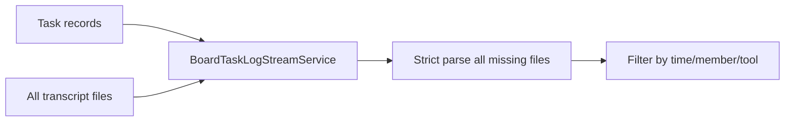
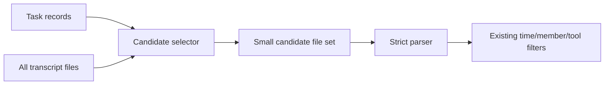
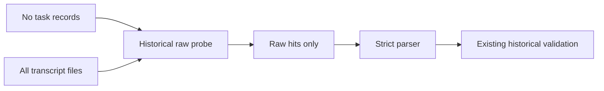

# Task Log Stream Candidate Selector Plan

## Summary

`Task Log Stream` can currently strict-parse hundreds of transcript files for a single task. The most visible failure mode is:

```text
Slow exact-log parse: files=876 messages=61654 elapsedMs=153048
Slow task-log stream layout: team=vector-room-131313 task=... elapsedMs=377395
```

The root cause is not the transcript discovery cache. Discovery intentionally finds all known session/root/subagent transcript files for a team. The bug is that task-scoped stream construction sometimes passes that full team-wide file list into `BoardTaskExactLogStrictParser`.

This plan introduces a task-scoped transcript candidate selection layer before strict parsing.

Chosen direction:

```text
TaskLogTranscriptCandidateSelector + HistoricalBoardMcpRawProbe
🎯 9   🛡️ 9   🧠 6
Estimated size: 550-850 LOC including tests
```

## Decision Matrix

### Option 1 - Selector + Raw Probe

```text
🎯 9   🛡️ 9   🧠 6
Estimated size: 550-850 LOC
```

This is the recommended option. It fixes the root cause by preventing broad strict parser input. It keeps existing renderer and response semantics. It is more code than a hard cap, but the behavior is explainable and testable.

Best fit when:

- we need to preserve historical task logs;
- we need inferred native tools to keep working;
- we want a reusable policy for stream and diagnostics;
- we want to avoid future hidden perf regressions.

### Option 2 - Inferred Path Only

```text
🎯 7   🛡️ 8   🧠 4
Estimated size: 250-450 LOC
```

This fixes the currently confirmed `records exist but execution links are missing` path, but leaves `recoverHistoricalBoardMcpRecords()` capable of full strict parsing. It is not enough if a user opens an old task with no activity records.

Best fit only if we need an emergency patch and explicitly accept a known remaining full-parse path.

### Option 3 - Hard Budget Or File Cap

```text
🎯 6   🛡️ 7   🧠 3
Estimated size: 120-260 LOC
```

This prevents UI hangs by refusing to parse too many files, but it can hide valid logs. It is operationally safe but semantically weaker.

Use only as a secondary safety rail after selector diagnostics prove a real need.

### Option 4 - Rewrite Activity Indexing First

```text
🎯 6   🛡️ 6   🧠 8
Estimated size: 900-1600 LOC
```

This could improve `BoardTaskActivityTranscriptReader` and task-activity indexing, but it is too broad for the confirmed strict-parse bug. It touches more persistence/cache behavior and increases regression risk.

Keep as a separate follow-up if activity transcript reads remain slow after strict parser input is bounded.

Goals:

- Never strict-parse all transcript files for inferred native task logs.
- Keep historical board MCP recovery, but prefilter files cheaply before strict parsing.
- Preserve renderer/API contracts and exact-log rendering semantics.
- Preserve old/historical logs where task evidence exists.
- Keep OpenCode runtime fallback behavior unchanged.
- Add diagnostics for future tuning without exposing debug noise in UI.
- Keep implementation aligned with `docs/FEATURE_ARCHITECTURE_STANDARD.md`: policy in small isolated classes, IO in adapters/helpers, service as orchestration.

Non-goals:

- Do not rewrite transcript discovery.
- Do not change IPC/preload/renderer response shapes.
- Do not add backend cancellation tokens in this pass.
- Do not hard-cap logs in a way that silently hides valid evidence.
- Do not change `BoardTaskActivityRecordSource` indexing in this pass.
- Do not optimize `BoardTaskLogDiagnosticsService` in the first cut unless stream fix is green.
- Do not change task ownership, runtime fallback, watchdog, member-work-sync, or delivery semantics.

## Current Evidence

Real team checked:

```text
team: vector-room-131313
discovered sessions: 93
discovered transcript files: 880
root jsonl files: 33
subagent jsonl files: 847
context size: ~166 MB
```

Risky tasks found:

```text
task #9c1a9dce
records: 3
execution links: 0
record files: 1
non-read sessions: 1
current inferred parse: 879 extra files
safe candidate set: 1 file

task #e6d65b6d
records: 3
execution links: 0
record files: 1
non-read sessions: 1
current inferred parse: 879 extra files
safe candidate set: 1 file
```

Raw prefilter check on `#9c1a9dce`:

```text
input files: 880
raw hits for task id/display id + board MCP marker: 2
elapsed: ~462ms
```

This means historical recovery can be reduced from strict parsing hundreds of JSONL files to strict parsing a few raw hits.

## Additional Code Research

### Transcript Discovery Is Intentionally Broad

`TeamTranscriptProjectResolver.discoverSessionIds()` combines:

- known session ids from `config.leadSessionId` and `sessionHistory`;
- root JSONL files that appear to belong to the team;
- every session directory under the transcript project directory.

`TeamTranscriptSourceLocator` then expands each session id into:

```text
<projectDir>/<sessionId>.jsonl
<projectDir>/<sessionId>/subagents/agent-*.jsonl
```

This is why big teams can have hundreds of transcript files. Narrowing discovery globally is risky because other features depend on broad historical discovery.

### Some Sessions Are Subagent-Heavy

Real data showed sessions with:

```text
72 files in one session
58 files in one session
55 files in one session
```

Session-bound selection is still a major improvement over 880 files, but it can still be broad in subagent-heavy cases. The first cut should warn on broad same-session candidate sets, not hard-drop them.

### Diagnostics Service Has A Separate Full-Parse Path

`BoardTaskLogDiagnosticsService.diagnose()` currently does:

```ts
const parsedMessagesByFile = await this.strictParser.parseFiles(transcriptFiles);
```

This can reproduce the same IO spike in live diagnostic tests. It is not the main renderer stream path, but live smoke tests call diagnostics before rendering. After the stream path is fixed, diagnostics should reuse the selector/probe or clearly mark itself as an expensive debug-only operation.

### Strict Parser Cache Has Retain-Only Semantics

`BoardTaskExactLogStrictParser.parseFiles()` calls:

```ts
this.cache.retainOnly(new Set(uniquePaths));
```

This means smaller candidate sets reduce current request work, but can evict cache entries from a previous request. Do not change this in the same patch. Instead:

- keep selector output deterministic;
- rely on layout in-flight coalescing for same task;
- measure after the input-size fix;
- consider an explicit `retainOnly` option later if needed.

### Existing Detail Selection Is Already Correctly Scoped

`BoardTaskExactLogSummarySelector` groups by explicit records and `BoardTaskExactLogDetailSelector` filters by explicit message/tool anchors. Those paths should not be rewritten. The fix should only control which extra files are parsed for inferred and historical fallback paths.

### Activity Reader Keeps Actor Context Separately From Board Links

`BoardTaskActivityTranscriptReader` intentionally parses lines containing `"agentName"` or `"agentId"` so `TranscriptSessionActorContextTracker` can remember actor context, but only emits records for lines containing `"boardTaskLinks"`.

Implication:

- candidate selector must use emitted `BoardTaskActivityRecord.actor.sessionId` and `record.source.filePath` as the trusted task evidence;
- raw historical probe must not try to replace the activity reader;
- if actor context is absent, selector should not invent member/session attribution from task owner.

### Exact Detail Service Should Stay Untouched

`BoardTaskExactLogDetailService.getTaskExactLogDetail()` already parses a single candidate file:

```ts
const parsedMessagesByFile = await this.strictParser.parseFiles([candidate.source.filePath]);
```

Do not route detail expansion through the new selector. Detail requests are already scoped by exact log id and source generation.

### Log Source Tracker Invalidation Still Applies

`TeamLogSourceTracker.onLogSourceChange(teamName)` invalidates shared `TeamTranscriptSourceLocator` discovery cache. The selector should not add a separate generation system. It should rely on the transcript context it receives from the locator.

If layout generation changes during a long build, the existing stale layout guard remains the cache-safety layer.

### OpenCode Runtime Fallback Is A Separate Source

`OpenCodeTaskLogStreamSource` has its own task-marker and attribution logic, its own limits, and its own cache. The selector must not try to recreate OpenCode projection rules.

Current merge behavior:

```text
if transcript layout has no visible slices:
  load runtime fallback

if transcript layout has slices and shouldMergeRuntimeFallback:
  merge runtime fallback response
```

Implication:

- empty inferred candidates should not disable fallback;
- no selector code should import `OpenCodeTaskLogStreamSource`;
- OpenCode-specific task-log bugs should remain in the runtime fallback source or attribution service, not in the generic transcript selector.

### Task Display Id Matching Is Short And Collision-Prone

`getTaskDisplayId(task)` usually returns the first 8 chars of a UUID. Raw historical probe can match short display ids. This is acceptable only because strict historical validation still checks structured tool input/result payloads.

Do not make raw display-id hits directly visible in UI.

## Root Cause

The dangerous path is in `BoardTaskLogStreamService.buildInferredExecutionSlices()`:

```ts
const transcriptFiles = transcriptContext?.transcriptFiles ?? [];
const missingFiles = transcriptFiles.filter((filePath) => !parsedMessagesByFile.has(filePath));
const additionalParsedMessages = await this.strictParser.parseFiles(missingFiles);
```

If a task has board records but no explicit `execution` links, the service parses every discovered transcript file not already parsed for explicit board records.

The second dangerous path is in `recoverHistoricalBoardMcpRecords()`:

```ts
const parsedMessagesByFile = await this.strictParser.parseFiles(transcriptFiles);
```

If activity records are missing, historical recovery strict-parses the whole team transcript context.

## Design Principles

### Keep Discovery Broad, Keep Parsing Narrow

`TeamTranscriptSourceLocator` should keep discovering all team-relevant transcript files. It serves multiple consumers and historical workflows. The fix should not make discovery less complete.

Instead, task log stream must narrow files before strict parsing.

### Evidence Before Expansion

Native tool rows can be inferred only from files with task-related evidence:

- explicit board activity record source files;
- same session as non-read/non-board task activity;
- historical raw file that mentions the task and a recoverable board MCP marker.

Do not expand by:

- owner name alone;
- current lead session alone;
- read-only `task_get` or `task_get_comment`;
- broad work interval alone;
- all team transcript files.

### Strict Parser Stays Authoritative

Raw prefilter only chooses candidates. It does not create records. Existing strict parser and existing historical task-reference validation remain authoritative.

False positives are acceptable. False negatives are risky and should be avoided by conservative raw matching.

### Deterministic Output

Candidate file lists must be sorted and deterministic. This matters because:

- stream layout cache keys are task-level;
- `BoardTaskExactLogStrictParser.parseFiles()` currently calls `retainOnly()`;
- nondeterministic file order makes tests and diagnostics harder.

### Fail Narrow, Not Broad

If evidence is missing or ambiguous, the system should prefer a smaller candidate set and visible diagnostics over parsing the full team context.

Allowed fallback:

- direct record files;
- runtime fallback for OpenCode when existing conditions allow it;
- empty stream with diagnostics.

Disallowed fallback:

- "no candidates, therefore parse all transcripts";
- "owner is known, therefore parse all owner-looking sessions";
- "work interval exists, therefore parse every file in the interval".

### Keep Time Filtering After File Filtering

Time windows are useful for filtering messages inside candidate files, but they are not safe enough to select files from the whole project.

Reason:

- open work intervals can extend to now;
- transcript files do not expose cheap precise min/max timestamps today;
- native tool calls often do not mention the task id;
- broad time windows over all files recreate the original bug.

Therefore:

```text
file evidence first
then strict parse
then timestamp/member/tool filtering inside parsed messages
```

### Keep Raw Probe Non-Authoritative

Raw text scanning can only decide "worth strict parsing". It must not decide "this is task activity".

The authoritative checks remain:

- strict JSONL parsing;
- tool call/result matching;
- `historicalBoardToolReferencesTask()`;
- existing task id/display id resolution.

## Proposed Components

### `TaskLogTranscriptCandidateSelector`

Location:

```text
src/main/services/team/taskLogs/stream/TaskLogTranscriptCandidateSelector.ts
```

Responsibility:

- Pure-ish selection policy.
- No file IO.
- Knows how to map discovered transcript file paths to session ids.
- Knows which board tools are read-only.
- Produces explainable candidate sets.

Suggested public API:

```ts
export interface TranscriptFileSessionIndex {
  projectDir: string;
  filesBySessionId: Map<string, string[]>;
  sessionIdByFilePath: Map<string, string>;
  rootFilesBySessionId: Map<string, string>;
  subagentFilesBySessionId: Map<string, string[]>;
}

export interface CandidateSelectionDiagnostics {
  recordFileCount: number;
  nonReadSessionCount: number;
  sameSessionFileCount: number;
  excludedReadOnlySessionCount: number;
  finalCandidateCount: number;
  reason: string;
}

export interface CandidateSelectionResult {
  filePaths: string[];
  diagnostics: CandidateSelectionDiagnostics;
}

export class TaskLogTranscriptCandidateSelector {
  buildSessionIndex(args: {
    projectDir: string;
    transcriptFiles: string[];
  }): TranscriptFileSessionIndex;

  selectInferredNativeFiles(args: {
    records: BoardTaskActivityRecord[];
    transcriptFiles: string[];
    projectDir?: string;
    alreadyParsedFilePaths?: Set<string>;
  }): CandidateSelectionResult;

  selectExplicitRecordFiles(args: {
    records: BoardTaskActivityRecord[];
  }): CandidateSelectionResult;
}
```

### `HistoricalBoardMcpRawProbe`

Location:

```text
src/main/services/team/taskLogs/stream/HistoricalBoardMcpRawProbe.ts
```

Responsibility:

- File IO adapter.
- Cheap raw text scan with bounded concurrency.
- Finds files that might contain recoverable historical board MCP task activity.
- Does not parse JSON.
- Does not create stream records.

Suggested public API:

```ts
export interface HistoricalBoardMcpRawProbeResult {
  filePaths: string[];
  scannedFileCount: number;
  hitCount: number;
  elapsedMs: number;
}

export class HistoricalBoardMcpRawProbe {
  async findCandidateFiles(args: {
    task: TeamTask;
    transcriptFiles: string[];
  }): Promise<HistoricalBoardMcpRawProbeResult>;
}
```

### Why Two Classes

`TaskLogTranscriptCandidateSelector` is policy. `HistoricalBoardMcpRawProbe` is IO.

This keeps SRP clean:

- selection rules are unit-testable without the filesystem;
- raw scan can be tested separately with temp files;
- `BoardTaskLogStreamService` remains an orchestrator;
- future diagnostics service can reuse both.

## Layering And Dependency Direction

This is not a new cross-process feature, so it should stay under `src/main/services/team/taskLogs`. Still, the same clean architecture rules apply locally:

```text
stream service
  depends on selector policy
  depends on raw probe adapter
  depends on strict parser

selector policy
  depends on task activity record types
  no filesystem
  no logger required for core decisions

raw probe
  depends on filesystem
  no stream rendering
  no task activity record building

strict parser
  unchanged
```

Do not let `TaskLogTranscriptCandidateSelector` import:

- `fs`;
- `readline`;
- renderer types;
- IPC contracts;
- runtime/provider services.

Do not let `HistoricalBoardMcpRawProbe` know about:

- stream segments;
- participants;
- exact-log chunk rendering;
- OpenCode fallback.

This keeps the service open for future selectors without changing rendering code.

### Shared Tool Name Normalization

Use the existing helper:

```ts
import { canonicalizeAgentTeamsToolName } from '../../agentTeamsToolNames';
```

Do not duplicate board-tool normalization in the selector or raw probe. The same canonicalization is already used by:

- `BoardTaskLogStreamService`;
- `OpenCodeTaskLogStreamSource`;
- task boundary parsing;
- stall monitor evidence.

Duplicating it creates a risk where one subsystem treats `mcp__agent-teams__task_get` as read-only while another treats it as work evidence.

Recommended shared helper extraction:

```ts
export function canonicalizeBoardTaskLogToolName(toolName: string | undefined): string | null {
  if (!toolName) return null;
  const normalized = canonicalizeAgentTeamsToolName(toolName).trim().toLowerCase();
  return normalized.length > 0 ? normalized : null;
}
```

If this helper is added, put it in a small local file such as:

```text
src/main/services/team/taskLogs/stream/boardTaskLogToolNames.ts
```

Then import it from `BoardTaskLogStreamService`, `TaskLogTranscriptCandidateSelector`, and `HistoricalBoardMcpRawProbe`.

## Data Flow

Before:



After:



Historical path:



## Candidate Reason Model

The selector should return why every file was selected. This is more verbose internally, but it makes diagnostics and tests much stronger.

Suggested internal model:

```ts
export type TaskLogCandidateReason =
  | 'direct_record_file'
  | 'same_session_non_read_record'
  | 'historical_raw_task_ref_and_board_marker';

export interface TaskLogCandidateFile {
  filePath: string;
  reason: TaskLogCandidateReason;
  sessionId?: string;
  sourceRecordIds?: string[];
}

export interface CandidateSelectionResult {
  filePaths: string[];
  candidates: TaskLogCandidateFile[];
  diagnostics: CandidateSelectionDiagnostics;
}
```

Rules:

- `filePaths` is sorted and deduped.
- `candidates` can contain merged reasons for the same file, or one canonical highest-priority reason.
- Tests should assert both final file list and reason counts.
- Do not expose `candidates` through public IPC or renderer APIs.

Priority if a file has multiple reasons:

```text
direct_record_file > same_session_non_read_record > historical_raw_task_ref_and_board_marker
```

## Candidate Selection Details

### Session Id Extraction

Known transcript shapes:

```text
<projectDir>/<sessionId>.jsonl
<projectDir>/<sessionId>/subagents/agent-<id>.jsonl
```

Implementation sketch:

```ts
function extractTranscriptSessionId(projectDir: string, filePath: string): string | null {
  const relative = path.relative(projectDir, filePath);
  if (relative.startsWith('..') || path.isAbsolute(relative)) {
    return null;
  }

  const parts = relative.split(path.sep).filter(Boolean);
  if (parts.length === 1 && parts[0].endsWith('.jsonl')) {
    return parts[0].slice(0, -'.jsonl'.length);
  }

  if (
    parts.length === 3 &&
    parts[1] === 'subagents' &&
    parts[2].startsWith('agent-') &&
    parts[2].endsWith('.jsonl')
  ) {
    return parts[0];
  }

  return null;
}
```

Edge cases:

- Path outside `projectDir`: ignore.
- Unknown shape: ignore for session expansion, but keep if it is already a direct record file.
- Windows separators: use `path.relative` and `path.sep`.
- Symlinks: do not resolve realpath in first pass; current code operates on paths as discovered.

### Non-Read Session Evidence

Read-only board tools are not task work evidence:

```ts
const READ_ONLY_BOARD_TOOL_NAMES = new Set(['task_get', 'task_get_comment']);
```

Do not expand sessions from records where:

- `record.action.category === 'read'`;
- canonical tool name is read-only;
- no actor session id.

Implementation sketch:

```ts
function isReadOnlyRecord(record: BoardTaskActivityRecord): boolean {
  const toolName = canonicalizeAgentTeamsToolName(record.action?.canonicalToolName ?? '');
  return record.action?.category === 'read' || READ_ONLY_BOARD_TOOL_NAMES.has(toolName);
}

function collectNonReadSessionIds(records: BoardTaskActivityRecord[]): Set<string> {
  const sessionIds = new Set<string>();
  for (const record of records) {
    if (isReadOnlyRecord(record)) continue;
    const sessionId = record.actor.sessionId?.trim();
    if (sessionId) {
      sessionIds.add(sessionId);
    }
  }
  return sessionIds;
}
```

### Inferred Native Candidate Set

Input:

- all records for the task;
- transcript context;
- already parsed files from explicit record details.

Output:

- direct record source files;
- same-session root and subagent files for non-read task activity sessions;
- minus files already parsed, if caller only needs missing files.

Selection levels:

```text
Level 0: direct record source files
Level 1: same-session root/subagent files from non-read evidence
Level 2: future optional same-session refinement if Level 1 is too broad
Never: full team transcript file list
```

Implementation sketch:

```ts
selectInferredNativeFiles(args): CandidateSelectionResult {
  const directFiles = new Set(args.records.map((record) => record.source.filePath));
  const nonReadSessions = collectNonReadSessionIds(args.records);
  const index = args.projectDir
    ? this.buildSessionIndex({ projectDir: args.projectDir, transcriptFiles: args.transcriptFiles })
    : null;

  const candidates = new Set<string>(directFiles);
  if (index) {
    for (const sessionId of nonReadSessions) {
      for (const filePath of index.filesBySessionId.get(sessionId) ?? []) {
        candidates.add(filePath);
      }
    }
  }

  for (const alreadyParsed of args.alreadyParsedFilePaths ?? []) {
    candidates.delete(alreadyParsed);
  }

  return {
    filePaths: [...candidates].sort((a, b) => a.localeCompare(b)),
    diagnostics: {
      recordFileCount: directFiles.size,
      nonReadSessionCount: nonReadSessions.size,
      sameSessionFileCount: candidates.size,
      excludedReadOnlySessionCount: countReadOnlySessions(args.records),
      finalCandidateCount: candidates.size,
      reason: nonReadSessions.size > 0 ? 'same_session_evidence' : 'record_files_only',
    },
  };
}
```

Important nuance:

The direct record file should always be considered evidence, but the caller may exclude it from `missingFiles` if it was already parsed during explicit detail loading. This avoids duplicate parse calls while preserving the file in diagnostics.

### Heavy Same-Session Handling

Same-session expansion is safe semantically, but can still be expensive when a session has many subagent files.

First cut behavior:

```text
include all same-session files
warn if final candidates > 100 or same-session candidates > 50
do not hard cap
```

Reason:

- subagent files can contain real work without task id in their native tool calls;
- dropping them by file name or size can hide valid work;
- a warning gives us production evidence for a second-stage index.

Future optional Level 2 if needed:

```text
For subagent-heavy sessions, build a cheap file envelope index:
- file path
- mtime/size
- first timestamp if cheaply discoverable
- last timestamp if cheaply discoverable
- contains native tool marker

Then include:
- root session file always;
- subagent file if timestamp envelope overlaps task window;
- subagent file if envelope missing but file contains native tool marker and candidate count is still below budget.
```

Do not add Level 2 in the initial patch. It requires timestamp-envelope parsing and more cache invalidation decisions.

### Native Tool Marker Probe Is Not Enough For Inferred Path

It is tempting to raw-scan same-session files for native tool names like `Bash`, `Read`, `Edit`, `Write` before strict parsing. This can help later, but it is not enough as a primary selector because:

- tool names vary by provider and formatter;
- user/assistant text can contain those words;
- some provider tools are lower-case or different names;
- OpenCode tools may be projected differently;
- the existing strict parser already normalizes parsed tool calls.

For the first cut, use task/session evidence for file selection and keep native-tool classification after parsing.

### Historical Raw Probe

Historical recovery should not strict-parse all files.

Raw candidate condition:

```text
file contains task canonical id OR task display id
AND
file contains at least one recoverable board MCP marker
```

Recoverable markers:

```ts
const HISTORICAL_RECOVERABLE_MARKERS = [
  'mcp__agent-teams__task_start',
  'mcp__agent-teams__task_complete',
  'mcp__agent-teams__task_set_status',
  'mcp__agent-teams__task_add_comment',
  'mcp__agent-teams__task_attach_file',
  'mcp__agent-teams__task_attach_comment_file',
  'mcp__agent-teams__task_set_owner',
  'mcp__agent-teams__task_set_clarification',
  'mcp__agent-teams__task_link',
  'mcp__agent-teams__task_unlink',
  'mcp__agent-teams__review_start',
  'mcp__agent-teams__review_request',
  'mcp__agent-teams__review_approve',
  'mcp__agent-teams__review_request_changes',
  'agent-teams_task_',
  'agent-teams_review_',
];
```

Implementation sketch:

```ts
async function fileMayContainHistoricalBoardTaskActivity(args: {
  filePath: string;
  taskRefs: string[];
}): Promise<boolean> {
  let hasTaskRef = false;
  let hasBoardMarker = false;
  for await (const line of readline.createInterface({ input: createReadStream(args.filePath) })) {
    const lowerLine = line.toLowerCase();
    hasTaskRef ||= args.taskRefs.some((ref) => lowerLine.includes(ref));
    hasBoardMarker ||= HISTORICAL_RECOVERABLE_MARKERS.some((marker) =>
      lowerLine.includes(marker)
    );
    if (hasTaskRef && hasBoardMarker) return true;
  }
  return false;
}
```

Why line-oriented instead of `readFile`:

- it preserves the cheap prefilter property without building a second JSON parser;
- it does not keep large transcript files in memory;
- it can stop early once both a task ref and a board MCP marker are present;
- it still allows task ref and marker on different lines via two booleans.

If file sizes above 25 MB appear in diagnostics, revisit this with a bounded rolling-window scanner.

Bounded concurrency:

```ts
const HISTORICAL_RAW_PROBE_CONCURRENCY = process.platform === 'win32' ? 4 : 8;
```

Concurrency rule:

```text
raw probe concurrency <= strict parser concurrency
```

Reason:

- raw probe should reduce pressure, not create a parallel IO storm before strict parsing.
- Keep it at 8 on macOS/Linux and 4 on Windows unless logs prove otherwise.

Why raw read is acceptable:

- It avoids JSON parse and object conversion.
- It yields a small strict-parse candidate set.
- It is only used when normal activity records are absent.
- It preserves historical recovery behavior without full strict parse.

Potential future optimization:

- read chunks instead of full file for very large files;
- add a tiny file content cache keyed by `mtimeMs/size`;
- not needed in first pass because tested files are under ~4 MB and raw probe was ~462ms for 880 files.

### Historical Marker False Positives

Raw probe can return files that mention the task but do not represent task work, for example:

- lead task creation transcript;
- inbox delivery prompt containing task instructions;
- task context embedded in a different tool result.

This is acceptable because strict historical recovery still checks:

```ts
historicalBoardToolReferencesTask({
  canonicalToolName,
  input,
  resultPayload,
  taskRefs,
});
```

The raw probe must be broad enough to include true positives. It does not need to exclude every false positive.

### Historical Marker False Negatives

False negatives are more dangerous. Avoid them by:

- matching both canonical task id and display id;
- matching raw task refs with both bare and `#` forms for display ids;
- using broad marker variants for `mcp__agent-teams__`, `mcp__agent_teams__`, `agent-teams_task_`, and `agent-teams_review_`;
- not requiring `boardTaskLinks`, because historical rows specifically lack them.

If old transcripts use a marker format not covered here, add that marker to `HISTORICAL_RECOVERABLE_MARKERS` with a fixture before rollout.

Suggested task ref builder:

```ts
function buildRawHistoricalTaskRefs(task: TeamTask): string[] {
  const canonicalId = task.id.trim();
  const displayId = getTaskDisplayId(task).trim();
  return [
    canonicalId,
    displayId,
    displayId ? `#${displayId}` : '',
  ].filter((value, index, all) => value.length > 0 && all.indexOf(value) === index);
}
```

Do not include task subject/description in raw refs. Those are too broad and can pull unrelated task-context files.

## Changes To `BoardTaskLogStreamService`

### Constructor

Add optional dependencies after existing dependencies, or as an options object if changing signature is too noisy.

Prefer minimal constructor churn:

```ts
constructor(
  private readonly recordSource = new BoardTaskActivityRecordSource(),
  private readonly summarySelector = new BoardTaskExactLogSummarySelector(),
  private readonly strictParser = new BoardTaskExactLogStrictParser(),
  private readonly detailSelector = new BoardTaskExactLogDetailSelector(),
  private readonly chunkBuilder = new BoardTaskExactLogChunkBuilder(),
  private readonly taskReader = new TeamTaskReader(),
  private readonly transcriptSourceLocator = new TeamTranscriptSourceLocator(),
  private readonly runtimeFallbackSource: TaskLogRuntimeStreamSource = new OpenCodeTaskLogStreamSource(),
  private readonly membersMetaStore = new TeamMembersMetaStore(),
  private readonly configReader = new TeamConfigReader(),
  private readonly transcriptCandidateSelector = new TaskLogTranscriptCandidateSelector(),
  private readonly historicalRawProbe = new HistoricalBoardMcpRawProbe()
) {}
```

Risk:

- There are many tests constructing this service with positional args.
- Appending optional dependencies at the end is safer than inserting dependencies earlier.

Safer alternative if constructor becomes too long:

```ts
interface BoardTaskLogStreamServiceDependencies {
  recordSource?: BoardTaskActivityRecordSource;
  summarySelector?: BoardTaskExactLogSummarySelector;
  strictParser?: BoardTaskExactLogStrictParser;
  detailSelector?: BoardTaskExactLogDetailSelector;
  chunkBuilder?: BoardTaskExactLogChunkBuilder;
  taskReader?: TeamTaskReader;
  transcriptSourceLocator?: TeamTranscriptSourceLocator;
  runtimeFallbackSource?: TaskLogRuntimeStreamSource;
  membersMetaStore?: TeamMembersMetaStore;
  configReader?: TeamConfigReader;
  transcriptCandidateSelector?: TaskLogTranscriptCandidateSelector;
  historicalRawProbe?: HistoricalBoardMcpRawProbe;
}
```

Do not switch to this object in the same patch unless positional constructor changes become unmanageable. A constructor refactor would touch many tests and can obscure the actual perf fix.

### Imports And Cycles

Avoid cycles:

```text
BoardTaskLogStreamService -> TaskLogTranscriptCandidateSelector
TaskLogTranscriptCandidateSelector -> BoardTaskActivityRecord types + tool name helper
TaskLogTranscriptCandidateSelector must not import BoardTaskLogStreamService
```

Keep shared constants either:

- in a small local helper file; or
- duplicated only if they are test-local, not production logic.

### Inferred Native Path

Current broad path:

```ts
const transcriptFiles = transcriptContext?.transcriptFiles ?? [];
const missingFiles = transcriptFiles.filter((filePath) => !parsedMessagesByFile.has(filePath));
```

Replace with:

```ts
const transcriptFiles = transcriptContext?.transcriptFiles ?? [];
const selected = this.transcriptCandidateSelector.selectInferredNativeFiles({
  records,
  transcriptFiles,
  projectDir: transcriptContext?.projectDir,
  alreadyParsedFilePaths: new Set(parsedMessagesByFile.keys()),
});
const missingFiles = selected.filePaths;

this.logCandidateSelectionIfLarge(teamName, taskId, 'inferred_native', selected.diagnostics);
```

Keep the rest of inferred message filtering:

- time windows;
- explicit message/tool dedupe;
- allowed member filtering;
- `messageHasNonBoardToolActivity`;
- `sanitizeJsonLikeToolResultPayloads`;
- `pruneEmptyInternalToolResultMessages`.

### Historical Recovery Path

Current broad path:

```ts
const parsedMessagesByFile = await this.strictParser.parseFiles(transcriptFiles);
```

Replace with:

```ts
const rawProbe = await this.historicalRawProbe.findCandidateFiles({
  task,
  transcriptFiles,
});

if (rawProbe.filePaths.length === 0) {
  return {
    task,
    parsedMessagesByFile: new Map(),
    records: [],
  };
}

const parsedMessagesByFile = await this.strictParser.parseFiles(rawProbe.filePaths);
```

Diagnostics:

```ts
if (rawProbe.scannedFileCount >= 500 || rawProbe.elapsedMs >= 3_000) {
  logger.warn(
    `Task-log historical raw probe: team=${teamName} task=${taskId} scanned=${rawProbe.scannedFileCount} hits=${rawProbe.hitCount} elapsedMs=${rawProbe.elapsedMs}`
  );
}
```

### Parser Call Invariants

After the change, these should be true:

```text
Explicit board details:
  parseFiles(candidate.source.filePath only)

Inferred native:
  parseFiles(selected missing same-session candidate files only)

Historical recovery:
  parseFiles(raw probe hit files only)

Never:
  parseFiles(transcriptContext.transcriptFiles) from stream layout path
```

Add test assertions directly on `strictParser.parseFiles.mock.calls`.

Anti-patterns to reject in review:

```ts
// Bad: reconstructs the original bug under another name.
await this.strictParser.parseFiles(transcriptContext.transcriptFiles);

// Bad: owner is not file evidence.
const ownerFiles = transcriptFiles.filter((file) => file.includes(task.owner));

// Bad: time window is not file evidence.
const allFilesInTaskTimeRange = await scanAllFilesForTimestamps(transcriptFiles, task);

// Bad: read-only task_get should not authorize native inference.
const sessions = records.map((record) => record.actor.sessionId);
```

### Layout Cache Interaction

Do not change layout cache keys in this patch:

```text
teamName::taskId
```

The candidate selector must be deterministic so the same task request produces the same layout input while transcript discovery generation is unchanged.

If `TeamTranscriptSourceLocator` generation changes during a long build, the existing stale layout guard should still prevent caching stale layouts. The selector does not need its own generation tracking.

### OpenCode Runtime Fallback Interaction

Keep existing behavior:

- if explicit execution links exist, runtime fallback is not merged;
- if owner provider is OpenCode and stream lacks explicit execution, fallback may still merge;
- selector failure or empty inferred candidates must not disable runtime fallback.

Do not make the selector OpenCode-aware. Provider-specific logic belongs in existing runtime fallback path.

## Diagnostics Strategy

Add developer-only logs when selection is unusually broad.

Suggested thresholds:

```ts
const TASK_LOG_CANDIDATE_SELECTION_WARN_FILES = 100;
const TASK_LOG_CANDIDATE_SELECTION_WARN_RATIO = 0.5;
```

Log example:

```text
Task-log inferred candidate selection broad:
team=vector-room-131313 task=... mode=inferred_native
recordFiles=1 nonReadSessions=1 sameSessionFiles=72 finalCandidates=72 transcriptFiles=880
```

Do not show this in UI.

### Diagnostic Fields

Log only structured counts and reason codes:

```ts
logger.warn('Task-log candidate selection broad', {
  teamName,
  taskId,
  mode: 'inferred_native',
  transcriptFileCount,
  recordFileCount,
  nonReadSessionCount,
  sameSessionFileCount,
  finalCandidateCount,
  excludedReadOnlySessionCount,
  reason: diagnostics.reason,
});
```

Avoid logging:

- raw prompt text;
- tool result payloads;
- full file contents;
- API keys;
- full task descriptions.

File paths are already present in existing developer diagnostics, but do not include long lists in warning logs. Use counts plus first 3 paths only in debug logs if needed.

### Metrics To Watch Manually

After implementation, these log patterns should drop:

```text
Slow exact-log parse: files=8xx
Slow task-log stream layout: ... elapsedMs=1xxxxx
```

Acceptable post-fix logs:

```text
Task-log inferred candidate selection broad: ... finalCandidateCount=72
Slow exact-log parse: files=72 ...
```

The second case means the selector worked but same-session workload is still heavy. That becomes a Level 2 optimization, not the original bug.

## Risk Register

| Risk | Severity | Likelihood | Mitigation |
| --- | --- | --- | --- |
| Native subagent tools disappear because selector only includes root transcript | High | Medium | Include all same-session root and `subagents/agent-*.jsonl` files for non-read evidence. Add integration test. |
| Read-only task lookup pulls unrelated native work into stream | High | High | Exclude `task_get` and `task_get_comment` sessions from expansion. Existing read-only test plus new parser-input test. |
| Historical old logs stop working because raw probe misses old marker format | Medium | Medium | Match broad marker variants. Keep historical fixture tests. Add marker only with fixture. |
| Parser cache reuse worsens because candidate sets are smaller | Low | Medium | Do not change cache semantics. Keep deterministic candidate ordering. Measure after fix. |
| Same-session candidate set is still large for subagent-heavy sessions | Medium | Medium | Warn with counts. Do not hard cap. Consider Level 2 timestamp envelope later. |
| Raw probe reads too much text under heavy load | Medium | Low | Bounded concurrency. Observed files under ~4 MB. Add slow diagnostics. Chunked scan is follow-up. |
| Lead task creation false positive creates fake history | High | Low | Raw probe only selects files. Strict historical validation remains authoritative and excludes non-recoverable tools. |
| OpenCode fallback stops showing logs | High | Low | Keep provider fallback unchanged and selector provider-agnostic. Add regression around fallback merge. |
| Live diagnostics still cause full parse and look like stream bug | Medium | High | Document as Cut 4. Update diagnostics after stream fix or mark as expensive. |
| New helper duplicates board tool normalization and drifts from runtime code | Medium | Medium | Reuse `canonicalizeAgentTeamsToolName` through a shared local helper. |
| Constructor refactor causes broad test churn unrelated to perf fix | Medium | Medium | Append optional deps or keep positional constructor; avoid dependency-object migration unless necessary. |
| Raw probe full-file reads compete with strict parser under load | Medium | Low | Bounded concurrency <= strict parser concurrency, no extra parallel probe once strict parse starts. |
| Candidate diagnostics become noisy in dev logs | Low | Medium | Warn only on broad candidates/slow probe, keep normal selections silent. |

## Implementation Invariants

These invariants should be enforced by tests:

- Selector never returns the full transcript list unless every file is directly evidenced by records or same-session evidence.
- Direct record source files are always preserved.
- Read-only records never create same-session expansion.
- Non-read records may expand by session id, not by owner name.
- Historical raw probe never creates `BoardTaskActivityRecord` directly.
- Strict parser receives a sorted, deduped file list.
- Empty candidate selection never falls back to all files.
- OpenCode runtime fallback remains independent from selector decisions.
- No public IPC, preload, renderer, or DTO shape changes.

## Failure Behavior

When candidate selection cannot confidently find files:

```text
records exist, no non-read session evidence:
  parse direct record files only

records absent, raw probe has no hits:
  return no recovered historical records

transcript context unavailable:
  skip inferred expansion and keep explicit slices/runtime fallback

projectDir unavailable:
  parse direct record files only, because session mapping cannot be trusted
```

Do not throw for these cases. They are data-shape limitations, not user-visible fatal errors.

## Rollback Strategy

If the implementation causes missing logs or unexpected regressions:

1. Revert the service integration commits first, leaving pure selector/probe tests if useful.
2. Do not revert unrelated task-log rendering fixes.
3. Confirm `BoardTaskLogStreamService` returns to previous behavior by checking parser calls in the synthetic test.
4. If rollback is needed because historical raw probe missed old logs, keep inferred-path selector and revert only historical integration.

Suggested commit split supports this:

```text
test(task-logs): cover transcript candidate selection
fix(task-logs): bound inferred native transcript parsing
fix(task-logs): prefilter historical board recovery files
test(task-logs): add live candidate smoke coverage
```

This lets us revert historical prefilter independently from inferred native selection.

## Benchmark Method

Use instrumentation that wraps `BoardTaskExactLogStrictParser.prototype.parseFiles` and records:

```ts
type ParseCallMetric = {
  count: number;
  unique: number;
  elapsedMs: number;
  sample: string[];
};
```

Before/after command shape:

```bash
LIVE_TASK_LOG_TEAM=vector-room-131313 \
LIVE_TASK_LOG_TASK=9c1a9dce-ecdf-4923-8ec6-6e9521534739 \
pnpm exec tsx scripts/task-log-stream-candidate-smoke.ts
```

Expected before:

```text
parseFiles unique=1
parseFiles unique=879
```

Expected after:

```text
parseFiles unique=1
parseFiles unique=0-1
```

The smoke script should be read-only and should not launch agents or runtimes.

## Test Plan

### Pure Selector Tests

File:

```text
test/main/services/team/TaskLogTranscriptCandidateSelector.test.ts
```

Cases:

- Extract root session id from `<projectDir>/<session>.jsonl`.
- Extract subagent session id from `<projectDir>/<session>/subagents/agent-abc.jsonl`.
- Ignore unknown file shapes for session expansion.
- Direct record file is always included.
- Non-read task activity expands same-session files.
- Read-only `task_get` does not expand same-session files.
- Mixed read and non-read records expand only non-read sessions.
- `alreadyParsedFilePaths` are excluded from missing candidate output.
- Output order is deterministic.
- Path traversal/outside-project files do not create session expansion.
- Same-session expansion includes subagent files.
- Missing `projectDir` falls back to direct record files only.
- Unknown transcript file shape does not crash selection.

Example:

```ts
it('does not expand candidates from read-only task_get records', () => {
  const selector = new TaskLogTranscriptCandidateSelector();
  const result = selector.selectInferredNativeFiles({
    records: [makeReadOnlyRecord('/tmp/project/session-a.jsonl', 'session-a')],
    projectDir: '/tmp/project',
    transcriptFiles: [
      '/tmp/project/session-a.jsonl',
      '/tmp/project/session-a/subagents/agent-work.jsonl',
    ],
  });

  expect(result.filePaths).toEqual(['/tmp/project/session-a.jsonl']);
  expect(result.diagnostics.excludedReadOnlySessionCount).toBe(1);
});
```

### Raw Probe Tests

File:

```text
test/main/services/team/HistoricalBoardMcpRawProbe.test.ts
```

Cases:

- Finds file with task id and board MCP marker.
- Finds file with display id and board MCP marker.
- Ignores file with task id but no recoverable marker.
- Ignores file with marker but no task ref.
- Ignores unreadable files without throwing.
- Uses bounded concurrency.
- Output order is deterministic.

Example:

```ts
it('prefilters historical recovery files by task ref and board marker', async () => {
  const probe = new HistoricalBoardMcpRawProbe();
  const result = await probe.findCandidateFiles({
    task: makeTask({ id: TASK_ID, displayId: 'c414cd52' }),
    transcriptFiles: [unrelatedPath, leadCreatePath, historicalPath],
  });

  expect(result.filePaths).toEqual([historicalPath]);
});
```

### Stream Service Tests

Existing file:

```text
test/main/services/team/BoardTaskLogStreamService.test.ts
```

New cases:

- Task has records but no `execution` links: strict parser receives only related/same-session files, not all transcript files.
- `task_get` record plus nearby same-session native tool: native tool is not inferred.
- Non-read record plus same-session subagent `bash`: native tool is inferred.
- Foreign session native tool inside same time window: excluded.
- Historical recovery with many unrelated files: strict parser receives only raw hits.
- Raw false-positive lead task creation file does not produce recovered stream rows.
- Empty raw hits do not call strict parser with the full transcript list.
- Broad same-session selection logs diagnostics but still returns logs.
- Runtime fallback merge conditions are unchanged for OpenCode owners.

Example for the critical regression:

```ts
it('bounds inferred native parsing to task-evidence sessions', async () => {
  const strictParser = {
    parseFiles: vi.fn(async (filePaths: string[]) => {
      return new Map(filePaths.map((filePath) => [filePath, messagesFor(filePath)]));
    }),
  };

  const transcriptSourceLocator = {
    getContext: vi.fn(async () => ({
      projectDir: '/tmp/project',
      transcriptFiles: [
        '/tmp/project/session-a.jsonl',
        '/tmp/project/session-a/subagents/agent-work.jsonl',
        ...Array.from({ length: 200 }, (_, index) => `/tmp/project/other-${index}.jsonl`),
      ],
      config: { members: [{ name: 'team-lead', agentType: 'team-lead' }] },
    })),
  };

  const response = await service.getTaskLogStream('demo', 'task-a');

  const parsedFileArgs = strictParser.parseFiles.mock.calls.flatMap(([files]) => files);
  expect(parsedFileArgs).not.toContain('/tmp/project/other-0.jsonl');
  expect(parsedFileArgs).toContain('/tmp/project/session-a/subagents/agent-work.jsonl');
});
```

### Integration Tests

Existing file:

```text
test/main/services/team/BoardTaskLogStreamIntegration.test.ts
```

Keep these green:

- explicit execution links show worker tool logs;
- historical board MCP rows are reconstructed;
- inferred time-window worker logs are shown when execution links are missing;
- annotated multi-task fixture does not leak unrelated task activity.

Add:

- fixture with `300` unrelated transcript files and one related file;
- assert response still includes expected native tool;
- assert strict parser did not receive unrelated files.

### Diagnostics Tests

Cut 4 should update:

```text
test/main/services/team/BoardTaskLogDiagnosticsService.test.ts
test/main/services/team/BoardTaskLogStream.live.test.ts
test/renderer/components/team/taskLogs/TaskLogStreamSection.live.test.ts
```

Required behavior after Cut 4:

- diagnostics no longer strict-parses the full transcript file list for normal task checks;
- diagnostics report includes candidate counts or mentions limited candidates;
- live smoke does not call diagnostics in a way that reintroduces 800-file strict parse before stream rendering.

If Cut 4 is not implemented immediately, live smoke should be run with stream service instrumentation rather than diagnostics-first instrumentation.

### Performance Regression Tests

Add a synthetic test with hundreds of unrelated files:

```ts
it('does not strict-parse unrelated transcripts for inferred native stream', async () => {
  const unrelatedFiles = Array.from({ length: 300 }, (_, index) =>
    `/tmp/project/unrelated-${index}.jsonl`
  );

  const strictParser = {
    parseFiles: vi.fn(async (filePaths: string[]) => {
      expect(filePaths).not.toEqual(expect.arrayContaining(unrelatedFiles));
      return new Map(filePaths.map((filePath) => [filePath, []]));
    }),
  };

  await service.getTaskLogStream('demo-team', 'task-a');

  const allParsedFiles = strictParser.parseFiles.mock.calls.flatMap(([files]) => files);
  expect(allParsedFiles).not.toContain('/tmp/project/unrelated-0.jsonl');
});
```

Add a real-shape fixture:

```text
project/
  session-a.jsonl
  session-a/subagents/agent-work.jsonl
  session-b.jsonl
  session-c/subagents/agent-noise.jsonl
```

Expected:

- `session-a` and `agent-work` included when non-read record has `session-a`;
- `session-b` and `session-c` excluded even if timestamps overlap.

### Mutation-Style Negative Tests

Add tests that would fail if a future change reintroduces broad parsing:

```ts
expect(strictParser.parseFiles).not.toHaveBeenCalledWith(
  expect.arrayContaining(['/tmp/project/unrelated-199.jsonl'])
);
```

And tests that verify no owner-based expansion:

```ts
it('does not select files just because file path or actor text matches task owner', async () => {
  const result = selector.selectInferredNativeFiles({
    records: [makeRecord({ actor: { memberName: 'alice' }, sessionId: undefined })],
    projectDir: '/tmp/project',
    transcriptFiles: ['/tmp/project/alice-looking-file.jsonl'],
  });

  expect(result.filePaths).not.toContain('/tmp/project/alice-looking-file.jsonl');
});
```

And tests that verify no task-subject raw matching:

```ts
it('does not use task subject as a raw historical ref', async () => {
  const task = makeTask({ subject: 'calculator' });
  const result = await probe.findCandidateFiles({
    task,
    transcriptFiles: [fileContainingOnlySubject],
  });

  expect(result.filePaths).toEqual([]);
});
```

### Live Smoke

Use read-only instrumentation, not a permanent test unless stable enough:

```bash
pnpm exec tsx scripts/task-log-stream-smoke.ts \
  --team vector-room-131313 \
  --task 9c1a9dce-ecdf-4923-8ec6-6e9521534739
```

Expected:

```text
strictParser parse calls:
  explicit: 1 unique file
  inferred: 0-1 additional unique files
not expected:
  parse call with 879 files
```

## Rollout Plan

### Cut 1 - Selector And Tests

Implement:

- `TaskLogTranscriptCandidateSelector`;
- pure tests.

No service behavior change yet.

Risk:

- Low. Pure functions only.

### Cut 2 - Inferred Native Path

Implement:

- inject selector into `BoardTaskLogStreamService`;
- replace broad inferred `missingFiles`;
- add stream service regression tests;
- run real smoke on risky tasks.

Risk:

- Medium. Could hide inferred native tools if session mapping is wrong.

Mitigation:

- Include root and subagent same-session files.
- Direct record file always included.
- Keep existing time/member filters unchanged.

### Cut 3 - Historical Raw Probe

Implement:

- `HistoricalBoardMcpRawProbe`;
- replace broad historical strict parse;
- add historical tests.

Risk:

- Medium. Raw prefilter could miss an old format.

Mitigation:

- Match both canonical id and display id.
- Use broad recoverable board MCP markers.
- Keep strict validation authoritative.
- If no raw hits, return empty instead of parsing all. This is intentional.

### Cut 4 - Diagnostics Service Follow-up

After stream path is stable, update `BoardTaskLogDiagnosticsService` to use the same selector/probe or explicitly mark full parse as debug-only expensive.

Risk:

- Low for production UI, but useful for live tests.

### Cut 5 - Optional Same-Session Envelope Index

Only do this if logs after Cuts 1-4 still show slow strict parses with candidate counts like `50-100` from one session.

Potential implementation:

- in-memory short TTL envelope cache keyed by file path + mtime + size;
- first/last timestamp by scanning first/last valid timestamp lines;
- `hasNativeToolMarker`;
- no persistence initially.

Risk:

- Medium. Adds another cache and partial parsing semantics.

Do not implement before measuring post-selector behavior.

### Cut 6 - Optional Activity Reader Index

Only do this if `Slow task-activity transcript read` remains a top bottleneck after strict parser is fixed.

Potential implementation:

- persistent task activity index by task id/display id;
- mtime/size invalidation;
- team-level rebuild on discovery generation change;
- separate from stream candidate selector.

Risk:

- High. This touches source-of-truth activity records and should be its own design.

## Verification Commands

Targeted:

```bash
pnpm exec vitest run \
  test/main/services/team/TaskLogTranscriptCandidateSelector.test.ts \
  test/main/services/team/HistoricalBoardMcpRawProbe.test.ts \
  test/main/services/team/BoardTaskLogStreamService.test.ts \
  --reporter=dot
```

Integration:

```bash
pnpm exec vitest run \
  test/main/services/team/BoardTaskLogStreamIntegration.test.ts \
  test/main/services/team/BoardTaskLogStreamSource.fixture-e2e.test.ts \
  --reporter=dot
```

Regression:

```bash
pnpm exec vitest run test/main/services/team/stallMonitor --reporter=dot
pnpm typecheck --pretty false
git diff --check
```

Live read-only smoke:

```bash
LIVE_TASK_LOG_TEAM=vector-room-131313 \
LIVE_TASK_LOG_TASK=9c1a9dce-ecdf-4923-8ec6-6e9521534739 \
pnpm exec vitest run test/main/services/team/BoardTaskLogStream.live.test.ts --reporter=dot
```

If diagnostics is not updated yet, prefer stream-only smoke instrumentation over `BoardTaskLogStream.live.test.ts`, because that test currently calls `BoardTaskLogDiagnosticsService` first.

Example ad-hoc stream-only smoke:

```bash
pnpm exec tsx -e '
import { BoardTaskLogStreamService } from "./src/main/services/team/taskLogs/stream/BoardTaskLogStreamService";
import { BoardTaskExactLogStrictParser } from "./src/main/services/team/taskLogs/exact/BoardTaskExactLogStrictParser";

const original = BoardTaskExactLogStrictParser.prototype.parseFiles;
const calls = [];
BoardTaskExactLogStrictParser.prototype.parseFiles = async function(filePaths) {
  const started = performance.now();
  const result = await original.call(this, filePaths);
  calls.push({ unique: new Set(filePaths).size, elapsedMs: Math.round(performance.now() - started) });
  return result;
};

await new BoardTaskLogStreamService().getTaskLogStream(
  "vector-room-131313",
  "9c1a9dce-ecdf-4923-8ec6-6e9521534739"
);
console.log(calls);
'
```

## Unknowns And Open Questions

### Can Same-Session Expansion Still Be Too Broad?

Yes. Real data has sessions with 72 files. This is still much smaller than 880, but can be ~20 MB for a single session.

Do not optimize this in the first cut unless tests prove it is still slow. If needed, add a second-stage same-session raw probe:

```text
include root session file always
include subagent files only if timestamp range overlaps task window OR file contains native tool marker
```

This is riskier because JSONL file timestamp range requires reading/parsing lines or maintaining an index.

Decision for first implementation:

```text
Do not add timestamp envelope.
Do add diagnostics and tests proving we reduced full-team parse.
```

### Should We Cache Raw Probe Results?

Not in first cut.

Reason:

- raw probe only runs when records are absent;
- context cache already short-circuits discovery;
- adding another cache increases invalidation risk.

Future cache key:

```text
teamName + taskId + transcript file mtime/size hash
```

### Should We Change `parseFiles().retainOnly()`?

Not in this patch.

It can reduce cross-task cache reuse when candidate sets differ, but it is existing behavior. Changing it may increase memory usage. Keep candidate sets deterministic first.

Potential future fix:

```ts
parseFiles(filePaths, { retainOnly: false })
```

Only after measuring memory and cache behavior.

### Should We Hard Limit Candidate Count?

Not as primary behavior.

Hard limit can hide valid logs. Prefer:

- warn when candidate count is high;
- keep response correct;
- later add degraded UI semantics if needed.

### Could Raw Probe Leak Sensitive Content?

It reads local transcript files but does not log raw content. Diagnostics must include only counts, file counts, task id/display id and timings. No prompts, tool results, API keys or file contents.

### Should Diagnostics Be Fixed In The Same PR?

Recommended:

```text
Stream path first, diagnostics second if tests stay manageable.
```

Reason:

- stream path is user-facing and confirmed slow;
- diagnostics service has a different report model and examples;
- changing both at once makes regressions harder to localize.

If live tests still call diagnostics first, either:

- update diagnostics in the same branch after stream fix is green; or
- change live smoke to measure `BoardTaskLogStreamService` directly for this perf check.

### Should Activity Transcript Reader Be Optimized Too?

Not in this plan.

`BoardTaskActivityRecordSource` still reads transcript files to build task activity records. That can also be slow, but it is a separate layer. The confirmed multi-minute spike is strict parsing and rendering layout over hundreds of files.

Follow-up candidates:

```text
activity index by task id/display id
mtime/size task activity cache
persistent activity index under team task-log cache
```

Do not mix those with this patch.

### Should We Add A File Envelope Index Now?

Not yet.

A file envelope index would store first/last timestamp and tool markers per transcript file. It can further reduce same-session subagent-heavy scans, but it introduces cache invalidation complexity and another persistence surface.

Possible future interface:

```ts
interface TranscriptFileEnvelope {
  filePath: string;
  mtimeMs: number;
  size: number;
  firstTimestamp?: string;
  lastTimestamp?: string;
  hasNativeToolMarker?: boolean;
  hasBoardMcpMarker?: boolean;
}
```

Only add this if post-selector logs still show slow same-session candidates.

## Acceptance Criteria

The implementation is acceptable when:

- `vector-room-131313` risky tasks no longer invoke strict parser with hundreds of files.
- `#9c1a9dce` and `#e6d65b6d` candidate parse count drops from `879` to `1` on current artifacts.
- Existing stream integration tests stay green.
- Historical recovery still reconstructs known historical fixtures.
- Inferred native logs still appear for missing execution-link fixtures.
- Read-only task records do not cause native inference.
- No renderer/IPС contract changes.
- Typecheck passes.
- `BoardTaskLogStreamService` no longer contains direct `strictParser.parseFiles(transcriptFiles)` calls.
- Any remaining full transcript parse is explicitly debug-only or moved behind candidate selector.

## Pre-Implementation Checklist

Before coding:

- Add failing tests for current behavior: inferred path parses unrelated transcript files.
- Add failing tests for historical path parsing all transcript files.
- Confirm test fixtures include both root and subagent transcript shapes.
- Confirm constructor changes do not break existing positional test setup.
- Confirm no public API changes are needed.

## Code Review Checklist

Use this checklist when reviewing the implementation:

- No new `strictParser.parseFiles(transcriptContext.transcriptFiles)` in stream or diagnostics paths.
- Existing `BoardTaskExactLogDetailService` remains single-file scoped.
- No selector import cycle back into `BoardTaskLogStreamService`.
- No owner-name-only selection.
- No task subject/description raw matching.
- No read-only session expansion.
- Root and subagent transcript shapes both covered.
- Raw probe does not parse JSON and does not create records.
- Historical strict validation remains unchanged or only receives narrower input.
- Runtime fallback code paths are not changed.
- `canonicalizeAgentTeamsToolName` is reused for board/read-only tool decisions.
- Diagnostics are count/reason based and do not log payloads.
- Tests assert parser input file paths, not only rendered output.
- Live smoke uses stream instrumentation and does not accidentally measure diagnostics full parse unless Cut 4 is included.

Before merging:

- Run synthetic tests with hundreds of unrelated files.
- Run real smoke on `vector-room-131313` risky tasks.
- Inspect logs for absence of `Slow exact-log parse: files=8xx`.
- Keep any new diagnostics short and developer-only.

## Recommended Next Action

Implement Cuts 1-3 together in one feature branch/worktree, but commit them separately:

```text
test(task-logs): cover transcript candidate selection
fix(task-logs): bound inferred native transcript parsing
fix(task-logs): prefilter historical board recovery files
```

Do not combine this with unrelated perf work such as advisory scans, config reads, or Codex account lifecycle. Those are separate bottlenecks and should not obscure this fix.
